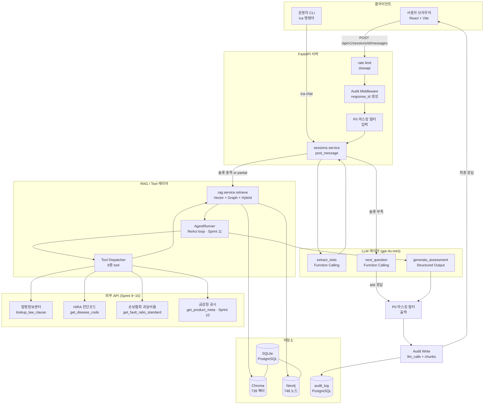
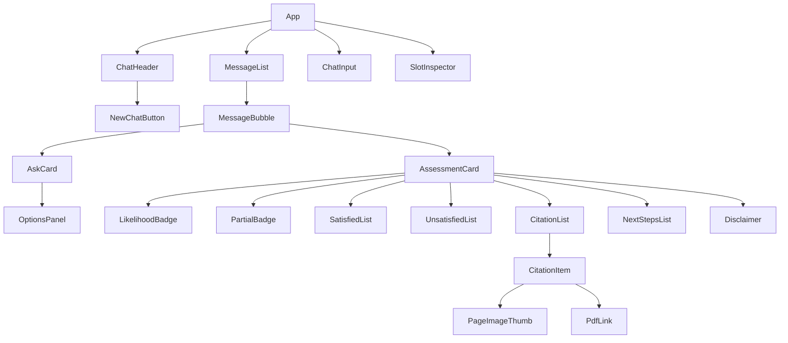
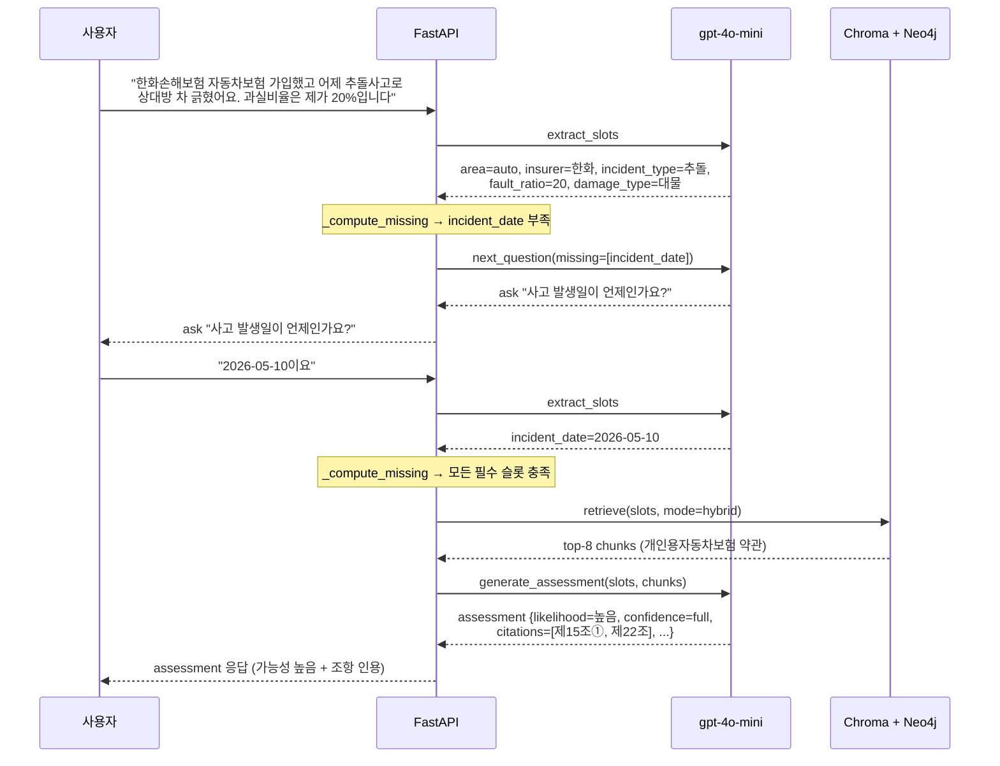
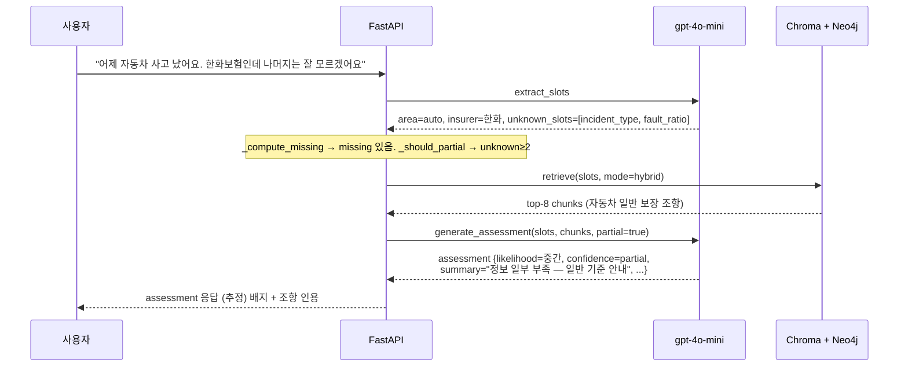
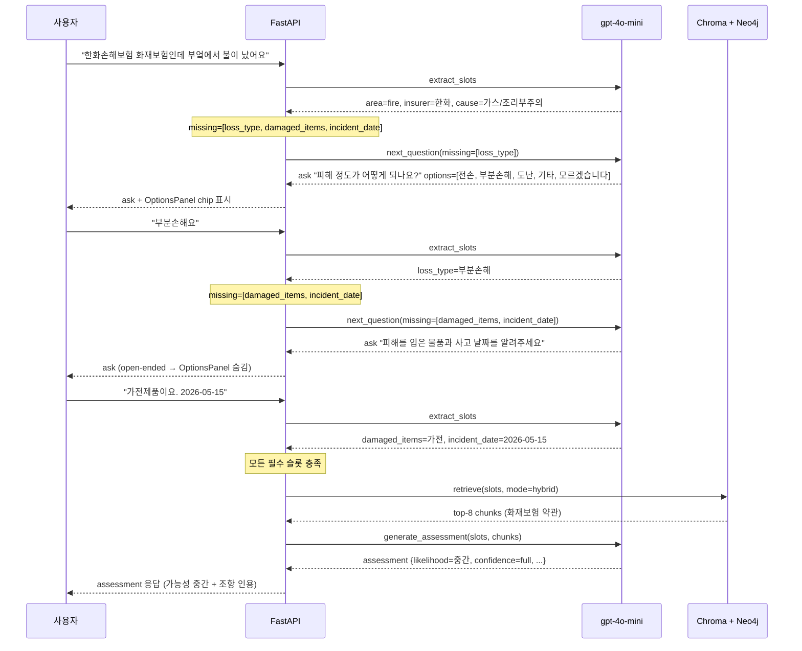
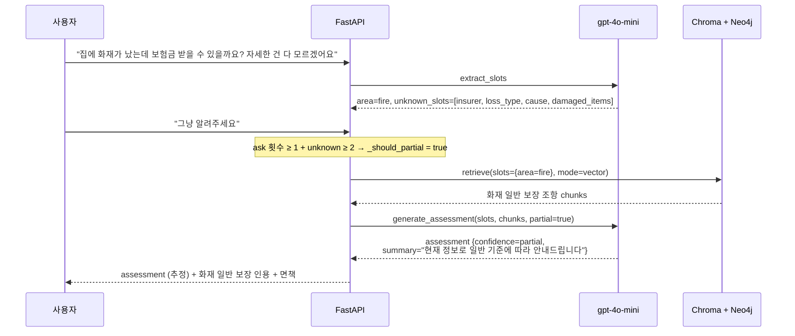

# 보험청구심사 어시스턴트 — 서비스 종합 안내서

> 작성일: 2026-05-24 기준 / 최종 갱신: 2026-05-26 (Sprint 15 OCR 서류 처리 반영)
> 대상: 외부 공유 · 소개 · 온보딩
> 단일 진입점 문서 — 세부 내용은 각 절 끝 링크를 따른다

---

## 목차

1. [서비스 개요](#1-서비스-개요)
2. [기술 스택](#2-기술-스택)
3. [전체 아키텍처](#3-전체-아키텍처)
4. [API 명세 요약](#4-api-명세-요약)
5. [프론트엔드 컴포넌트 흐름](#5-프론트엔드-컴포넌트-흐름)
6. [뉴로심볼릭 구성](#6-뉴로심볼릭-구성)
7. [시나리오 흐름 4건](#7-시나리오-흐름-4건)
8. [데이터 자산](#8-데이터-자산)
9. [운영 인프라](#9-운영-인프라)
10. [로드맵](#10-로드맵)
11. [참고 문서 인덱스](#11-참고-문서-인덱스)

---

## 1. 서비스 개요

**보험청구심사 어시스턴트**는 일반 국민이 자신의 보험금 청구 가능성을 자연어로 질문하면, 실제 보험사 약관 PDF 원문을 근거로 "가능성 높음 / 중간 / 낮음" 등급과 조항 인용을 함께 제시하는 **RAG 기반 대국민 서비스 도구**다.

단정적 판단("된다 / 안된다") 대신 충족 항목과 미충족 항목을 정리해 사용자가 직접 최종 판단을 내릴 수 있도록 돕는다. 모든 응답에는 법적 면책 문구가 포함된다.

### 도메인

- **대상 영역**: 자동차보험 (`auto`) · 화재보험 (`fire`) · 상해질병 (`accident_disease`)
- **현재 데이터**: 한화손해보험 자동차·화재 약관 + 요약서 PDF 4종

### 주요 사용자

| 사용자 | 진입 방식 | 목적 |
|:--|:--|:--|
| 일반 국민 | 웹 UI 채팅 | 청구 가능성 사전 확인 |
| 운영자 | CLI + API + `/metrics` | 데이터 적재·모니터링·감사 |
| 개발자 | 소스코드 + 이 문서 | 온보딩·기능 이해 |

### 현재 진행률 (2026-05-24 기준)

| 스프린트 | 내용 | 상태 |
|:--|:--|:--|
| Sprint 1 | PDF 적재 파이프라인 + CLI | ✅ 완료 |
| Sprint 2 | 멀티턴 대화 HTTP API | ✅ 완료 |
| Sprint 3 | 웹 UI 사양서 + 백엔드 정비 | ✅ 완료 |
| Sprint 4 | GraphRAG + Hybrid + ReAct 골격 | ✅ 완료 |
| Sprint 5 | 인용 카드 PDF 페이지 캡처 | ✅ 완료 |
| Sprint 6 | 응답 품질 정책 (partial + 모름 처리) | ✅ 완료 |
| Sprint 7 | 응답 톤 정책 (능동적 안내 + 친절체) | ✅ 완료 |
| Sprint 8 | 대국민 서비스 전환 인프라 (감사/PII/rate limit/circuit breaker) | ✅ 완료 |
| Sprint 8.5 | 후속 보정 + 디자인 패키지 + frontend 통합 | ✅ 완료 |
| Sprint 8.6 | 옵션 노출 정책 정교화 (OptionsPanel + closed-ended 분기) | ✅ 완료 |
| Sprint 9 | 외부 read-only tool (KIDI 활성 + law/hira 골격) | 🚧 ~60% |
| Sprint 10 | fss 금감원 크롤링 | 🔜 보류 |
| Sprint 11 | ReAct agent 본격 활성 (AgentRunner 핵심 완료) | 🚧 ~93% |
| Sprint 12 | 벡터 DB pgvector 전환 (Chroma → PostgreSQL + pgvector, env 토글 병행) | ✅ 완료 |
| Sprint 13 | LangGraph StateGraph agent backend + `RAG_BACKEND` env 토글 + `ica agent-graph` 시각화 | ✅ 완료 |
| Sprint 14 | 마이데이터 + 로그인 (잔여 보류 중) | 🔜 보류 |
| Sprint 15 | OCR 서류 처리 — multipart 업로드 + OpenAI Vision + 5종 분류 + 슬롯 자동 매핑 + 24h TTL | ✅ 완료 |
| Sprint 16 | Upstage OCR 전환 + Sprint 14 잔여 통합 | 🔜 다음 |

> 테스트: **898 passed + ruff 0** (Sprint 8.6 기준) / Sprint 12: 동등성 회귀 top-8 overlap ≥ 7/8 통과 / Sprint 13: commit 3b2bebc / Sprint 15: commit 817d26e + 6ece7d7

자세한 내용은 [docs/sprint.md](sprint.md) 참고.

---

## 2. 기술 스택

### 백엔드

| 기술 | 버전 | 역할 | 선택 이유 |
|:--|:--|:--|:--|
| Python | 3.11+ | 전체 백엔드 언어 | AI/ML 라이브러리 생태계 + 팀 역량 |
| FastAPI | 0.110+ | REST API 서버 | 비동기 · 타입 검증 · OpenAPI 자동 문서화 |
| Typer + Rich | - | CLI (`ica` 명령어) | 데이터 파이프라인 운영자 도구 |
| SQLAlchemy + Alembic | - | ORM + 마이그레이션 | SQL injection 원천 차단 + 스키마 이력 관리 |
| pydantic-settings | 2.x | 환경 변수 관리 | `.env` 기반 타입 안전 설정 |
| slowapi | - | rate limit (per-IP / per-session) | FastAPI 네이티브 미들웨어 |
| pybreaker | - | circuit breaker | 외부 API 장애 격리 |
| httpx | - | 외부 API 비동기 클라이언트 | MCP 없이 직접 REST 호출 |

### AI / 검색

| 기술 | 역할 | 선택 이유 |
|:--|:--|:--|
| OpenAI gpt-4o-mini | LLM (슬롯 추출·질문 생성·판단) | 한국어 품질 무난 + 비용 저렴 |
| OpenAI text-embedding-3-small (1536-d) | 청크 임베딩 | LLM과 동일 제공자 → API 키 1개 |
| Chroma (로컬 영속화) | 벡터 DB | 임베디드 (별도 서버 없음) + 메타데이터 필터링 |
| Neo4j 5.x community (Docker) | 그래프 DB | 약관 계층 탐색 + LangChain GraphCypherQAChain |
| LangChain (app/rag/ 한정) | GraphRAG 래퍼 | GraphCypherQAChain 재사용 + LangChain-neo4j 통합 |
| **LangGraph** (app/rag/langgraph_agent.py, Sprint 13) | StateGraph 기반 ReAct agent | 노드/엣지 명시화 + `ica agent-graph` Mermaid 시각화. AgentRunner 점진 대체 |
| **OpenAI Vision** (gpt-4o-mini multimodal, Sprint 15) | OCR 텍스트 추출 + 서류 분류 + 슬롯 매핑 | 이미지/PDF → 텍스트 추출. 추가 API 키 불필요. Sprint 16에서 Upstage로 교체 예정 |
| pdfplumber + PyMuPDF | PDF 파서 | pdfplumber: 표 추출 강함 / PyMuPDF: 텍스트 + 페이지 이미지 |

### 데이터베이스

| DB | 용도 | 선택 이유 |
|:--|:--|:--|
| SQLite (기본) / PostgreSQL (운영 옵션) | 메타데이터 + 감사 로그 | PoC는 파일 기반 SQLite → 운영은 DATABASE_URL로 PostgreSQL 전환 |
| Chroma (Sprint 13 이후 폐기 예정) | 벡터 임베딩 + 유사도 검색 (개발 기본) | Python 네이티브 + 메타 필터. VECTOR_STORE=chroma 또는 미설정 시 사용 |
| **pgvector** (PostgreSQL 확장, Sprint 12 신규) | 벡터 임베딩 + 유사도 검색 (운영 권장) | 운영 DB 통합 + ACID + 백업 통합. DATABASE_URL=postgresql://... 설정 시 자동 활성 |
| Neo4j | 약관 계층 지식 그래프 | Cypher 검색 → 조항 간 참조 추적 |
| 인메모리 dict + TTL | 대화 세션 (30분) | 세션 휘발성 요구 + PoC 단순화 |

### 프론트엔드

| 기술 | 역할 | 비고 |
|:--|:--|:--|
| React + Vite + TypeScript | 채팅 UI | 사용자가 Claude 디자인 서비스로 생성 |
| CSS Modules | 스타일 | 컴포넌트 스코프 격리 |

### 운영 / 인프라

| 기술 | 역할 |
|:--|:--|
| Docker Compose | Neo4j · PostgreSQL 로컬 실행 |
| Prometheus `/metrics` | SLO 메트릭 수집 |
| Alembic | DB 스키마 마이그레이션 |
| presidio (옵션) | PII 마스킹 라이브러리 |
| cachetools | 외부 API 인메모리 캐시 |
| GitHub Actions | CI (PR마다 테스트 + ruff) |

자세한 결정 이유는 [docs/design/tech-decisions.md](design/tech-decisions.md) 참고.

---

## 3. 전체 아키텍처

서비스의 전체 데이터 흐름을 한눈에 보여준다. 사용자 요청이 들어와서 응답이 나가기까지 거치는 모든 레이어를 표현한다.



**레이어 역할 요약**

| 레이어 | 역할 | 핵심 파일 |
|:--|:--|:--|
| FastAPI Router | 인증 없음 + rate limit + CORS | `app/sessions/router.py` |
| Audit Middleware | response_id 생성 + 감사 기록 | `app/audit/middleware.py` |
| PII 마스킹 | 입출력 개인정보 정규식 차단 | `app/security/pii.py` |
| sessions.service | 오케스트레이션 (슬롯 수집 → 분기 → 응답) | `app/sessions/service.py` |
| LLM 레이어 | 3종 Function Calling + Structured Output | `app/sessions/llm.py` |
| RAG 레이어 | Vector/Graph/Hybrid 검색 + ReAct loop | `app/rag/` |
| Tool Dispatcher | 8종 tool 라우팅 | `app/tools/dispatcher.py` |
| 외부 어댑터 | httpx + cachetools + circuit breaker | `app/external/` |

자세한 내용은 [docs/design/agent-architecture.md](design/agent-architecture.md) 참고.

---

## 4. API 명세 요약

**Base URL**: `http://localhost:8000/api/v1`
**인증**: 없음 (비로그인 대국민 서비스)
**응답 형식**: JSON

### 세션 API (4종)

| 메서드 | 경로 | 응답 종류 | 설명 |
|:--|:--|:--|:--|
| `POST` | `/sessions` | 201 `{session_id, ttl_seconds}` | 새 대화 세션 생성. `initial_message` 선택 포함 가능 |
| `POST` | `/sessions/{id}/messages` | 200 `ask` 또는 `assessment` | 멀티턴 핵심. 슬롯 부족 시 `ask`, 충족 시 `assessment` 반환 |
| `GET` | `/sessions/{id}` | 200 세션 전체 상태 | 디버그용. 슬롯 현황 + 대화 이력 포함 |
| `DELETE` | `/sessions/{id}` | 204 | 세션 명시 폐기 (멱등) |

### 문서 API (2종)

| 메서드 | 경로 | 설명 |
|:--|:--|:--|
| `GET` | `/documents/products` | 등록 상품 목록 (페이지네이션, UI 셀렉트박스용) |
| `GET` | `/documents/insurers` | 등록 보험사 목록 |

### 운영 API (2종)

| 메서드 | 경로 | 설명 |
|:--|:--|:--|
| `GET` | `/health` | 서버 상태 확인 |
| `GET` | `/metrics` | Prometheus 메트릭 (SLO 수집용) |

### 응답 모드 2가지

**`type: ask`** — 슬롯 정보 보강 질의

```json
{
  "assistant": {
    "type": "ask",
    "message": "사고 당시 과실 비율을 알고 계신가요? 모르시면 '모르겠습니다'를 선택해 주세요.",
    "expected_slots": ["fault_ratio"],
    "options": ["0%", "10%", "20~50%", "50%+", "모르겠습니다"]
  }
}
```

**`type: assessment`** — 최종 판단 응답

```json
{
  "assistant": {
    "type": "assessment",
    "likelihood": "중간",
    "confidence": "full",
    "summary": "치료 사실은 보장 조건에 부합하지만 ...",
    "satisfied": ["입원 기간 5일 — 보장 한도 내"],
    "unsatisfied": ["사고 경위 증빙 미확보"],
    "citations": [{"insurer": "한화손해보험", "clause": "제15조", "page": 12, "...": "..."}],
    "next_steps": ["경찰 사고 사실 확인원 발급"],
    "disclaimer": "본 결과는 참고용이며 ..."
  }
}
```

`confidence: "partial"` — 필수 슬롯 일부 미충족 상태로 진입한 추정 응답. UI에서 "(추정)" 배지로 표시.

### 공통 에러 코드

| HTTP | code | 발생 시점 |
|:--|:--|:--|
| 400 | `VALIDATION_ERROR` | 입력값 검증 실패 |
| 404 | `SESSION_NOT_FOUND` | 세션 만료 또는 오타 |
| 429 | `RATE_LIMITED` | per-IP 10 req/min 초과 |
| 503 | `LLM_UNAVAILABLE` | OpenAI 호출 실패 |

자세한 내용은 [docs/design/api-spec.md](design/api-spec.md) 참고.

---

## 5. 프론트엔드 컴포넌트 흐름

프론트엔드는 React + Vite + TypeScript 단일 페이지 앱이다. 사용자가 Claude 디자인 서비스로 생성했으며 `frontend/` 폴더에 위치한다.

### 컴포넌트 트리



### 핵심 컴포넌트 역할

| 컴포넌트 | 역할 | 핵심 동작 |
|:--|:--|:--|
| `App` | 루트 — 세션 상태 관리 | `useSession` hook으로 sessionId + messages + isSending 관리 |
| `ChatInput` | 사용자 입력 전송 | Enter 또는 전송 버튼 → `POST /sessions/{id}/messages` |
| `AskCard` | ask 응답 렌더링 | `options.length > 0` 이면 `OptionsPanel` 노출 (chip 선택) |
| `OptionsPanel` | 선택지 chip 표시 | closed-ended 슬롯 (area, incident_type 등)에만 노출. open-ended는 자동 숨김 |
| `AssessmentCard` | 판단 결과 카드 | likelihood 배지 + partial 배지(추정) + 충족/미충족 + citations + 면책 |
| `CitationItem` | 인용 카드 | 조항 원문 + PDF 페이지 썸네일(`/static/page_images/`) + PDF 링크(`#page=N`) |
| `SlotInspector` | 디버그 패널 | 현재 슬롯 현황 접힌 상태로 표시 |

### 라우팅

단일 페이지(`/`) — 별도 라우터 없음. Sprint 8.5에서 추가된 보조 페이지:

| 경로 | 내용 |
|:--|:--|
| `/legal` | 법적 이용약관 |
| `/disclaimer` | 서비스 면책 |
| `/privacy` | 개인정보 처리방침 |
| `/accessibility` | 접근성 안내 |
| `/sources` | 데이터 출처 |

### useSession 훅 핵심 흐름

1. 첫 메시지 전송 시 `POST /sessions` → `sessionId` 획득
2. 이후 메시지 전송마다 `POST /sessions/{id}/messages` 호출
3. 응답 `type`에 따라 `AskCard` 또는 `AssessmentCard` 렌더
4. 오류 발생 시 낙관적 업데이트 롤백 + 에러 메시지 표시

자세한 내용은 [docs/design/ui-spec.md](design/ui-spec.md) 참고.

---

## 6. 뉴로심볼릭 구성

본 서비스는 **Neuro(신경망)** 와 **Symbolic(규칙 기반)** 을 결합한 뉴로심볼릭 아키텍처를 채택한다. LLM이 자연어 이해와 추론을 담당하고, 규칙 기반 로직이 신뢰성 보장과 결정론 계산을 담당한다.

**현재 진행률: ~93%** (Sprint 11 AgentRunner 핵심 구현 완료. `RAG_REACT=true`로 활성화 가능)

### Neuro (신경망) 구성 요소

| 구성 요소 | 역할 | 모델 | 적용 범위 | 상태 |
|:--|:--|:--|:--|:--|
| `extract_slots` | 사용자 자연어 → SlotState 필드 추출 | gpt-4o-mini (temperature 0.0) | 모든 turn | ✅ 완료 |
| `next_question` | 부족 슬롯 → 자연어 질문 생성 + 옵션 | gpt-4o-mini (temperature 0.0) | ask 응답 | ✅ 완료 |
| `generate_assessment` | 슬롯 + RAG 청크 → 가능성 판단 + 인용 | gpt-4o-mini (temperature 0.2) | assessment 응답 | ✅ 완료 |
| RAG Hybrid 검색 | 질의 → 관련 약관 청크 검색 | text-embedding-3-small | 모든 assessment | ✅ 완료 |
| ReAct agent loop — AgentRunner | LLM이 tool을 자가 선택·반복 호출 (자체 구현) | gpt-4o-mini + tool_calls | `RAG_REACT=true RAG_BACKEND=agentrunner` | ✅ 완료 (Sprint 11) |
| ReAct agent loop — **LangGraph StateGraph** | 노드/엣지 명시화 + `ica agent-graph` 시각화 | gpt-4o-mini + tool_calls | `RAG_REACT=true RAG_BACKEND=langgraph` | ✅ 완료 (Sprint 13) |
| **OCR 텍스트 추출** (`app/external/ocr/`) | 업로드 이미지/PDF → 텍스트 추출 | gpt-4o-mini Vision (image_url base64) | `POST /sessions/{id}/documents` | ✅ 완료 (Sprint 15) |
| **서류 유형 분류** (`classify_document`) | OCR 텍스트 → 5종 분류 + 신뢰도 | gpt-4o-mini Function Calling | 업로드 시 자동 호출 | ✅ 완료 (Sprint 15) |
| **슬롯 매핑** (`extract_slots_from_document`) | 서류 유형별 기대 필드 → SlotState | gpt-4o-mini Function Calling | 분류 후 자동 호출 | ✅ 완료 (Sprint 15) |

**LLM 호출 순서 (기본 흐름)**:
1. `extract_slots` (Function Calling) — 매 turn 의무
2. `next_question` (Function Calling) — 슬롯 부족 시
3. RAG 검색 (Chroma + Neo4j) — 슬롯 충족 시
4. `generate_assessment` (Structured Output, JSON Schema 강제) — 최종 판단

### Symbolic (규칙 기반) 구성 요소

| 구성 요소 | 역할 | 위치 | 상태 |
|:--|:--|:--|:--|
| 슬롯 validator (`_compute_missing`) | 영역별 필수 슬롯 충족 여부 결정론 계산 | `app/sessions/service.py` | ✅ 완료 |
| partial 분기 (`_should_partial`) | ask ≥ 3회 / unknown ≥ 2개 / 명시 키워드 → partial 강제 진입 | `app/sessions/service.py` | ✅ 완료 |
| Neo4j 지식 그래프 | 약관 조항 계층 탐색 (Insurer→Product→Version→Document→Clause→SubClause) | `app/rag/graph.py` | ✅ 완료 |
| Tool Dispatcher | LLM tool_call 이름 → 실제 함수 라우팅 (8종) | `app/tools/dispatcher.py` | ✅ 완료 |
| KIDI 과실비율 정적 데이터 | 6 시나리오 정적 JSON (`get_fault_ratio_standard`) | `app/external/kidi/` | ✅ 완료 |
| `calc_claim_amount` | 의료수가 / 손해액 → 보험금 산정 (순수 Python 계산) | `app/tools/calc.py` | ✅ 완료 |
| `validate_coverage_period` | 사고일 ∈ 보장기간 유효성 검증 | `app/tools/calc.py` | ✅ 완료 |
| 구조 인식 청킹 | 제N조 / 항 / 표 단위 의미 분할 (LLM 없이 정규식) | `app/chunks/` | ✅ 완료 |

### 옵션 노출 정책 (Sprint 8.6 결정)

Symbolic 정책의 대표 사례다. `_NEXT_QUESTION_SYSTEM` 프롬프트가 슬롯 성격에 따라 `options` 배열을 결정론으로 채운다.

| 슬롯 종류 | options 처리 | 예시 |
|:--|:--|:--|
| closed-ended (enum형) 5종 | options 배열 채움 + "모르겠습니다" 의무 | `area`, `incident_type`, `damage_type`, `loss_type`, `cause` |
| open-ended (자유 입력) | options 빈 배열 → OptionsPanel 자동 숨김 | `insurer`, `incident_date`, `diagnosis`, `fault_ratio` 등 |

자세한 내용은 [docs/design/agent-architecture.md](design/agent-architecture.md) 참고.

---

## 7. 시나리오 흐름 4건

실제 사용 시나리오 4건을 시퀀스 다이어그램으로 표현한다. 각각 정보 충분/부족 상황과 자동차/화재 영역의 조합이다.

### 시나리오 A — 자동차 정보 충분 → ask 1턴 → assessment full

사용자가 보험사·사고 유형·과실 비율 등 대부분의 정보를 첫 메시지에 담은 경우다.



### 시나리오 B — 자동차 정보 부족 ("그냥 모름") → 즉시 partial

사용자가 상세 정보를 모르거나 "그냥 알려주세요"라고 요청한 경우다.



### 시나리오 C — 화재 정보 충분 → ask 2턴 → assessment full

화재보험은 자동차보다 필수 슬롯이 다르다. `loss_type`과 `cause`를 추가로 수집한다.



### 시나리오 D — 화재 정보 부족 → 즉시 partial

화재 사고 정보를 거의 모르는 사용자 시나리오다.



---

## 8. 데이터 자산

서비스가 운용하는 전체 데이터 자산 목록이다.

### PDF 원본 데이터

| 보험사 | 영역 | 문서 종류 | 파일 |
|:--|:--|:--|:--|
| 한화손해보험 | auto | 약관 (terms) | `data/raw/hanwha/auto/.../terms.pdf` |
| 한화손해보험 | auto | 상품요약 (summary) | `data/raw/hanwha/auto/.../summary.pdf` |
| 한화손해보험 | fire | 약관 (terms) | `data/raw/hanwha/fire/.../terms.pdf` |
| 한화손해보험 | fire | 상품요약 (summary) | `data/raw/hanwha/fire/.../summary.pdf` |

### SQLite / PostgreSQL 메타데이터

| 테이블 | 레코드 수 | 내용 |
|:--|:--|:--|
| `insurers` | 1 | 한화손해보험 |
| `products` | 2 | 개인용자동차보험, 화재보험 |
| `product_versions` | 2 | 각 상품의 현행 판매 버전 |
| `documents` | 4 | terms + summary × 2 영역 |
| `clause_chunks` | 739 | 구조 인식 청킹 결과 |
| `audit_log` | 17+ | 응답 감사 기록 (운영 중 누적) |

### 벡터 DB (Sprint 12 기준 — Chroma 또는 pgvector)

**Chroma** (개발 기본, Sprint 13 이후 폐기 예정):

| 컬렉션 | 벡터 수 | 임베딩 모델 | 차원 |
|:--|:--|:--|:--|
| `insurance_clauses` | 739 | text-embedding-3-small | 1536 |

각 벡터에는 `insurer`, `product`, `version`, `doc_type`, `clause_no`, `page` 메타데이터가 함께 저장된다.

**pgvector** (운영 권장, Sprint 12 신규):

| 테이블.컬럼 | 벡터 수 | 임베딩 모델 | 차원 | 인덱스 |
|:--|:--|:--|:--|:--|
| `clause_chunks.embedding` | 739 | text-embedding-3-small | 1536 | HNSW (m=16, ef_construction=64, cosine) |

PostgreSQL `clause_chunks` 테이블에 `embedding vector(1536)` 컬럼을 추가해서 메타데이터와 벡터를 단일 테이블에서 관리한다. `ica reindex --vector-store=pgvector`로 적재.

### 지식 그래프 (Neo4j)

| 노드 라벨 | 수 | 역할 |
|:--|:--|:--|
| `Insurer` | 1 | 보험사 |
| `Product` | 2 | 상품 |
| `Version` | 2 | 판매기간 버전 |
| `Document` | 4 | 원본 PDF |
| `Clause` | 351 | 조항 (제N조) |
| `SubClause` | 388 | 항 (①②③) |
| **합계** | **748** | - |

엣지 5종: `SELLS` · `HAS_VERSION` · `HAS_DOCUMENT` · `CONTAINS` · `HAS_SUBCLAUSE`

Neo4j Browser: `http://localhost:7474` (Docker 실행 시)

### 외부 정적 데이터 (KIDI)

| 데이터셋 | 시나리오 수 | 내용 |
|:--|:--|:--|
| 손보협회 과실비율 (정적 JSON) | 6 | 차101/차202/차305/차411/보03/이15 |

### 평가 셋

| 데이터셋 | 시나리오 수 | 위치 |
|:--|:--|:--|
| eval 시나리오 | 10 | `eval/scenarios/` |

자세한 내용은 [docs/design/data-model.md](design/data-model.md), [docs/design/graph-schema.md](design/graph-schema.md) 참고.

---

## 9. 운영 인프라

Sprint 8에서 PoC 가정을 폐기하고 대국민 서비스 수준의 운영 인프라를 도입했다. 신뢰성, 추적 가능성, 개인정보 보호가 1급 요구사항으로 격상되었다.

### SLO 목표

| 메트릭 | 목표 | 측정 위치 |
|:--|:--|:--|
| API p95 응답시간 | < 5초 (LLM 호출 포함) | FastAPI 미들웨어 |
| API p50 응답시간 | < 2초 | 동상 |
| 에러율 (5xx) | < 0.5% / 24h | 동상 |
| LLM 토큰 비용 | < $0.05 / 응답 | LLM 호출 wrapper |
| RAG 검색 latency p95 | < 1초 | rag_service.retrieve |
| 외부 API 실패율 | < 5% (API별) | external 어댑터 |

### 감사 로그 (audit_log)

모든 응답에 대해 PostgreSQL `audit_log` 테이블에 레코드를 기록한다.

| 필드 | 내용 |
|:--|:--|
| `response_id` | UUID (PK) — 분쟁 시 특정 응답 재현 키 |
| `session_id` | FK (세션 삭제 후에도 보존) |
| `masked_user_input` | PII 마스킹 후 사용자 입력 |
| `llm_calls` | JSONB — 함수명, 모델, 토큰, latency_ms |
| `retrieved_chunk_ids` | text[] — RAG 인용 청크 ID |
| `external_api_calls` | JSONB — 외부 API 호출 기록 |
| `assistant_response_type` | ask / assessment |
| `confidence` | partial / full / null |

보존 기간: 7년 (보험 분쟁 시효 기준, [확인 필요] 법무 확인 필수)

### PII 마스킹

입력·출력·로그 3곳 모두에 정규식 기반 마스킹이 적용된다.

| 마스킹 대상 | 처리 |
|:--|:--|
| 주민번호, 휴대전화, 계좌번호, 카드번호, 이메일 | 정규식 + presidio (옵션) 마스킹 |
| 진단명, 과실비율, 사고 경위 | 마스킹 제외 (분쟁 시 필수) |

`Settings.pii_masking_enabled=False` 로 테스트 환경에서 비활성화 가능.

### Rate Limit + Circuit Breaker

| 위치 | 정책 |
|:--|:--|
| API 진입 (slowapi) | per-IP 10 req/min / per-session 30 req/min |
| 외부 API 어댑터 | 5xx/timeout 5회 연속 → 60초 circuit open → vector RAG 단독 폴백 |
| LLM 호출 | 일일 $50 한도 초과 시 503 |

### 면책 + 법적 책임 한정

| 위치 | 내용 |
|:--|:--|
| 모든 assessment 응답 | `_DEFAULT_DISCLAIMER` — "본 결과는 참고용이며 최종 청구 가능 여부 판단을 대체하지 않습니다" |
| 모든 ask 응답 | "본 안내는 참고용입니다" |
| UI 헤더 | 영구 표시 |
| `/disclaimer` 페이지 | 최초 접속 시 확인 (선택) |

### 첨부 파일 TTL 관리 (Sprint 15)

OCR 서류 업로드 파일은 개인정보 보호를 위해 24시간 후 자동 삭제된다.

| 항목 | 값 | 환경 변수 |
|:--|:--|:--|
| 저장 경로 | `data/uploads/{session_id}/{uuid}.{ext}` | `ATTACHMENT_STORAGE_PATH` |
| TTL | 24시간 (기본) | `ATTACHMENT_TTL_HOURS` |
| cleanup 주기 | 1시간 간격 (APScheduler) | — |
| audit 보존 | 파일 해시 + 메타만 `external_api_calls` JSONB에 보존 | — |

`ATTACHMENT_TTL_HOURS=0` 으로 설정하면 자동 삭제를 비활성화한다. 운영 환경에서는 권장하지 않는다.

### 모니터링

- **`GET /metrics`**: Prometheus exposition endpoint (Sprint 8 완료)
- **Grafana 대시보드**: Sprint 11+ 계획
- **OpenTelemetry tracing**: Sprint 11+ 계획

### 평가 셋

```
eval/
├── scenarios/          ← 10 시나리오 JSON (입력 + 기대 슬롯 + 기대 confidence + 기대 citations)
├── runner.py           ← 시나리오 실행 → 결과 비교 → 메트릭 출력
└── README.md
```

실행: `python -m eval.runner`

자세한 내용은 [docs/usage_ops.md](usage_ops.md) 참고.

---

## 10. 로드맵

### Sprint 9 — 외부 read-only tool 활성 (~60% 진행)

**현재 완료**:
- KIDI 과실비율 정적 데이터 적재 + `get_fault_ratio_standard` 활성
- `lookup_law_clause` (법령정보센터), `get_disease_code` (HIRA) 어댑터 골격 구현
- `calc_claim_amount` + `validate_coverage_period` (Sprint 10 선행 완료)
- Tool Dispatcher 통합 완료

**대기 중** (외부 조건):
- 법령정보센터 OC 코드 발급 후 `lookup_law_clause` 완전 활성화
- HIRA 공공데이터포털 serviceKey 발급 후 `get_disease_code` 완전 활성화

### Sprint 10 — fss 금감원 크롤링 (보류)

- `get_product_meta` — 금감원 공시 각 보험사 공시실 HTML 스크래핑
- 각 보험사 공시실 구조가 달라 구현 복잡도 높음 → Sprint 9 이후 착수
- 캐싱 TTL: 24시간

### Sprint 11 — ReAct agent 본격 활성 (~93% 완료)

**완료**:
- `app/rag/agent.py` AgentRunner 구현 (LLM이 tool_calls 반복, max_iter=5)
- `rag.service.run_agent` 진입점
- `sessions.service` 분기 (`RAG_REACT=true` 시 agent 경로 + 폴백)
- audit tool_calls 기록 연동

**남은 작업**:
- `RAG_REACT=true` 환경에서 10 eval 시나리오 전수 통과 확인
- Sprint 11 시스템 프롬프트 영역별 의무/권장 tool 명시 최종화
- Grafana 대시보드 연동

### Sprint 12 — 벡터 DB pgvector 전환 (✅ 완료)

- pgvector 어댑터 (`app/rag/vectorstore.py`) + HNSW 인덱스 (m=16, ef_construction=64)
- `VECTOR_STORE` env 토글 (chroma / pgvector / 자동 선택)
- `ica reindex --vector-store=pgvector` 재임베딩 명령
- Chroma ↔ pgvector 동등성 회귀 top-8 overlap ≥ 7/8 통과
- 문서: `usage_ops.md § 7` + `data-model.md` + `README.md` 갱신

**Chroma 폐기**: Sprint 13 완료 후 별도 chore commit으로 진행.

### Sprint 13 — LangGraph 전환 (✅ 완료 — commit 3b2bebc)

- `app/rag/langgraph_agent.py` LangGraph StateGraph — 노드 4종 (prepare / call_llm / execute_tools + 조건 엣지)
- `RAG_BACKEND` env 토글 (`agentrunner` / `langgraph`) — 점진 마이그레이션, 회귀 0 보장
- `ica agent-graph [--out <path>]` — `draw_mermaid()` 시각화 CLI 신규
- AgentRunner 와 LangGraph 동등성 회귀 검증 (eval 10 시나리오)
- **남은 작업**: Sprint 14~15 안정화 후 AgentRunner 폐기 (별도 chore commit)

### Sprint 14 — 마이데이터 + 로그인 (잔여 보류 중)

- 사용자 인증 선택 도입 (현재 비로그인 → 선택)
- 마이데이터 API 연동 — 보험 가입 이력 자동 확인
- sessions API 인증 옵셔널 + audit user_id + slot prefill 흐름 통합
- **현재 상태**: Sprint 15 OCR 진행으로 보류. Sprint 16에서 OCR + 마이데이터 통합 정리 예정

### Sprint 15 — OCR 서류 처리 (✅ 완료 — commit 817d26e + 6ece7d7)

- `POST /api/v1/sessions/{id}/documents` — multipart 업로드 + OpenAI Vision OCR
- 서류 유형 5종 자동 분류 (`classify_document` LLM) + 신뢰도 < 0.7 시 `other` 폴백
- 슬롯 자동 매핑 (`extract_slots_from_document` LLM) — 서류 유형별 기대 필드
- OCR 직후 PII 마스킹 → 마스킹 후 텍스트만 LLM 전달
- APScheduler 24h TTL cleanup (1시간 간격)
- 사용자 확인 카드 정책 — 자동 반영 X, `POST /apply-extracted` 명시 적용
- 문서: `docs/usage_ocr.md` (신규) + `docs/design/api-spec.md` + `README.md` + `SERVICE_OVERVIEW.md` + `agent-architecture.md`

### Sprint 16 — Upstage OCR 전환 + Sprint 14 잔여 통합 (다음)

- `OCR_BACKEND=upstage` 활성화 (현재 skeleton — Sprint 16에서 API 키 + 실구현)
- Sprint 14 잔여 (마이데이터 prefill + OCR prefill 충돌 정책 통합)
- AgentRunner 폐기 (LangGraph 안정화 후 별도 chore commit)

### Sprint 17+ — 외부 배포

- 도메인 · TLS · DPIA (개인정보영향평가)
- 클라우드 배포 (운영자 결정) — S3 첨부 파일 스토리지 + presigned URL
- Secret Manager 연동 (현재 환경변수)
- WCAG AA 접근성 전수 점검 (스크린리더 `aria-live` 포함)

---

## 11. 참고 문서 인덱스

### 설계 문서 (docs/design/)

| 문서 | 내용 |
|:--|:--|
| [tech-decisions.md](design/tech-decisions.md) | Sprint 1~8.6 모든 기술 결정 기록 (선택 이유 + 대안) |
| [agent-architecture.md](design/agent-architecture.md) | LLM agent 아키텍처 + ReAct loop + tool 카탈로그 |
| [api-spec.md](design/api-spec.md) | CLI 명세 + HTTP API 전체 엔드포인트 + JSON Schema |
| [external-apis.md](design/external-apis.md) | 외부 API 4종 명세 (법령정보센터, HIRA, KIDI, 금감원) |
| [ui-spec.md](design/ui-spec.md) | 화면 명세 + 컴포넌트 분해 + 레이아웃 원칙 |
| [ui-api-flow.md](design/ui-api-flow.md) | UI ↔ API 데이터 흐름 + TypeScript 타입 + 에러 처리 |
| [ui-states.md](design/ui-states.md) | 화면 상태 전이 다이어그램 (gathering → analyzing → answered) |
| [data-model.md](design/data-model.md) | ERD + 테이블 스키마 + SlotState 필드 정의 |
| [rag-architecture.md](design/rag-architecture.md) | Vector/Graph/Hybrid/ReAct 구조 + 모듈 설계 |
| [graph-schema.md](design/graph-schema.md) | Neo4j 노드/엣지 스키마 + 인덱스 + Cypher 예시 |

### 요구사항 문서 (docs/requirements/)

| 문서 | Sprint | 내용 |
|:--|:--|:--|
| [01_insurance_claim_assistant.md](requirements/01_insurance_claim_assistant.md) | 1 | 서비스 핵심 목표 + 기능 목록 |
| [02_multiturn_api.md](requirements/02_multiturn_api.md) | 2 | 멀티턴 대화 HTTP API |
| [03_web_ui.md](requirements/03_web_ui.md) | 3 | 웹 UI 요구사항 |
| [04_graphrag_react.md](requirements/04_graphrag_react.md) | 4 | GraphRAG + ReAct |
| [05_pdf_page_render.md](requirements/05_pdf_page_render.md) | 5 | 인용 카드 PDF 렌더 |
| [06_response_quality.md](requirements/06_response_quality.md) | 6 | 응답 품질 정책 (partial + 모름) |
| [07_response_tone.md](requirements/07_response_tone.md) | 7 | 응답 톤 정책 (능동적 안내 + 친절체) |
| [08_public_service_transition.md](requirements/08_public_service_transition.md) | 8 | 대국민 서비스 전환 |
| [09_trust_ux_polish.md](requirements/09_trust_ux_polish.md) | 8.6 | 신뢰도 + UX 보강 |

### PM 분석 문서 (docs/pm/)

각 스프린트의 분석·설계 회의록과 결정 배경이 담겨 있다. `docs/pm/01_sprint1-analysis.md` ~ `docs/pm/11_sprint11-analysis.md`.

### 사용 가이드 (docs/)

| 문서 | 내용 |
|:--|:--|
| [usage_sessions.md](usage_sessions.md) | HTTP API 4종 curl 예시 + CLI `ica chat` 사용법 |
| [usage_graphrag.md](usage_graphrag.md) | GraphRAG 설정 + Neo4j Docker + `ica graph-build` + 모드 비교 |
| [usage_response_quality.md](usage_response_quality.md) | partial 모드 동작 + 톤 정책 + LLM 프롬프트 규칙 |
| [usage_pdf_render.md](usage_pdf_render.md) | PDF 페이지 캡처 동작 원리 + 트러블슈팅 |
| [usage_ops.md](usage_ops.md) | 운영자 가이드 — SLO / 감사 로그 / PII / rate limit / PostgreSQL 전환 / 평가 셋 실행 |

### 스프린트 이력

| 문서 | 내용 |
|:--|:--|
| [sprint.md](sprint.md) | 전체 스프린트 이력 (Sprint 1~8.6 완료 + Sprint 9/11 진행 중) |
| [README.md](../README.md) | 프로젝트 빠른 시작 + 기술 스택 + 환경 변수 |

### agent 보고서 (docs/agents/)

doc-writer, design-reviewer, test-writer, researcher agent의 작업 보고서.
`docs/agents/doc-writer/index.md`, `docs/agents/design-reviewer/index.md` 등.

---

> **면책**: 본 서비스의 모든 판단 결과는 참고용이며, 최종 보험금 청구 가능 여부의 결정은 보험사에 있습니다.
