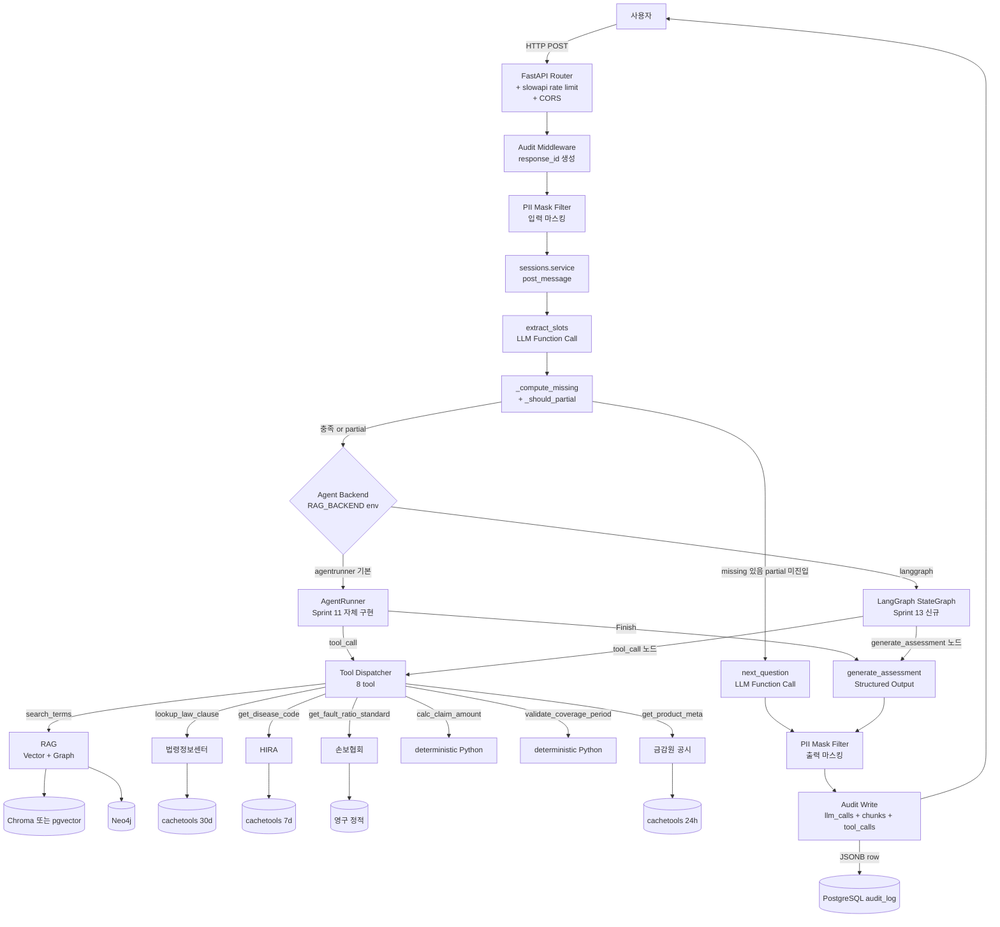
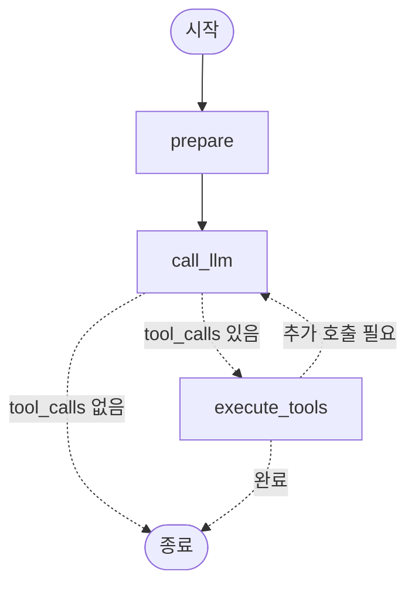

# LLM Agent 아키텍처 (Sprint 8~15 통합 설계)

- 작성일: 2026-05-25 / 최종 갱신: 2026-05-26 (Sprint 15 OCR 서류 처리 반영)
- 관련: [REQ-08](../requirements/08_public_service_transition.md), [REQ-11](../requirements/11_ocr-document.md), [REQ-12](../requirements/12_langgraph-migration.md), [tech-decisions § Sprint 13](tech-decisions.md), [tech-decisions § Sprint 15](tech-decisions.md), [external-apis.md](external-apis.md)

## 1. 목적

PoC 단방향 흐름 (서비스가 RAG 호출 → LLM 컨텍스트 주입) 을 **ReAct + tool 라우팅 agent** 로 진화. LLM 이 필요한 외부 데이터 (약관·법령·판례·진단코드·과실비율·계산) 를 자가 판단해 호출 + 모든 응답에 출처 인용.

## 2. 단계적 진화 (Sprint 8 → 11)

| Sprint | 변화 | LLM 호출 모드 |
|:--|:--|:--|
| **현재 (Sprint 1~7)** | 단방향: extract_slots → next_question OR (RAG → generate_assessment) | Function Calling 3개 + Structured Output 1개 |
| **Sprint 8** | 인프라 추가 (audit/PII/rate limit). LLM 흐름 동일 | 동일 |
| **Sprint 9** | 외부 read-only tool 3개 추가 (`lookup_law_clause` / `get_disease_code` / `get_fault_ratio_standard`). **서비스 레이어가 rule-based 호출** (영역별). LLM 은 결과만 컨텍스트로 받음. | Function Calling 3 + Structured Output 1 + 외부 API 사전 호출 |
| **Sprint 10** | 계산기 tool 2개 추가 (`calc_claim_amount` / `validate_coverage_period`) + 크롤링 (`get_product_meta`). 여전히 rule-based. | 동상 + 계산 사전 호출 |
| **Sprint 11** | **ReAct 본격**. LLM 이 tool 다발 자가 선택. `RAG_MODE=agent` 신규 모드. | LLM 이 tool_calls 반복 (max 5) → Finish → 응답 |

→ Sprint 8~10 은 **점진적 tool 추가** (rule-based 호출로 회귀 위험 ↓). Sprint 11 에서 한번에 ReAct 활성화 (회귀 원인 명확).

## 3. Agent 아키텍처 (Sprint 11 → 13)

### 3.1 컴포넌트 다이어그램 (공통 — backend 무관)



### 3.2 Backend 선택 — env 토글 (Sprint 13)

`RAG_REACT=true` 로 Agent 모드 전체를 활성화한 뒤, `RAG_BACKEND` 로 구현을 선택한다.

| env 조합 | 동작 | 특이 사항 |
|:--|:--|:--|
| `RAG_REACT=false` (기본) | ReAct 비활성 — 단순 RAG 검색 1회 | 회귀 0 보장 |
| `RAG_REACT=true RAG_BACKEND=agentrunner` | Sprint 11 자체 구현 AgentRunner | 기본 backend. Sprint 14~15 안정화 후 폐기 예정 |
| `RAG_REACT=true RAG_BACKEND=langgraph` | Sprint 13 LangGraph StateGraph | 점진 마이그레이션 대상 |

```bash
# LangGraph backend로 서버 실행
RAG_REACT=true RAG_BACKEND=langgraph uvicorn app.main:app --reload --port 8000

# CLI 대화 (LangGraph backend)
RAG_REACT=true RAG_BACKEND=langgraph ica chat
```

`sessions.service.py` 분기:

```python
if get_settings().rag_react:
    if get_settings().rag_backend == "langgraph":
        from app.rag.service import run_agent_langgraph as run_agent
    else:
        from app.rag.service import run_agent
```

### 3.3 LangGraph StateGraph 노드 구성 (Sprint 13)

`app/rag/langgraph_agent.py` 에 정의된 `build_agent_graph()` 가 반환하는 StateGraph.

#### AgentState TypedDict

| 필드 | 타입 | 역할 |
|:--|:--|:--|
| `slots` | `SlotState` | 현재 슬롯 값 (영역·사고일·진단명 등) |
| `messages` | `list[dict[str, Any]]` | LLM 대화 이력 (system + user + assistant) |
| `tool_calls` | `list[dict[str, Any]]` | tool 호출 기록 — audit row 직렬화용 |
| `retrieved_chunks` | `list[dict[str, Any]]` | RAG 검색 결과 누적 |
| `visited_tools` | `set[str]` | 중복 tool 호출 방지 (dedup) |
| `iter_count` | `int` | 반복 횟수 가드 (max_iter 기준) |
| `next_action` | `Literal["ask","retrieve","tool_call","assessment","end"]` | 조건 엣지 분기 키 |

#### 노드 4종 + 조건 엣지

실제 구현(`build_agent_graph()`)의 노드는 4종이다. `prepare` 는 초기화 + 슬롯 충족 검사(decide 역할 포함)를 수행하며, `call_llm` 이 LLM tool_calls 반복을 담당한다.

| 노드 | 책임 | 재사용 함수 |
|:--|:--|:--|
| `prepare` | 시스템 프롬프트 구성 + 슬롯 검사 (`_compute_missing` + `_should_partial`) → next_action 결정 | `sessions.service` 내부 함수 |
| `call_llm` | ChatOpenAI tool_calls 호출 — tool 있으면 `execute_tools` 로, 없으면 `END` 로 | `sessions.llm.generate_assessment` 또는 직접 LLM 호출 |
| `execute_tools` | `dispatcher.invoke` 8 tool 라우팅 → state 업데이트 | `tools.dispatcher.invoke` |
| (조건 엣지) | `call_llm` 출력 → tool_calls 존재 시 `execute_tools` / 없을 시 `END` | LangGraph `add_conditional_edges` |

시각화(`ica agent-graph` 로 생성한 Mermaid):



> `ica agent-graph --out docs/design/diagrams/langgraph-flow.md` 로 최신 그래프를 재생성한다.

### 3.4 tool 카탈로그 (Sprint 11 기준 — AgentRunner · LangGraph 공통 재사용)

| Tool | 종류 | 책임 | 입력 | 출력 | 캐싱 | 영역 (호출 조건) |
|:--|:--|:--|:--|:--|:--|:--|
| `search_terms` | 약관 RAG | 약관 청크 검색 (Chroma + Neo4j hybrid) | slots | chunks[] | — | 모든 영역 (의무) |
| `lookup_law_clause` | 외부 | 보험업법·상법 조항 lookup | 키워드 / 조항번호 | 조문 본문 + 출처 URL | 30일 | 모든 영역 (권장) |
| `get_disease_code` | 외부 | 진단명 → KCD 코드 | 진단명 (한국어) | KCD-8 코드 + 정식명 | 7일 | accident_disease 만 |
| `get_fault_ratio_standard` | 외부 | 표준 과실비율 lookup | 사고유형 | 기본 비율 + 가감 요소 | 영구 | auto 만 |
| `calc_claim_amount` | deterministic | 보험금 산정 | 의료수가 / 손해액 / 지급률 | 금액 | — | 청구금액 산정 시 |
| `validate_coverage_period` | deterministic | 사고일 ∈ 보장기간 검증 | 사고일 / 보장 시작·만료일 | 유효 / 사유 | — | 모든 영역 |
| `get_product_meta` | 외부 (Sprint 10) | 보험사·상품 메타 + 약관 PDF URL | 보험사 + 상품명 | 메타 dict | 24시간 | insurer/product 보강 시 |

### 3.5 Tool 선택 정책 (Sprint 11 — AgentRunner · LangGraph 공통)

LLM 이 자가 라우팅하되, 시스템 프롬프트에 영역별 의무/권장 명시:

| 영역 | 의무 tool | 권장 tool |
|:--|:--|:--|
| auto | search_terms, validate_coverage_period | lookup_law_clause (자배법), get_fault_ratio_standard, calc_claim_amount |
| fire | search_terms, validate_coverage_period | lookup_law_clause (상법), calc_claim_amount |
| accident_disease | search_terms, validate_coverage_period | lookup_law_clause (보험업법), get_disease_code, calc_claim_amount |

**LLM 환각 회피 가드레일**:
- 같은 tool 동일 인자 2회 호출 시 cache hit 강제
- 5회 iteration 한도 (Sprint 4 ReAct 결정 유지)
- citations.minItems=1 강제 (RAG 결과 없으면 응답 거부 → _build_no_match_ask)

## 4. 운영 흐름 (모든 응답 공통)

```
1. HTTP POST /api/v1/sessions/{id}/messages
2. slowapi rate limit 검증 (per-IP / per-session)
3. response_id = uuid4()
4. audit_log: precommit row (timestamp, masked_input, response_id)
5. service.post_message
   ├─ extract_slots → slots
   ├─ _compute_missing → missing[]
   ├─ _should_partial → partial?
   ├─ 분기:
   │   ├─ missing + 미partial → next_question (LLM #2)
   │   └─ 충족 또는 partial → Orchestrator (ReAct loop)
   │                            ├─ tool_calls × N (cache aware)
   │                            └─ generate_assessment (Structured Output)
   └─ response 직전: audit_log update (llm_calls, retrieved_chunk_ids, external_api_calls)
6. response 직전 PII 마스킹 재검증
7. SLO 메트릭 emit (응답시간 / 토큰 비용)
8. 응답 반환
```

## 5. 회귀 위험 + 대응

| 위험 | 대응 |
|:--|:--|
| Sprint 11 ReAct 활성화 시 LLM tool 선택 환각 | Sprint 8~10 동안 rule-based 로 결과 검증 후 활성화 + 평가 셋 회귀 |
| 외부 API 다중 호출 비용 폭증 | 캐싱 + circuit breaker + 일일 비용 한도 (서비스 차단) |
| audit_log 쌓이는 속도 (월 1만 응답 = 12만 row/년) | PostgreSQL 파티션 (월 단위) + 보존 정책 7년 |
| Sprint 8 의 PII 마스킹이 진단명 오마스킹 가능 | regex pattern 화이트리스트 (의료 용어는 보존) + 평가 셋에 케이스 추가 |
| 미들웨어 추가로 기존 578 테스트 회귀 | researcher 통합점 보고서 + test-writer 회귀 검증 |

## 6. 도메인 응집 디렉터리 변경 (Sprint 8~15 누계)

```
app/
├── core/                 ← config, logging (PII filter Sprint 8)
├── audit/                ← NEW Sprint 8: model + service + middleware
├── security/             ← NEW Sprint 8: PII 마스킹
├── sessions/             ← 기존
│   └── llm.py            ← Sprint 15: classify_document + extract_slots_from_document 추가
├── documents/, chunks/, search/, rag/, pdfimage/  ← 기존
├── attachments/          ← NEW Sprint 15: 첨부 파일 저장/조회/삭제/TTL
│   ├── schemas.py        ← AttachmentMeta (id, session_id, path, sha256, size, created_at)
│   └── service.py        ← save_bytes / read_bytes / delete / cleanup_expired
├── external/             ← NEW Sprint 9~15
│   ├── ocr/              ← NEW Sprint 15: OCR 어댑터
│   │   └── adapter.py    ← OcrAdapter Protocol + OpenAiVisionAdapter + UpstageAdapter(skeleton) + 팩토리
│   ├── law/              ← 법령정보센터
│   ├── hira/             ← HIRA
│   ├── kidi/             ← 손보협회
│   └── fss/              ← 금감원 공시 (Sprint 10)
├── tools/                ← NEW Sprint 9~11: LLM tool 어댑터
│   ├── definitions.py    ← OpenAI Function Calling 정의 (모든 tool)
│   ├── dispatcher.py     ← LLM tool_call → 실 함수 호출 라우팅
│   └── calc.py           ← calc_claim_amount, validate_coverage_period
└── eval/                 ← NEW Sprint 8: 평가 셋 runner
```

## 7. [확인 필요] 항목

1. **DB 마이그 시점** — Sprint 8 끝 vs Sprint 9 시작 (audit_log 모델 추가 시점에 함께)
2. **audit_log 보존 기간** — 7년 가정 (보험 분쟁 시효) → 법무 확인 필수
3. **약관 동의 화면** — Sprint 11 에 옵션. 운영자 결정
4. **ReAct mode 명명** — `RAG_MODE=agent` vs 기존 `hybrid` + `RAG_REACT=true` 조합 유지 — Sprint 11 시작 시 확정
5. **외부 호스팅 시점** — Sprint 12+ 별도 sub-project (도메인·인증서·DPIA 포함)

## 8. OCR 어댑터 + Neural Layer 확장 (Sprint 15)

Sprint 15 에서 Neural Layer 에 OCR 파이프라인이 추가되었다. 기존 sessions.llm.py LLM 함수 3종 외에 2종이 신규 추가된다.

### 8.1 OCR 어댑터 추상화 (`app/external/ocr/adapter.py`)

`OcrAdapter` Protocol 은 단일 메서드(`extract_text`) 로 모든 OCR backend 를 통일한다. backend 교체 시 어댑터만 변경하면 된다.

| 어댑터 | 상태 | 활성 조건 |
|:--|:--|:--|
| `OpenAiVisionAdapter` | 활성 (Sprint 15) | `OCR_BACKEND=openai` (기본) |
| `UpstageAdapter` | skeleton (Sprint 16) | `OCR_BACKEND=upstage` → 현재 `OcrNotConfiguredError` 발생 |

```python
class OcrAdapter(Protocol):
    def extract_text(self, image_bytes: bytes, mime_type: str) -> OcrResult: ...

# OcrResult: {text: str, confidence: float, page_count: int}
```

`get_ocr_adapter(settings)` 팩토리 함수가 `OCR_BACKEND` env 값에 따라 적절한 어댑터를 반환한다.

### 8.2 LLM 호출 2종 신규 (`app/sessions/llm.py`)

| 함수 | 역할 | 입력 | 출력 | 호출 시점 |
|:--|:--|:--|:--|:--|
| `classify_document(text)` | OCR 텍스트 → 5종 분류 + 신뢰도 | 마스킹된 OCR 텍스트 (max 2000자) | `{doc_type, confidence, reason}` | 업로드 직후 |
| `extract_slots_from_document(text, doc_type)` | 서류 유형별 기대 필드 → SlotState 매핑 | 마스킹된 OCR 텍스트 (max 3000자) + doc_type | `{슬롯명: 값, ...}` | 분류 후 |

두 함수 모두 OpenAI Function Calling 방식으로 호출한다. `extract_slots` (기존 채팅 슬롯 추출) 와 이름이 유사하지만 별개의 함수다.

### 8.3 사용자 확인 카드 정책

OCR 추출 결과는 **세션 슬롯에 자동 반영되지 않는다**. `POST /sessions/{id}/documents` 응답에 `extracted_slots` 와 `confidence_per_field` 를 포함해서 UI 가 확인 카드를 노출한다. 사용자가 카드에서 내용을 검토하고 `POST /sessions/{id}/apply-extracted` 를 명시 호출해야 슬롯이 반영된다.

**이유**: OCR 오추출 위험 → 자동 반영 시 잘못된 assessment 발생 가능. F-6 사용자 확인 강제 정책과 일치.

마이데이터 prefill 과 OCR prefill 이 동일 슬롯을 채우면 사용자가 어느 출처 값을 쓸지 선택한다. 서버는 두 값을 자동으로 병합하지 않는다.
