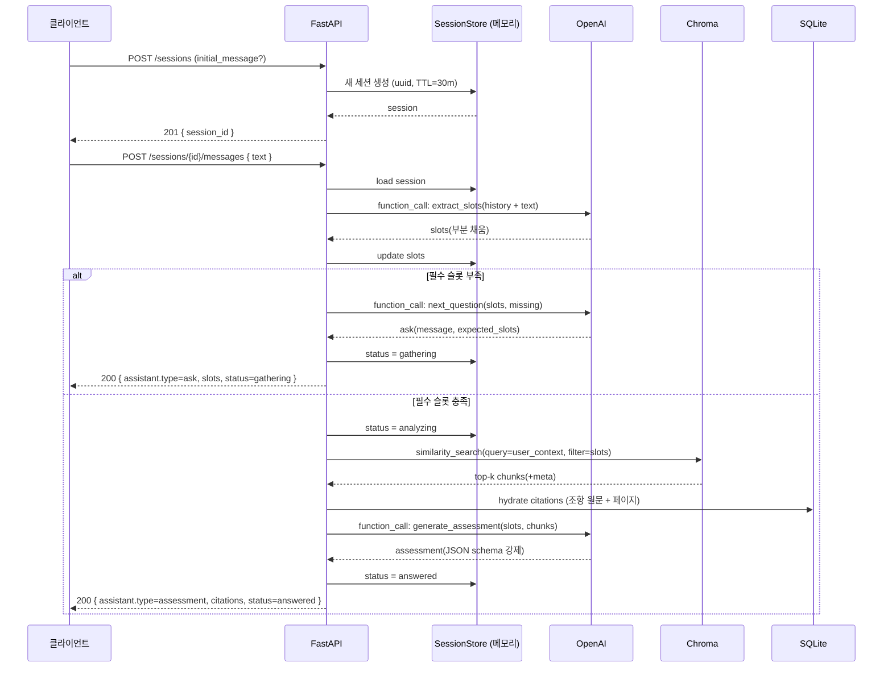

# API · CLI 명세

- 작성일: 2026-05-22
- 스프린트: 1 (CLI 중심) + 2~3 (HTTP API 윤곽)
- 관련 요구사항: [REQ-01](../requirements/01_insurance_claim_assistant.md)
- 관련 결정: [tech-decisions.md](tech-decisions.md), [data-model.md](data-model.md)

## 인터페이스 분리

| 스프린트 | 인터페이스 | 목적 |
|:--|:--|:--|
| 1 | **CLI** | 데이터 파이프라인 적재·검증. 사람이 직접 실행 |
| 2 | **HTTP API** (FastAPI) | 멀티턴 대화 + 가능성 판단 응답 |
| 3 | **HTTP API + 웹 UI** | 데모용 채팅 인터페이스 |

---

# Sprint 1 — CLI

`python -m insurance_claim_assistant.<command>` 또는 `pyproject.toml` 의 `[project.scripts]` 로 진입점 노출.

## 공통 옵션

| 옵션 | 기본값 | 설명 |
|:--|:--|:--|
| `--config` | `./config.yml` | 설정 파일 경로 |
| `--db-path` | `./data/app.db` | SQLite 경로 |
| `--chroma-path` | `./data/chroma` | Chroma 영속 경로 |
| `--raw-path` | `./data/raw` | 원본 PDF 폴더 |
| `--verbose` | False | 디버그 로그 |

## 1) `ingest` — PDF 폴더 적재

폴더를 스캔해 신규/변경된 PDF를 파싱·청킹·임베딩·DB 적재한다. 멱등 동작 (해시 비교).

```bash
ica ingest [OPTIONS]
```

| 옵션 | 타입 | 기본값 | 설명 |
|:--|:--|:--|:--|
| `--insurer` | str | (전체) | 특정 보험사만 적재 (ex. `hanwha`) |
| `--area` | str | (전체) | 특정 영역만 (`auto`, `accident_disease`, `fire`) |
| `--dry-run` | flag | False | 실제 적재 없이 처리 대상만 출력 |
| `--force` | flag | False | 해시 동일해도 재처리 |
| `--max-workers` | int | 4 | 병렬 워커 수 |

**산출 로그 예시**
```
[1/3] hanwha / auto / personal_auto_joint / 2026-03-01_present
  - terms.pdf (162p, sha256=ab12...) → 새 문서. 파싱 중
    구조 인식: 본 41조 / 항 178 / 표 12 / 별표 4
    청크 생성: 251개 (평균 토큰 412)
    임베딩 + Chroma 적재 완료
  - business.pdf → 해시 동일. 스킵
  - summary.pdf → 해시 동일. 스킵
[2/3] ...
```

**종료 코드**: 0=정상, 1=일부 실패(파일별 오류 누적), 2=치명적 오류 (DB 연결 등)

## 2) `search` — 약관 검색 (RAG 검증용)

```bash
ica search "발목 골절 입원 보험금" [OPTIONS]
```

| 옵션 | 타입 | 기본값 | 설명 |
|:--|:--|:--|:--|
| `--insurer` | str | (전체) | 보험사 필터 |
| `--area` | str | (전체) | 영역 필터 |
| `--product` | str | (전체) | 상품 필터 |
| `--doc-type` | str | (전체) | `summary`/`business`/`terms` |
| `--top-k` | int | 8 | 반환 개수 |
| `--format` | str | `table` | `table`/`json`/`markdown` |

**출력 예시 (table)**
```
# rank | score | insurer | product | clause   | page | text 발췌
  1    | 0.832 | hanwha  | 개인용  | 제15조   | 12   | 보험금 지급 사유는 다음과 같다 ...
  2    | 0.814 | hanwha  | 개인용  | 제15조①  | 12   | 입원의료비는 1일당 ...
```

## 3) `list` — 적재 현황 조회

```bash
ica list [OPTIONS]
```

| 옵션 | 타입 | 설명 |
|:--|:--|:--|
| `--scope` | `insurers`/`products`/`versions`/`documents`/`chunks` | 출력 범위 (기본 `products`) |
| `--insurer` | str | 필터 |
| `--area` | str | 필터 |

## 4) `inspect` — 청크 상세 조회 (검증)

```bash
ica inspect CHUNK_ID [--show-parent] [--show-siblings]
```

청크 본문 + 메타데이터 + 부모/형제 조항 출력. 청킹 품질 수동 검수용.

## 5) `rebuild` — 재파싱

```bash
ica rebuild [--insurer X] [--product Y] [--parser-version 0.2]
```

파서 버전 업그레이드 시 사용. 영향 받는 문서를 식별해 재처리.

---

# Sprint 2~3 — HTTP API (윤곽)

**기본 URL**: `http://localhost:8000/api/v1`

## 공통

### 헤더

| 헤더 | 필수 | 설명 |
|:--|:--|:--|
| `Content-Type` | O | `application/json` (POST/PATCH) |
| `X-Session-Id` | 일부 | 세션 식별자 (생성 후 클라이언트 보관) |

### 인증
- **없음** (요구사항 결정 — 비로그인 서비스)
- 학습/실험용 관리 엔드포인트는 `/admin/*` 로 분리하고 환경변수 기반 토큰 보호

### 페이지네이션

| 파라미터 | 기본 | 설명 |
|:--|:--|:--|
| `page` | 1 | 1부터 |
| `size` | 20 | 최대 100 |

```json
{
  "data": [],
  "pagination": { "page": 1, "size": 20, "total_count": 0, "has_next": false }
}
```

### 에러 응답 표준

```json
{
  "error": {
    "code": "VALIDATION_ERROR",
    "message": "보험사를 선택해 주세요.",
    "details": [
      { "field": "insurer_id", "message": "필수 필드입니다." }
    ]
  }
}
```

### 공통 에러 코드

| HTTP | code | 설명 |
|:--|:--|:--|
| 400 | `VALIDATION_ERROR` | 입력값 검증 실패 |
| 400 | `INVALID_REQUEST` | 비즈니스 규칙 위반 |
| 404 | `SESSION_NOT_FOUND` | 세션 없음/만료 |
| 404 | `RESOURCE_NOT_FOUND` | 일반 리소스 없음 |
| 409 | `CONFLICT` | 충돌 |
| 422 | `INSUFFICIENT_CONTEXT` | 분석에 필요한 정보 부족 (어시스턴트가 추가 질문해야 함) |
| 429 | `RATE_LIMITED` | 호출 제한 |
| 500 | `INTERNAL_ERROR` | 서버 내부 오류 |
| 503 | `LLM_UNAVAILABLE` | OpenAI 호출 실패 |
| 503 | `OCR_NOT_CONFIGURED` | OCR backend 미활성 (Upstage — Sprint 16 예정) |
| 502 | `OCR_FAILED` | OCR 처리 실패 (Vision API 오류) |
| 400 | `INVALID_FILE` | 허용되지 않는 파일 형식 또는 크기 초과 |

## 리소스

| 리소스 | 설명 |
|:--|:--|
| `/sessions` | 대화 세션 (휘발성) |
| `/sessions/{id}/messages` | 멀티턴 대화 |
| `/products` | 등록된 상품 메타 (디버그/UI 선택지) |
| `/clauses/search` | 약관 검색 (디버그/관리) |

## 엔드포인트

| 메서드 | 경로 | 설명 | 인증 | 비고 |
|:--|:--|:--|:--|:--|
| POST | `/sessions` | 새 세션 생성 | X | session_id 반환 |
| GET | `/sessions/{id}` | 세션 상태 조회 (디버그) | X | 휘발성, TTL 30분 |
| DELETE | `/sessions/{id}` | 세션 폐기 | X | 명시적 종료 |
| POST | `/sessions/{id}/messages` | 사용자 메시지 + 어시스턴트 응답 | X | 멀티턴 핵심 |
| POST | `/sessions/{id}/documents` | 서류 업로드 + OCR + 슬롯 추출 | X | multipart (Sprint 15) |
| POST | `/sessions/{id}/apply-extracted` | OCR 추출 슬롯 세션에 적용 | X | 사용자 확인 후 명시 적용 (Sprint 15) |
| GET | `/products` | 등록 상품 목록 | X | 페이지네이션 |
| GET | `/clauses/search` | 약관 검색 (관리) | 토큰 | `/admin` 분리 검토 |

### POST `/sessions` — 새 세션

**요청 본문**

| 필드 | 타입 | 필수 | 설명 |
|:--|:--|:--|:--|
| `initial_message` | string | X | 첫 자유 입력 (있으면 즉시 처리) |

**응답** (201)

```json
{
  "session_id": "7f3e8c2a-...",
  "created_at": "2026-05-22T09:00:00Z",
  "ttl_seconds": 1800
}
```

### POST `/sessions/{id}/messages` — 멀티턴 핵심 엔드포인트

**요청 본문**

| 필드 | 타입 | 필수 | 설명 |
|:--|:--|:--|:--|
| `text` | string | O | 사용자 입력 (자연어) |

**응답 형식 — 어시스턴트 응답은 두 가지 모드 중 하나**

```json
{
  "session_id": "7f3e8c2a-...",
  "turn": 3,
  "assistant": {
    "type": "ask | assessment",
    ...
  },
  "slots": {
    "insurer": "한화손해보험",
    "area": "auto",
    "incident_date": "2026-05-01",
    "diagnosis": null
  },
  "status": "gathering | analyzing | answered"
}
```

**상태 전이 규칙**:
- `gathering` (기본): 필수 슬롯 부족. 어시스턴트가 `ask` 응답
- `analyzing`: 필수 슬롯 충족 후 RAG 검색 + LLM 호출 진행 중 (응답 직전 잠시 거치는 상태)
- `answered`: `assessment` 응답을 1회 이상 제공한 상태
- **`answered` 회귀**: `answered` 상태에서 사용자가 슬롯을 변경하는 메시지(예: "사실 사고일은 5/2였어요")를 보내면, 변경 슬롯에 따라 다시 슬롯 검증을 수행하고 부족하면 `gathering`으로 회귀해 새 `ask` 응답을 반환할 수 있다. 충분하면 새 `assessment`를 다시 생성한다.

**모드 1 — 정보 보강 질의 (`type: ask`)**

```json
{
  "assistant": {
    "type": "ask",
    "message": "사고 당시 본인 과실 비율을 알고 계신가요? 모르시면 '모름'이라고 답변해 주세요.",
    "expected_slots": ["fault_ratio"],
    "options": ["0%", "10%", "20~50%", "50%+", "모름"]
  }
}
```

**모드 2 — 최종 판단 (`type: assessment`)**

```json
{
  "assistant": {
    "type": "assessment",
    "likelihood": "중간",
    "summary": "치료 사실은 보장 조건에 부합하지만, 사고 경위 입증 자료가 부족해 청구 시 추가 자료 요청이 예상됩니다.",
    "satisfied": [
      "입원 기간 5일 — 보장 한도 내",
      "진단명 '발목 골절' — 상해 분류 명시"
    ],
    "unsatisfied": [
      "사고 경위 증빙 (경찰 신고서, 사고 사진 등) 미확보"
    ],
    "citations": [
      {
        "insurer": "한화손해보험",
        "product": "개인용자동차보험(공동물건)",
        "version": "2026-03-01_present",
        "doc_type": "terms",
        "clause": "제15조",
        "sub_no": "①",
        "text": "보험금 지급 사유는 다음과 같다 ... (원문 발췌)",
        "page": 12
      }
    ],
    "next_steps": [
      "경찰 사고 사실 확인원 발급",
      "치료 진료비 영수증 원본 보관"
    ],
    "disclaimer": "본 결과는 참고용이며 최종 청구 가능 여부 판단을 대체하지 않습니다."
  }
}
```

**에러 응답**

| HTTP | code | 시점 |
|:--|:--|:--|
| 404 | `SESSION_NOT_FOUND` | 세션 만료/오타 |
| 422 | `INSUFFICIENT_CONTEXT` | 어시스턴트가 판단 불가 (희귀. 보통 `ask`로 처리) |
| 503 | `LLM_UNAVAILABLE` | OpenAI 호출 실패 |

### POST `/sessions/{id}/documents` — 서류 업로드 + OCR (Sprint 15)

사고 관련 서류를 업로드하면 OCR로 텍스트를 추출하고 LLM이 서류 유형을 분류해 슬롯을 자동 매핑한다.

**인증**: 없음

**요청** (`multipart/form-data`)

| 파라미터 | 위치 | 타입 | 필수 | 설명 |
|:--|:--|:--|:--|:--|
| `session_id` | path | string | O | 세션 UUID |
| `file` | form | UploadFile | O | 이미지(JPEG/PNG/WebP) 또는 PDF. 최대 10MB |

지원 MIME 타입: `image/jpeg`, `image/png`, `image/webp`, `application/pdf`

**요청 예시 (curl)**

```bash
curl -X POST \
  "http://localhost:8000/api/v1/sessions/{session_id}/documents" \
  -F "file=@diagnosis.jpg;type=image/jpeg"
```

**응답** (200)

```json
{
  "attachment_id": "a1b2c3d4-...",
  "doc_type": "diagnosis",
  "doc_type_confidence": 0.92,
  "extracted_slots": {
    "diagnosis_name": "발목 골절 (S825)",
    "hospital": "한강병원",
    "treatment_period": "2026-05-10 ~ 2026-05-20",
    "hospitalization_days": 10
  },
  "confidence_per_field": {
    "diagnosis_name": 0.95,
    "hospital": 0.88,
    "treatment_period": 0.91,
    "hospitalization_days": 0.95
  }
}
```

`doc_type` 5종: `diagnosis` (진단서) / `police_report` (경찰 신고서) / `claim_form` (보험 청구서) / `receipt` (영수증) / `other` (기타)

`doc_type_confidence` < 0.7이면 `doc_type=other`로 폴백되고 `extracted_slots`는 빈 객체.

`extracted_slots`는 세션 슬롯에 자동 반영되지 않는다. 사용자가 확인 후 `POST /sessions/{id}/apply-extracted`로 명시적으로 적용해야 한다.

**에러 응답**

| HTTP | code | 시점 |
|:--|:--|:--|
| 404 | `SESSION_NOT_FOUND` | 세션 만료/없음 |
| 400 | `INVALID_FILE` | 허용되지 않는 MIME 타입 또는 파일 크기 초과 |
| 503 | `OCR_NOT_CONFIGURED` | OCR_BACKEND=upstage (Sprint 16 미활성) |
| 502 | `OCR_FAILED` | OpenAI Vision API 호출 실패 |

---

### POST `/sessions/{id}/apply-extracted` — 추출 슬롯 적용 (Sprint 15)

사용자가 OCR 추출 결과 확인 카드에서 선택한 슬롯을 세션에 반영한다.

**인증**: 없음

**요청** (`application/json`)

```json
{
  "confirmed_slots": {
    "diagnosis_name": "발목 골절 (S825)",
    "hospital": "한강병원",
    "hospitalization_days": 10
  }
}
```

| 필드 | 타입 | 필수 | 설명 |
|:--|:--|:--|:--|
| `confirmed_slots` | object | O | 사용자가 확인한 슬롯만 포함 (SlotState 필드 부분 집합) |

**응답** (200)

```json
{ "ok": true }
```

**에러 응답**

| HTTP | code | 시점 |
|:--|:--|:--|
| 404 | `SESSION_NOT_FOUND` | 세션 만료/없음 |

---

### GET `/sessions/{id}` — 디버그용 세션 상태

**응답**

```json
{
  "session_id": "...",
  "created_at": "...",
  "last_activity_at": "...",
  "status": "gathering",
  "slots": {},
  "history": [
    { "role": "user", "text": "...", "ts": "..." },
    { "role": "assistant", "type": "ask", "message": "...", "ts": "..." }
  ]
}
```

### GET `/products` — 등록 상품 (UI 셀렉트박스 후보)

**쿼리**

| 파라미터 | 타입 | 설명 |
|:--|:--|:--|
| `insurer` | str | 필터 |
| `area` | str | `auto`/`accident_disease`/`fire` |
| `active_only` | bool | 기본 `true` |

**응답**

```json
{
  "data": [
    {
      "product_id": "personal_auto_joint",
      "name": "개인용자동차보험(공동물건)",
      "insurer": { "id": "hanwha", "name": "한화손해보험" },
      "area": "auto",
      "versions": [
        { "id": 12, "label": "2026-03-01_present", "valid_from": "2026-03-01", "valid_to": null, "is_active": true }
      ]
    }
  ],
  "pagination": { "page": 1, "size": 20, "total_count": 1, "has_next": false }
}
```

## 멀티턴 흐름 (Sequence)



## 출력 스키마 강제 — `assessment` 모드

OpenAI **Structured Outputs** 사용 (JSON Schema 강제). 미준수 시 LLM 재시도 1회, 그 후 `LLM_UNAVAILABLE` 또는 `INSUFFICIENT_CONTEXT` 반환.

```json
{
  "name": "claim_assessment",
  "schema": {
    "type": "object",
    "required": ["likelihood","summary","satisfied","unsatisfied","citations","next_steps","disclaimer"],
    "properties": {
      "likelihood": { "type": "string", "enum": ["높음","중간","낮음"] },
      "summary": { "type": "string", "minLength": 10 },
      "satisfied": { "type": "array", "items": { "type": "string" } },
      "unsatisfied": { "type": "array", "items": { "type": "string" } },
      "citations": { "type": "array", "minItems": 1, "items": {
        "type": "object",
        "required": ["chunk_id","insurer","product","version","doc_type","clause","sub_no","text","page"],
        "properties": {
          "chunk_id": { "type": "string", "description": "SQLite clause_chunks.id / Chroma id (감사 추적용)" },
          "insurer": { "type": "string" },
          "product": { "type": "string" },
          "version": { "type": "string" },
          "doc_type": { "type": "string", "enum": ["summary","business","terms"] },
          "clause": { "type": "string" },
          "sub_no": { "type": ["string","null"] },
          "text": { "type": "string", "minLength": 5 },
          "page": { "type": "integer", "minimum": 1 }
        }
      }},
      "next_steps": { "type": "array", "items": { "type": "string" } },
      "disclaimer": { "type": "string" }
    }
  },
  "strict": true
}
```

## 보안/개인정보 처리

- 세션은 메모리 + TTL 30분. 만료 시 자동 폐기.
- 응답 로그에 사용자 입력 원문을 남기지 않는다 (해시 또는 토큰 길이만 기록).
- `X-Session-Id`는 쿠키가 아닌 헤더로만 전달 (CSRF 회피).
- LLM 호출 시 OpenAI 데이터 정책에 따라 학습에 사용되지 않도록 API 설정 확인 ([확인 필요]).

## 검증 체크리스트

- [x] REST 명명 규칙 준수 (`/sessions`, `/messages`, 복수형)
- [x] 모든 엔드포인트에 메서드·상태코드 명시
- [x] 요청/응답 스키마 정의
- [x] 에러 코드 일관성
- [x] 페이지네이션 적용 (목록 API)
- [x] 멀티턴 핵심 흐름 시퀀스 다이어그램
- [x] 출력 JSON Schema 강제
- [x] 인증/세션 처리 명시
- [ ] [확인 필요] OpenAI 학습 정책 설정 검증 (`X-OpenAI-Data-Policy` 등)
- [ ] [확인 필요] Rate limit 정책 (Sprint 3 직전 결정)

## Sprint 2 디테일 확정 (분석·설계 단계 답변 반영)

### `next_question` 응답 형식 (ask 모드 디테일)

LLM 의 `next_question` 함수가 반환하는 JSON 의 스키마:

```json
{
  "name": "next_question",
  "schema": {
    "type": "object",
    "required": ["message", "expected_slots"],
    "properties": {
      "message": { "type": "string", "minLength": 1, "description": "사용자에게 보낼 자연어 질문" },
      "expected_slots": {
        "type": "array",
        "minItems": 1,
        "maxItems": 2,
        "description": "이 질문으로 채우려는 슬롯 이름 (한 번에 1~2개)",
        "items": {
          "type": "string",
          "enum": [
            "area", "insurer", "product", "version", "incident_date",
            "incident_type", "fault_ratio", "damage_type",
            "loss_type", "damaged_items", "cause",
            "diagnosis", "hospitalization_days", "outpatient_visits",
            "evidence"
          ]
        }
      },
      "options": {
        "type": "array",
        "items": { "type": "string" },
        "description": "선택지가 명확하면 옵션 제공 (예: 사고유형)"
      }
    }
  },
  "strict": true
}
```

### `extract_slots` 함수 시그니처

```json
{
  "name": "extract_slots",
  "description": "사용자 자연어 메시지에서 SlotState 의 필드를 추출/갱신한다. 추론 불가능한 필드는 그대로 둔다.",
  "parameters": {
    "type": "object",
    "properties": {
      "slot_updates": {
        "type": "object",
        "description": "갱신할 슬롯들. data-model.md 의 SlotState 와 동일 필드명",
        "additionalProperties": true
      }
    },
    "required": ["slot_updates"]
  }
}
```

### `generate_assessment` 입력 파라미터 (서비스 레이어가 LLM 에 전달)

`generate_assessment` 는 OpenAI Function Calling 이 아니라 **Structured Outputs (response_format = json_schema)** 로 호출된다.
즉 함수 시그니처는 없고 **system prompt + user prompt + response_format** 으로 호출. 입력 구조는 다음과 같다.

```json
{
  "system": "보험약관 RAG 어시스턴트... (면책 + 인용 규칙)",
  "user": {
    "slots": { "(SlotState 직렬화 — data-model.md 참조)": "..." },
    "chunks": [
      {
        "id": "(chunk_id UUID)",
        "insurer": "한화손해보험",
        "product": "개인용자동차보험(공동물건)",
        "version": "2026-03-01_present",
        "doc_type": "terms",
        "clause": "제15조",
        "sub_no": "①",
        "text": "(청크 본문 — 한도 1000 토큰)",
        "page": 12,
        "score": 0.62
      }
    ]
  },
  "response_format": "claim_assessment JSON Schema (위 § 출력 스키마 강제 절 참조)"
}
```

- `chunks` 는 `app.search.service.similarity_search()` 결과 top-k (k=8)
- 서비스 레이어(`sessions.service.post_message`)가 SlotState 필드 검사로 `missing` 슬롯 계산 → 부족 시 `next_question`, 충족 시 `generate_assessment` 분기 (LLM 이 missing 계산하지 않음 — 책임 분리)

### `assessment` 응답에 노출할 인용 원문 길이

- **결정**: 청크 텍스트 전체를 그대로 (chunks/schemas.py `Chunk.text` 기본 1000 토큰 한도라 과하지 않음)
- 이유: 일부 발췌는 단서/예외 절 누락 위험. 신뢰성 우선. 가독성은 UI 측이 책임 (Sprint 3 웹 UI)

### CLI `ica chat` 명세 (HTTP API 와 별개 인터페이스 — 명세 완료, 구현 Sprint 2)

```
사용법: ica chat [--area <auto|fire|accident_disease>] [--insurer <id>]

설명:
  터미널에서 멀티턴 대화. 내부적으로 sessions.service.post_message 를 직접 호출 (HTTP X).
  /quit 또는 Ctrl+C 로 종료.

대화 흐름:
  1. 세션 자동 생성 (uuid)
  2. 사용자 자연어 입력 → 어시스턴트 응답 (ask 또는 assessment)
  3. ask 응답이면 옵션 표시 + 다음 입력 대기
  4. assessment 응답이면 가능성 등급 + 인용 + 면책 카드 출력
  5. /quit 입력 또는 Ctrl+C → 세션 폐기 + 종료

옵션:
  --area      초기 영역 사전 지정 (생략 시 첫 메시지에서 추출)
  --insurer   초기 보험사 사전 지정 (디버깅 용)

예시:
  $ ica chat
  > 어제 빙판에 미끄러져 발목 골절로 입원했어요. 보험금 받을 수 있나요?
  [ask] 어떤 보험사·상품에 가입하셨나요? (예: 한화손해보험 — 개인용자동차보험)
  > 한화손해보험, 자동차는 아니고 상해보험이요
  ...
```

## 검증 체크리스트 (Sprint 2 확정 후 갱신)

- [x] REST 명명 규칙 준수 (`/sessions`, `/messages`, 복수형)
- [x] 모든 엔드포인트에 메서드·상태코드 명시
- [x] 요청/응답 스키마 정의
- [x] 에러 코드 일관성
- [x] 페이지네이션 적용 (목록 API)
- [x] 멀티턴 핵심 흐름 시퀀스 다이어그램
- [x] 출력 JSON Schema 강제 (`generate_assessment` 함수 정의 + `next_question` 함수 정의 + `extract_slots` 함수 정의)
- [x] 인증/세션 처리 명시
- [x] 영역별 슬롯 정의 확정 (data-model.md 와 동기화)
- [x] CLI `ica chat` 명세
- [ ] [확인 필요] OpenAI 학습 정책 설정 검증 — `.env` 에 `OPENAI_DATA_OPT_OUT=1` 또는 API 키 자체 organization 설정
- [ ] [확인 필요] Rate limit 정책 — Sprint 3 직전 결정 (PoC 단계 미인지)

## [확인 필요] 항목 (Sprint 1 → Sprint 2 해소 추적)

- ~~멀티턴 슬롯 정의의 영역별 차이~~ → data-model.md § 영역별 필수 슬롯 표 + 본 문서 § next_question / extract_slots 함수 정의로 확정
- ~~`assessment` 응답에 노출할 인용 원문 길이~~ → 청크 전체 (단서/예외 절 보존, 신뢰성 우선)
- `/admin` 엔드포인트의 환경변수 토큰 형식 — Sprint 5+ 운영 단계 결정 (현재 사용자 노출 안 됨)
- OpenAI 학습 정책 — `.env` 적재 시점에 검증, Sprint 2 구현 중 명시
