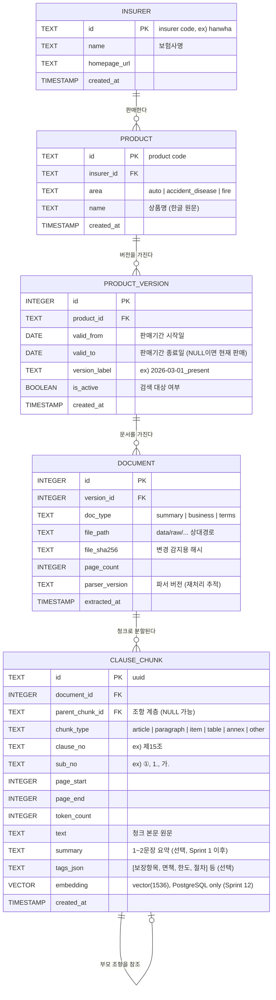
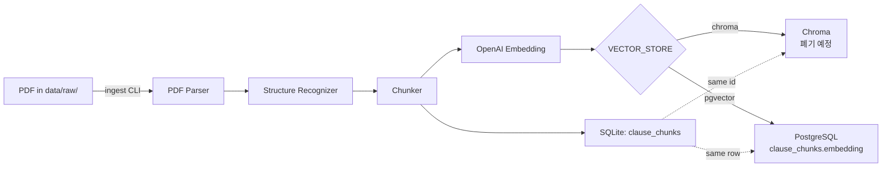

# 데이터 모델

- 작성일: 2026-05-22
- 최종 갱신: 2026-05-25 (Sprint 12 — clause_chunks.embedding + HNSW 인덱스 추가)
- 스프린트: 1 중심 (Sprint 2~3 모델은 윤곽만, Sprint 12 pgvector 반영)
- 관련 요구사항: [REQ-01](../requirements/01_insurance_claim_assistant.md), [REQ-13](../requirements/13_pgvector-migration.md)
- 관련 결정: [tech-decisions.md](tech-decisions.md), [tech-decisions.md § Sprint 12](tech-decisions.md)

## 저장소 분리

| 저장소 | 용도 |
|:--|:--|
| **SQLite** (`./data/app.db`) | 보험사·상품·문서·청크 **메타데이터** |
| **Chroma** (`./data/chroma/`) | 청크 **임베딩 + 검색용 메타** (Sprint 12 이전 기본값 / Sprint 13 이후 폐기 예정) |
| **PostgreSQL + pgvector** | 청크 **임베딩** — `clause_chunks.embedding vector(1536)` (Sprint 12 신규, 운영 권장) |
| **인메모리(dict + TTL)** | 대화 **세션** (Sprint 2부터) |
| **파일 시스템** (`./data/raw/`) | 원본 PDF |

Sprint 12부터 벡터 backend를 `VECTOR_STORE` 환경 변수로 선택합니다. `DATABASE_URL`이 PostgreSQL이면 pgvector가 자동 활성화됩니다. Chroma는 Sprint 13 완료 후 폐기 예정이며 현재는 양쪽 backend를 병행합니다.

청크 메타는 SQLite와 벡터 DB 양쪽에 중복 저장한다. SQLite는 정합성/관리용, 벡터 DB는 검색 시 필터링용. ID는 동일하게 사용 (`chunk_id`)해서 동기화.

## 도메인 객체 (Sprint 1)

| 객체 | 설명 | 비고 |
|:--|:--|:--|
| Insurer | 보험사 | 사용자가 임의로 선정한 2곳 |
| Product | 상품 (예: "개인용자동차보험(공동물건)") | 보험사 × 영역 × 상품명 |
| ProductVersion | 상품의 판매기간 버전 | 약관은 시기별로 개정되므로 버전 관리 필수 |
| Document | 1개의 원본 PDF | 종류: 상품요약 / 사업방법 / 약관확인 |
| ClauseChunk | 약관 의미 단위 청크 | 1청크 ≈ 1조항. 부모-자식 self-ref 가능 |

## 폴더 구조 (원본 PDF)

```
data/raw/
  {insurer_code}/                 ex) hanwha
    {area_code}/                  ex) auto / accident_disease / fire
      {product_code}/             ex) personal_auto_joint
        {version_label}/          ex) 2026-03-01_present
          summary.pdf             상품요약
          business.pdf            사업방법
          terms.pdf               약관확인
```

코드 규칙: 영문 lower_snake_case. 한글명은 메타데이터로 별도 저장.

## ERD (Mermaid)



## 테이블 스키마 (SQLite)

### insurers

| 컬럼 | 타입 | 제약 | 기본값 | 설명 |
|:--|:--|:--|:--|:--|
| id | TEXT | PK | - | 보험사 코드 (lower_snake_case) |
| name | TEXT | NOT NULL | - | 보험사명 (한글 원문) |
| homepage_url | TEXT | NULL | - | 공시실 URL (선택) |
| created_at | TIMESTAMP | NOT NULL | CURRENT_TIMESTAMP | - |

### products

| 컬럼 | 타입 | 제약 | 기본값 | 설명 |
|:--|:--|:--|:--|:--|
| id | TEXT | PK | - | 상품 코드 |
| insurer_id | TEXT | FK → insurers(id), NOT NULL | - | - |
| area | TEXT | NOT NULL, CHECK(area IN ('auto','accident_disease','fire')) | - | 영역 코드 (Sprint 1 T6.5 에서 fire 추가) |
| name | TEXT | NOT NULL | - | 상품명 한글 원문 |
| created_at | TIMESTAMP | NOT NULL | CURRENT_TIMESTAMP | - |

### product_versions

| 컬럼 | 타입 | 제약 | 기본값 | 설명 |
|:--|:--|:--|:--|:--|
| id | INTEGER | PK AUTOINCREMENT | - | - |
| product_id | TEXT | FK → products(id), NOT NULL | - | - |
| valid_from | DATE | NOT NULL | - | 판매기간 시작 |
| valid_to | DATE | NULL | NULL | 현재 판매 중이면 NULL |
| version_label | TEXT | NOT NULL | - | ex) `2026-03-01_present` |
| is_active | BOOLEAN | NOT NULL | 1 | 검색 노출 여부 |
| created_at | TIMESTAMP | NOT NULL | CURRENT_TIMESTAMP | - |

UNIQUE: (product_id, valid_from)

### documents

| 컬럼 | 타입 | 제약 | 기본값 | 설명 |
|:--|:--|:--|:--|:--|
| id | INTEGER | PK AUTOINCREMENT | - | - |
| version_id | INTEGER | FK → product_versions(id), NOT NULL | - | - |
| doc_type | TEXT | NOT NULL, CHECK(doc_type IN ('summary','business','terms')) | - | - |
| file_path | TEXT | NOT NULL | - | 상대 경로 |
| file_sha256 | TEXT | NOT NULL | - | 파일 변경 감지 |
| page_count | INTEGER | NOT NULL | - | - |
| parser_version | TEXT | NOT NULL | - | 재처리 추적 |
| extracted_at | TIMESTAMP | NOT NULL | CURRENT_TIMESTAMP | - |

UNIQUE: (version_id, doc_type)

### clause_chunks

| 컬럼 | 타입 | 제약 | 기본값 | 설명 |
|:--|:--|:--|:--|:--|
| id | TEXT | PK | - | UUID. 벡터 DB ID와 동일 |
| document_id | INTEGER | FK → documents(id), NOT NULL | - | - |
| parent_chunk_id | TEXT | FK → clause_chunks(id), NULL | NULL | 조항 계층 자기참조 |
| chunk_type | TEXT | NOT NULL, CHECK in ('article','paragraph','item','table','annex','other') | - | - |
| clause_no | TEXT | NULL | NULL | ex) `제15조` |
| sub_no | TEXT | NULL | NULL | ex) `①`, `1.`, `가.` |
| page_start | INTEGER | NOT NULL | - | - |
| page_end | INTEGER | NOT NULL | - | - |
| token_count | INTEGER | NOT NULL | - | - |
| text | TEXT | NOT NULL | - | 원문 |
| summary | TEXT | NULL | NULL | Sprint 1 이후 선택 |
| tags_json | TEXT | NULL | NULL | JSON 배열 |
| embedding | VECTOR(1536) | NULL | NULL | **PostgreSQL only** (Sprint 12). text-embedding-3-small 1536차원. SQLite 환경에서는 컬럼 없음 |
| created_at | TIMESTAMP | NOT NULL | CURRENT_TIMESTAMP | - |

## 인덱스 설계

| 테이블 | 인덱스명 | 컬럼 | 종류 | 이유 |
|:--|:--|:--|:--|:--|
| products | idx_products_insurer | insurer_id | INDEX | 보험사별 상품 조회 |
| products | idx_products_area | area | INDEX | 영역 필터링 |
| product_versions | idx_versions_product | product_id | INDEX | 상품별 버전 조회 |
| product_versions | idx_versions_active | is_active, valid_from | COMPOSITE | 활성 버전 + 시점 필터 |
| documents | idx_documents_version_type | version_id, doc_type | UNIQUE | 버전별 문서 종류 유일성 |
| clause_chunks | idx_chunks_document | document_id | INDEX | 문서별 청크 조회 |
| clause_chunks | idx_chunks_parent | parent_chunk_id | INDEX | 계층 탐색 |
| clause_chunks | idx_chunks_clause | document_id, clause_no | COMPOSITE | 조항 단위 조회 |
| clause_chunks | clause_chunks_embedding_hnsw_idx | embedding | **HNSW (PostgreSQL only)** | 코사인 유사도 벡터 검색 (Sprint 12) |

### HNSW 인덱스 상세 (Sprint 12 — PostgreSQL only)

Alembic revision `b1c2d3e4f5a6`에서 생성됩니다. SQLite 환경에서는 자동으로 건너뜁니다.

```sql
CREATE INDEX clause_chunks_embedding_hnsw_idx
    ON clause_chunks USING hnsw (embedding vector_cosine_ops)
    WITH (m = 16, ef_construction = 64);
```

| 파라미터 | 값 | 의미 |
|:--|:--|:--|
| `m` | 16 | 노드당 최대 연결 수. 높을수록 정확도 ↑, 메모리 ↑ |
| `ef_construction` | 64 | 인덱스 빌드 시 후보 탐색 수. 높을수록 품질 ↑, 빌드 시간 ↑ |
| 거리 함수 | `vector_cosine_ops` | 코사인 거리 (`<=>` 연산자). Chroma 기본 cosine과 동등 |

739 청크 기준 HNSW 빌드는 1초 이내에 완료됩니다.

## 벡터 DB 설계 (Sprint 12 기준)

Sprint 12부터 Chroma와 pgvector를 `VECTOR_STORE` 환경 변수로 선택합니다. 두 backend 모두 동일한 임베딩 모델과 메타데이터 구조를 사용합니다.

### 공통 사양

- **임베딩 모델**: `text-embedding-3-small` (1536차원)
- **ID**: SQLite `clause_chunks.id`와 동일 (UUID)
- **거리 함수**: cosine (양쪽 backend 동일)
- **검색 동등성**: 동일 질의에 대해 top-8 overlap ≥ 7/8 보장

### Chroma 컬렉션 (Sprint 13 이후 폐기 예정)

- **컬렉션명**: `insurance_clauses`
- **저장 위치**: `./data/chroma/` (파일 기반)
- **Document**: 청크 본문 텍스트 (필요 시 요약 prepend)
- **ID**: SQLite `clause_chunks.id`와 동일 (UUID)
- **Metadata** (검색 필터링용):

```json
{
  "document_id": 47,
  "insurer_id": "hanwha",
  "insurer_name": "한화손해보험",
  "product_id": "personal_auto_joint",
  "product_name": "개인용자동차보험(공동물건)",
  "area": "auto",
  "version_id": 12,
  "version_label": "2026-03-01_present",
  "valid_from": "2026-03-01",
  "valid_to": null,
  "is_active": true,
  "doc_type": "terms",
  "chunk_type": "article",
  "clause_no": "제15조",
  "sub_no": null,
  "page_start": 12,
  "page_end": 13
}
```

**메타데이터 포함 정책**:
- `document_id` 포함: 검색 결과만으로 어떤 문서에서 왔는지 즉시 식별 가능 + SQLite hydrate 시 단일 조인 키로 사용
- `parent_chunk_id` 제외: 검색 필터링 용도가 없고, 인용 시점에 부모 조항이 필요하면 `chunk_id`로 SQLite에서 즉시 lookup. Chroma 메타 비대화 방지
- `text`, `summary`, `tags_json` 제외: Chroma의 `document` 필드(임베딩 대상 본문)와 중복. SQLite가 source of truth
- `token_count` 제외: 검색 필터링 용도 없음

**SQLite ↔ Chroma 동기화 (정합성 유지)**:
1. 청크 생성: SQLite INSERT 성공 후 Chroma upsert. Chroma 실패 시 SQLite 트랜잭션 롤백 + 재시도
2. 청크 갱신(재파싱): 동일 `chunk_id`로 Chroma upsert. 양쪽 모두 같은 트랜잭션 단위로 처리
3. 청크 삭제: Chroma delete 성공 후 SQLite DELETE. 역순으로 하면 고아 임베딩 발생 가능

영역(auto/accident_disease/fire)별로 컬렉션을 분리할지 단일 컬렉션 + 필터로 갈지는 청크 수가 1만 건을 넘어가면 재검토. Sprint 1은 단일 컬렉션.

### pgvector 저장 방식 (Sprint 12 신규, 운영 권장)

`clause_chunks` 테이블에 `embedding vector(1536)` 컬럼을 추가합니다. 메타데이터는 기존 SQLite 컬럼을 그대로 사용하므로 별도 메타 저장이 필요 없습니다.

| 항목 | 구현 |
|:--|:--|
| 임베딩 저장 | `clause_chunks.embedding vector(1536)` |
| 검색 쿼리 | `SELECT id, text, embedding <=> $1 AS distance FROM clause_chunks WHERE ... ORDER BY distance LIMIT $2` |
| 필터링 | SQL WHERE 절 직접 사용 (`area`, `insurer_id`, `doc_type` 등) |
| 인덱스 | HNSW (m=16, ef_construction=64, cosine_ops) |

Alembic revision: `b1c2d3e4f5a6` (`sprint12_pgvector_embedding`). `down_revision`: `afc2f2f931bf`.

## 세션 모델 (Sprint 2 — 확정)

인메모리 + TTL. ORM/마이그레이션 없음 — `app/sessions/store.py` 의 `SessionStore` 가 dict 로 보관.
세션 종료(명시적 DELETE 또는 TTL 만료) 시 폐기.

### Session pydantic 모델

```python
# app/sessions/schemas.py
class Message(BaseModel):
    role: Literal["user", "assistant"]
    content: str
    created_at: datetime
    # assistant 만: 응답 모드 + 메타 (감사 추적용)
    response_type: Literal["ask", "assessment"] | None = None

class SlotState(BaseModel):
    """현재 채워진 슬롯 상태. None 은 미채움."""
    # 공통
    insurer: str | None = None
    area: Literal["auto", "fire", "accident_disease"] | None = None
    product: str | None = None
    version: str | None = None
    incident_date: date | None = None
    evidence: list[str] = []
    # auto 전용
    incident_type: str | None = None       # 추돌/단독/대물/대인
    fault_ratio: int | None = None         # 0~100
    damage_type: str | None = None         # 자차/대물/대인
    # fire 전용
    loss_type: str | None = None           # 전소/부분소실/도난/누수
    damaged_items: list[str] = []
    cause: str | None = None
    # accident_disease 전용
    diagnosis: str | None = None
    hospitalization_days: int | None = None
    outpatient_visits: int | None = None

class Session(BaseModel):
    session_id: str                        # uuid v4
    created_at: datetime
    last_activity_at: datetime
    status: Literal["gathering", "analyzing", "answered", "closed"]
    slots: SlotState
    history: list[Message] = []

    def is_expired(self, now: datetime, ttl_seconds: int) -> bool:
        return (now - self.last_activity_at).total_seconds() > ttl_seconds
```

### 영역별 필수 슬롯 (확정)

| 슬롯 | 공통 (모든 영역) | auto | fire | accident_disease |
|:--|:--|:--|:--|:--|
| `area` | O (가장 먼저 결정) |  |  |  |
| `insurer` | O | | | |
| `product` | O | | | |
| `version` | O (없으면 active 자동 선택) | | | |
| `incident_date` | O | | | |
| `incident_type` |  | O (추돌/단독/대물/대인) |  |  |
| `fault_ratio` |  | O (0~100) |  |  |
| `damage_type` |  | O (자차/대물/대인) |  |  |
| `loss_type` |  |  | O (전소/부분소실/도난/누수) |  |
| `damaged_items` |  |  | O (가전/가구/건물 등) |  |
| `cause` |  |  | O (원인) |  |
| `diagnosis` |  |  |  | O (진단명) |
| `hospitalization_days` |  |  |  | O (입원 일수) |
| `outpatient_visits` |  |  |  | O (통원 횟수) |
| `evidence` | 권장 | 신고서/사진/영수증 | 사진/소방서확인/영수증 | 진단서/입원확인서/영수증 |

### `next_question` 우선순위

1. `area` 미정 → 가장 먼저 (다른 슬롯 의미 없음)
2. `insurer` + `product` → RAG 필터 직결
3. 영역별 필수 슬롯
4. `evidence` 는 마지막에 권장 (사용자가 시작 시 미보유 일반적)

한 번에 1~2개 슬롯만 질문 (피로 회피).

### 상태 전이 (api-spec.md 와 동기화)

```
gathering ── 필수 슬롯 충족 ──→ analyzing ── assessment 생성 성공 ──→ answered
    ↑                                ↓
    └────── 사용자 슬롯 변경 ────────┘
answered ── 사용자 보정 메시지 ─→ gathering (재분기)
*  ── DELETE 또는 TTL 만료 ──→ closed
```

## 데이터 흐름



Sprint 12부터 임베딩 저장 대상이 `VECTOR_STORE` 설정에 따라 달라집니다. `ica reindex --vector-store=pgvector`로 기존 Chroma 데이터를 pgvector로 마이그레이션합니다.

## 마이그레이션 (Sprint 1)

SQLAlchemy + Alembic 사용 권장 (도메인 응집 구조와 호환). 초기 마이그레이션 SQL은 Sprint 1 구현 시 자동 생성. 본 문서는 스키마만 정의.

## [확인 필요]

- `area` 코드 확장 시 CHECK 제약을 ENUM 대체 대신 별도 ref 테이블로 갈지 (Sprint 4 이후 확장 시 결정)
- 청크 `summary`, `tags_json` 의 채움 시점 — 임베딩 전 LLM으로 채울지 사후 채울지 (Sprint 2 응답 품질 보고 결정)
- 표(table) 청크의 원문 보존 형식 — Markdown vs HTML vs CSV (Sprint 1 검증 단계에서 결정)

## 정규화 판단

- 1NF/2NF/3NF 만족
- `clause_chunks`에 보험사명/상품명 등을 비정규화하여 중복 저장하지 않는다 (정합성 우선). Chroma 메타에는 검색 성능을 위해 비정규화 복제 (그쪽은 단방향 복사 — SQLite가 source of truth)
- 비정규화 정합성 유지: Chroma 메타 갱신은 SQLite 트랜잭션 후 동기 호출. 실패 시 SQLite 롤백 후 재시도
