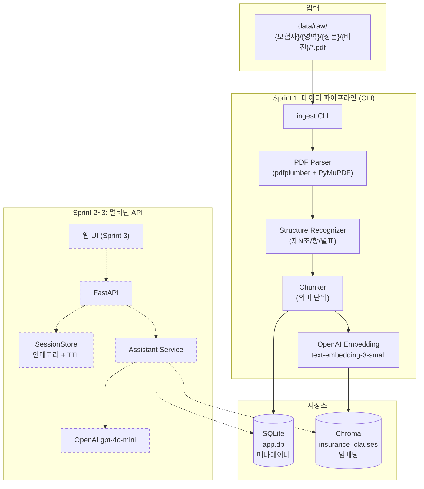

# 시스템 아키텍처

Sprint 1(데이터 적재 CLI) + Sprint 2~3(멀티턴 HTTP API)를 한 그림에 표시한다. 회색 점선 박스는 Sprint 2~3에서 추가되는 컴포넌트.

요약:
- Sprint 1은 PDF → 청크 → SQLite + Chroma 로 적재하는 단방향 파이프라인.
- Sprint 2~3는 대화 세션을 메모리에 두고 Assistant Service가 Chroma 검색 + SQLite 메타 hydrate + LLM 호출로 응답.
- OpenAI는 임베딩(Sprint 1) + LLM(Sprint 2)에 모두 사용. 단일 API 키.
