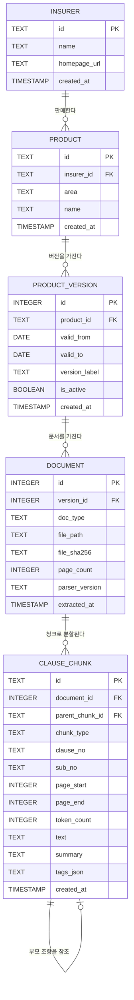

# ERD — 전체 테이블 관계도

Sprint 1 SQLite 메타데이터 스키마를 시각화한다. Chroma 컬렉션은 별도(임베딩 + 검색 메타) 이지만 `chunk.id` 를 키로 SQLite `clause_chunks` 와 연결된다.

요약: 보험사 → 상품 → 판매기간 버전 → PDF 문서 → 의미 단위 청크의 계층. 청크는 부모 조항을 self-ref 한다.
