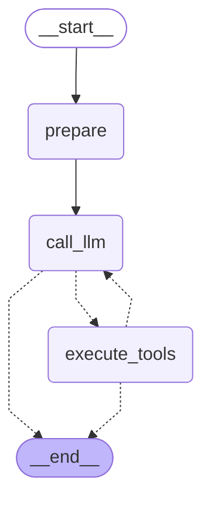

# LangGraph Agent Flow (Sprint 13)

> 자동 생성 — `ica agent-graph --out <path>` 로 재생성한다.
> 소스: `app/rag/langgraph_agent.py build_agent_graph()`

```mermaid
---
config:
  flowchart:
    curve: linear
---
graph TD;
	__start__([<p>__start__</p>]):::first
	prepare(prepare)
	call_llm(call_llm)
	execute_tools(execute_tools)
	__end__([<p>__end__</p>]):::last
	__start__ --> prepare;
	call_llm -.-> __end__;
	call_llm -.-> execute_tools;
	execute_tools -.-> __end__;
	execute_tools -.-> call_llm;
	prepare --> call_llm;
	classDef default fill:#f2f0ff,line-height:1.2
	classDef first fill-opacity:0
	classDef last fill:#bfb6fc

```
