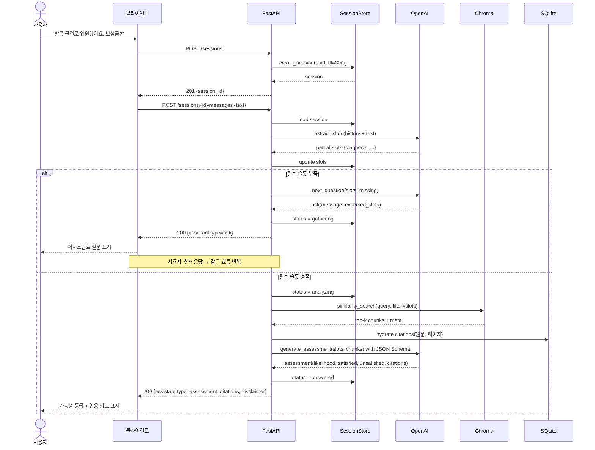

# 시퀀스 — 멀티턴 대화 (Sprint 2)

`POST /sessions/{id}/messages` 호출 시 어시스턴트가 정보 보강 질의(`ask`) 또는 최종 판단(`assessment`) 중 하나를 반환하는 흐름.

요약:
- `extract_slots` 와 `next_question` 두 LLM function call로 정보 보강 루프를 만든다.
- 필수 슬롯이 다 차야 RAG 검색 → 최종 판단으로 넘어간다.
- 출력은 JSON Schema로 강제해 인용 누락을 방지한다.
