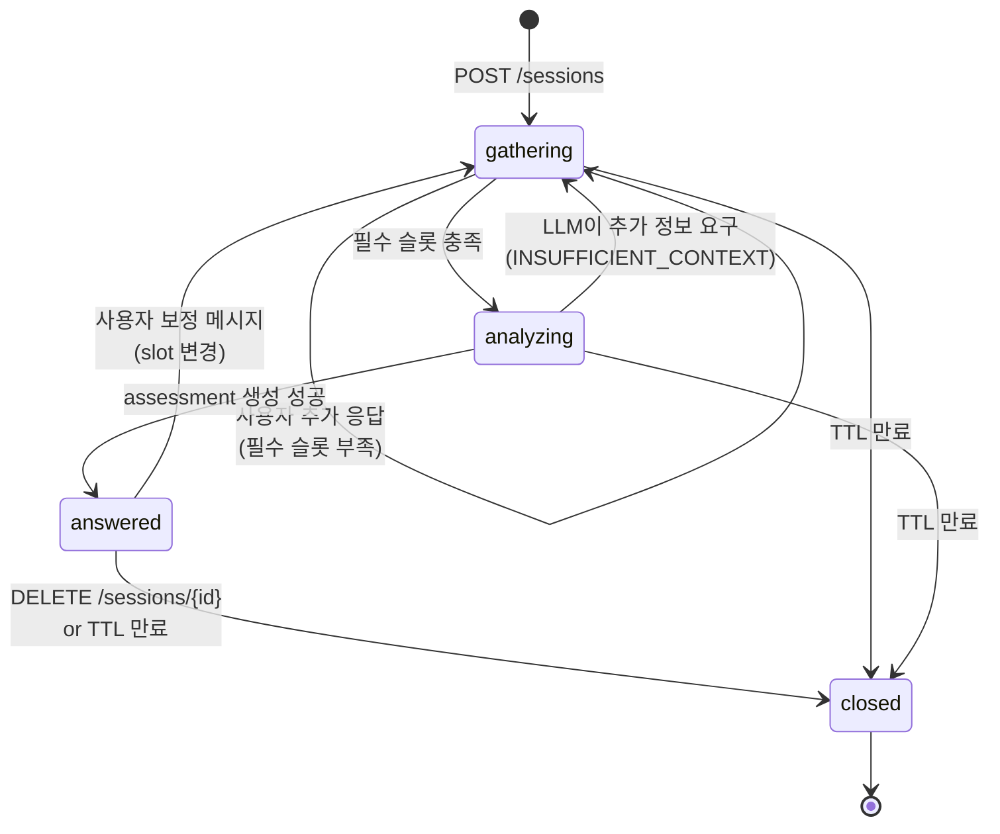

# 상태 다이어그램 — 대화 세션 (Sprint 2)

상태 의미:
- **gathering**: 슬롯이 부족해 어시스턴트가 후속 질문 중
- **analyzing**: 슬롯 충족 후 RAG 검색 + 응답 생성 진행 중 (짧은 시간)
- **answered**: 최종 판단 응답을 1회 이상 제공한 상태. 사용자가 정보 보정 메시지를 주면 다시 `gathering` 으로 회귀 가능
- **closed**: 명시적 종료 또는 TTL(30분) 만료. 메모리에서 제거
