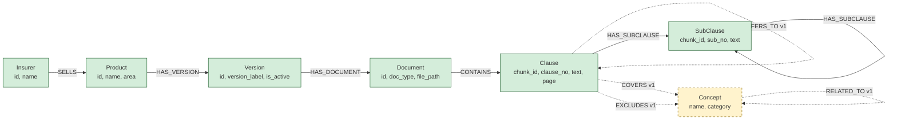

# Neo4j 그래프 스키마

- 작성일: 2026-05-24
- 스프린트: 4
- 관련 요구사항: [REQ-04](../requirements/04_graphrag_react.md)
- 관련 설계: [tech-decisions.md § Sprint 4](tech-decisions.md), [rag-architecture.md](rag-architecture.md), [data-model.md](data-model.md)

본 문서는 약관 데이터를 Neo4j 지식 그래프로 적재하기 위한 **노드/엣지 스키마 + 인덱스 + 적재 규칙 + Cypher 예시**를 정의한다. 단계는 v0 (LLM 없는 결정론 매핑) + v1 (LLM 기반 엔티티/관계 추출) 으로 분리.

---

## 1. 전체 다이어그램 (v0 + v1)



- **실선/녹색** = v0 (SQLite 직접 변환, LLM 0회). Sprint 4 안에 구축
- **점선/노랑** = v1 (LLM 추출). Sprint 5+ 백로그

---

## 2. 노드 라벨 (v0)

### 2.1 `Insurer`

| 속성 | 타입 | 필수 | 비고 |
|:--|:--|:--|:--|
| `id` | string | O | 보험사 코드 (예: `hanwha`) — Unique |
| `name` | string | O | 한글명 (예: `한화손해보험`) |
| `homepage_url` | string | X | (선택) |

**SQLite 출처**: `insurers` 테이블 1:1

### 2.2 `Product`

| 속성 | 타입 | 필수 | 비고 |
|:--|:--|:--|:--|
| `id` | string | O | 상품 코드 (예: `personal_auto_joint`) — Unique |
| `name` | string | O | 한글명 |
| `area` | string | O | `auto` / `fire` / `accident_disease` |

**SQLite 출처**: `products` 테이블 1:1. `insurer_id` 는 엣지로 변환

### 2.3 `Version`

| 속성 | 타입 | 필수 | 비고 |
|:--|:--|:--|:--|
| `id` | integer | O | product_versions.id — Unique |
| `version_label` | string | O | 예: `2026-03-01_present` |
| `valid_from` | date | O | ISO |
| `valid_to` | date | X | null = 현재 |
| `is_active` | boolean | O | |

**SQLite 출처**: `product_versions` 테이블 1:1

### 2.4 `Document`

| 속성 | 타입 | 필수 | 비고 |
|:--|:--|:--|:--|
| `id` | integer | O | documents.id — Unique |
| `doc_type` | string | O | `summary` / `business` / `terms` |
| `file_path` | string | O | 원본 PDF 경로 |
| `page_count` | integer | O | |

**SQLite 출처**: `documents` 테이블 1:1.

**의도적 누락 (WARN-4 명시)**: `file_sha256` / `parser_version` / `extracted_at` 컬럼은 그래프에 적재하지 않는다. 이유: graph traversal/Cypher 쿼리에서 사용처 없음 (해시/파서 버전은 ingestion 검증 용도, SQLite 가 진실의 원천). v1 에서 필요해지면 후속 추가.

### 2.5 `Clause`

| 속성 | 타입 | 필수 | 비고 |
|:--|:--|:--|:--|
| `chunk_id` | string (UUID) | O | clause_chunks.id — Unique |
| `clause_no` | string | O | 예: `제15조` |
| `text` | string | O | 청크 본문 |
| `page_start` | integer | O | |
| `page_end` | integer | O | |
| `token_count` | integer | O | |
| `summary` | string | X | (선택) |

**SQLite 출처**: `clause_chunks` 테이블 (`chunk_type='article'` 인 행만)

### 2.6 `SubClause`

| 속성 | 타입 | 필수 | 비고 |
|:--|:--|:--|:--|
| `chunk_id` | string (UUID) | O | clause_chunks.id — Unique |
| `sub_no` | string | X | 예: `①`, `1.` (null 가능) |
| `text` | string | O | |
| `page_start` | integer | O | |
| `chunk_type` | string | O | `paragraph` / `item` / `table` / `annex` / **`other`** (catch-all) |

**SQLite 출처**: `clause_chunks` 테이블 (`chunk_type` ∈ {paragraph, item, table, annex, **other**}).

**`other` 처리 규칙 (CRIT-1 보정)**: `app/chunks/schemas.py` 의 `ChunkType` enum 에 `other` 가 유효값으로 존재한다 (구조 인식 실패 시 fallback). 그래프 적재 시 `chunk_type='other'` 인 청크는 **SubClause 로 분류** 한다. 손실 방지가 우선 — graph 에서 catch-all 로 다뤄지면 vector RAG 결과와 chunk_id dedupe 가능.

---

## 3. 엣지 (v0)

| 엣지 | 방향 | 속성 | SQLite 출처 |
|:--|:--|:--|:--|
| `SELLS` | `(Insurer)-[:SELLS]->(Product)` | — | `products.insurer_id` |
| `HAS_VERSION` | `(Product)-[:HAS_VERSION]->(Version)` | — | `product_versions.product_id` |
| `HAS_DOCUMENT` | `(Version)-[:HAS_DOCUMENT]->(Document)` | — | `documents.version_id` |
| `CONTAINS` | `(Document)-[:CONTAINS]->(Clause)` | `seq:int` (문서 내 순서, 선택) | `clause_chunks.document_id` (article 만) |
| `HAS_SUBCLAUSE` | `(Clause\|SubClause)-[:HAS_SUBCLAUSE]->(SubClause)` | `seq:int` | `clause_chunks.parent_chunk_id` |

**HAS_SUBCLAUSE 주의**: 부모는 Clause 또는 SubClause 둘 다 가능 (중첩 항/호 표현). Cypher 트래버설 시 가변 깊이 사용 (`[:HAS_SUBCLAUSE*0..3]`).

---

## 4. v1 노드/엣지 (LLM 추출 — Sprint 5+ 백로그)

### 4.1 `Concept` 노드
- 속성: `name` (예: "발목 골절", "교통사고", "면책사유"), `category` (`condition` / `coverage_item` / `exclusion`)
- 출처: LLM 으로 청크 텍스트에서 추출 (Chain-of-Thought 또는 keyword extraction)

### 4.2 v1 엣지
- `(Clause)-[:REFERS_TO]->(Clause)` — "제N조에 따른" 패턴. regex 1차 후 LLM 검증
- `(Clause)-[:COVERS]->(Concept)` — 보장 항목 매핑
- `(Clause)-[:EXCLUDES]->(Concept)` — 면책 사유 매핑
- `(Concept)-[:RELATED_TO]->(Concept)` — 동의어/상위 개념

---

## 5. 인덱스 + 제약 (Cypher DDL)

`ica graph-build` 첫 실행 시 자동 생성:

```cypher
// Unique 제약 (자동 인덱스 포함)
CREATE CONSTRAINT insurer_id_unique IF NOT EXISTS FOR (n:Insurer) REQUIRE n.id IS UNIQUE;
CREATE CONSTRAINT product_id_unique IF NOT EXISTS FOR (n:Product) REQUIRE n.id IS UNIQUE;
CREATE CONSTRAINT version_id_unique IF NOT EXISTS FOR (n:Version) REQUIRE n.id IS UNIQUE;
CREATE CONSTRAINT document_id_unique IF NOT EXISTS FOR (n:Document) REQUIRE n.id IS UNIQUE;
CREATE CONSTRAINT clause_chunk_id_unique IF NOT EXISTS FOR (n:Clause) REQUIRE n.chunk_id IS UNIQUE;
CREATE CONSTRAINT subclause_chunk_id_unique IF NOT EXISTS FOR (n:SubClause) REQUIRE n.chunk_id IS UNIQUE;

// 검색 인덱스 (자주 쓰는 속성)
CREATE INDEX clause_no_index IF NOT EXISTS FOR (n:Clause) ON (n.clause_no);
CREATE INDEX product_area_index IF NOT EXISTS FOR (n:Product) ON (n.area);
CREATE INDEX version_active_index IF NOT EXISTS FOR (n:Version) ON (n.is_active);
```

---

## 6. 적재 알고리즘 (`ica graph-build`)

```python
# 의사 코드 (app/rag/indexer.py 구현 대상)
def build_graph(session: SqlSession, graph: Neo4jGraph) -> None:
    """SQLite → Neo4j 결정론 변환. LLM 0회 호출."""
    # Step 1: 제약/인덱스 생성
    apply_schema_ddl(graph)
    
    # Step 2: 노드 적재 (MERGE = upsert)
    for insurer in session.query(Insurer): MERGE_node(graph, "Insurer", {...})
    for product in session.query(Product): MERGE_node(graph, "Product", {...})
    for version in session.query(ProductVersion): MERGE_node(graph, "Version", {...})
    for doc in session.query(Document): MERGE_node(graph, "Document", {...})
    for chunk in session.query(ClauseChunk).filter_by(chunk_type='article'):
        MERGE_node(graph, "Clause", {...})
    for chunk in session.query(ClauseChunk).filter(chunk_type != 'article'):
        MERGE_node(graph, "SubClause", {...})
    
    # Step 3: 엣지 적재 (MATCH + MERGE)
    # SELLS / HAS_VERSION / HAS_DOCUMENT / CONTAINS / HAS_SUBCLAUSE
    ...
```

**멱등 보장**: 모든 적재가 `MERGE` 라 재실행해도 중복 없음. SQLite 가 진실의 원천 (source of truth) — Neo4j 는 캐시·뷰 역할.

**증분 갱신**: Sprint 5+ 백로그. 현재 v0 은 `ica graph-build` 전체 재구축.

---

## 7. Cypher 예시 쿼리 (사용자 시연 시나리오)

### 7.1 "한화 자동차 약관의 보험금 지급 사유 조항"

```cypher
MATCH (i:Insurer {id: 'hanwha'})-[:SELLS]->(p:Product {area: 'auto'})
      -[:HAS_VERSION]->(v:Version {is_active: true})
      -[:HAS_DOCUMENT]->(d:Document {doc_type: 'terms'})
      -[:CONTAINS]->(c:Clause)
WHERE c.text CONTAINS '보험금 지급 사유'
RETURN i.name, p.name, c.clause_no, c.page_start, c.text
ORDER BY c.page_start LIMIT 5;
```

### 7.2 "제6조의 모든 항/호 본문" (계층 활용)

```cypher
MATCH (c:Clause {clause_no: '제6조'})-[:HAS_SUBCLAUSE*1..3]->(s:SubClause)
RETURN c.clause_no, s.sub_no, s.text, s.page_start
ORDER BY s.page_start, s.sub_no;
```

### 7.2.1 HAS_SUBCLAUSE 부모 union 패턴 (WARN-1 보정)

HAS_SUBCLAUSE 의 부모는 Clause 또는 SubClause 둘 다 가능 (중첩 항/호). Cypher MATCH 패턴 권장:

```cypher
// 부모가 Clause 인 경우 (top-level 항)
MATCH (c:Clause)-[:HAS_SUBCLAUSE]->(s:SubClause)

// 부모가 SubClause 인 경우 (중첩 호/목)
MATCH (s1:SubClause)-[:HAS_SUBCLAUSE]->(s2:SubClause)

// 부모 무관 (둘 다 매칭) — 라벨 union
MATCH (parent)-[:HAS_SUBCLAUSE]->(child:SubClause)
WHERE parent:Clause OR parent:SubClause

// 가변 깊이 트래버설 (Clause 부터 모든 후손 SubClause)
MATCH (c:Clause)-[:HAS_SUBCLAUSE*1..5]->(s:SubClause)
```

위 마지막 패턴이 RAG 검색에서 가장 자주 쓰임 — 한 조항(Clause)의 모든 항/호/표/별표 (SubClause) 를 가져옴.

### 7.3 "자동차 영역에 적재된 보험사·상품" (placeholder 문제 해결)

```cypher
MATCH (i:Insurer)-[:SELLS]->(p:Product {area: 'auto'})
RETURN DISTINCT i.name AS insurer, p.name AS product;
```

→ Sprint 3 데모의 "보험사1/2/3" placeholder 대신 실제 데이터로 옵션 채움 가능 (Sprint 5 의 옵션 동적 생성 기능과 연계).

### 7.4 "제15조에 따른 보장" (v1 — Sprint 5+)

```cypher
MATCH (c1:Clause {clause_no: '제15조'})-[:REFERS_TO]->(c2:Clause)
RETURN c1.clause_no, c2.clause_no, c2.text;
```

→ v1 의 REFERS_TO 엣지가 없으면 vector RAG 로는 추적 불가.

---

## 8. GraphCypherQAChain 프롬프트 힌트

`langchain_neo4j.GraphCypherQAChain` 의 `enhanced_schema=True` 옵션으로 위 스키마가 자동으로 LLM 프롬프트에 포함됨. 추가 권장:

**few-shot 예시** (시스템 프롬프트에 첨부):
- 한국어 질문 → 위 § 7 의 Cypher 4개 예시
- 약관 도메인 키워드 ("제N조", "지급 사유", "면책") 가이드

**가드**:
- `top_k=10` (기본). 결과 폭증 차단
- `validate_cypher=True` — 생성된 Cypher 의 syntax 검증
- `return_intermediate_steps=True` — 생성된 Cypher 응답에 포함 (감사 추적)

---

## 9. 검증 체크리스트 (design-reviewer 검토 대상)

- [ ] 모든 v0 노드 라벨이 SQLite 테이블과 1:1 매핑되는가
- [ ] 모든 v0 엣지가 SQLite FK 와 1:1 매핑되는가
- [ ] HAS_SUBCLAUSE 의 부모 라벨 union (Clause | SubClause) 처리 가능한가 (Cypher MATCH 패턴 작성 가능)
- [ ] Unique 제약이 적재 멱등성을 보장하는가
- [ ] `chunk_type` 분류 (article / paragraph / item / table / annex) 와 Clause/SubClause 분리 규칙이 명확한가
- [ ] § 7 예시 쿼리가 실제 적재된 데이터 (739 청크) 에 대해 동작하는가 (적재 후 smoke test)
- [ ] v0 → v1 확장 시 기존 노드/엣지 영향 없는가 (additive only)
- [ ] Cypher 인덱스가 § 7 쿼리 패턴을 충족하는가

---

## 10. 변경 이력

| 일자 | 변경 | 비고 |
|:--|:--|:--|
| 2026-05-24 | v0 스키마 확정 (LLM 0회) | researcher 03 + PM-05 |
| (TBD) | v1 LLM 추출 노드/엣지 추가 | Sprint 5+ |
