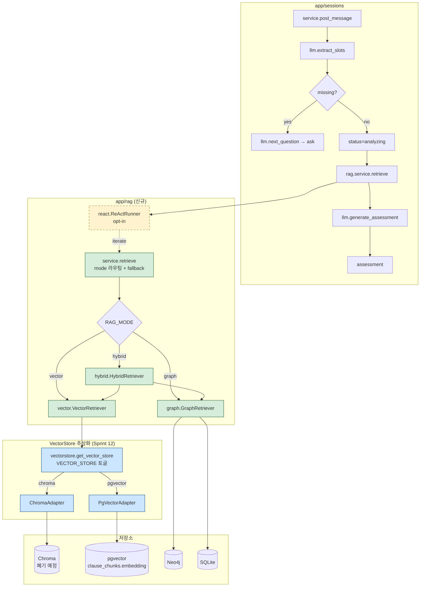
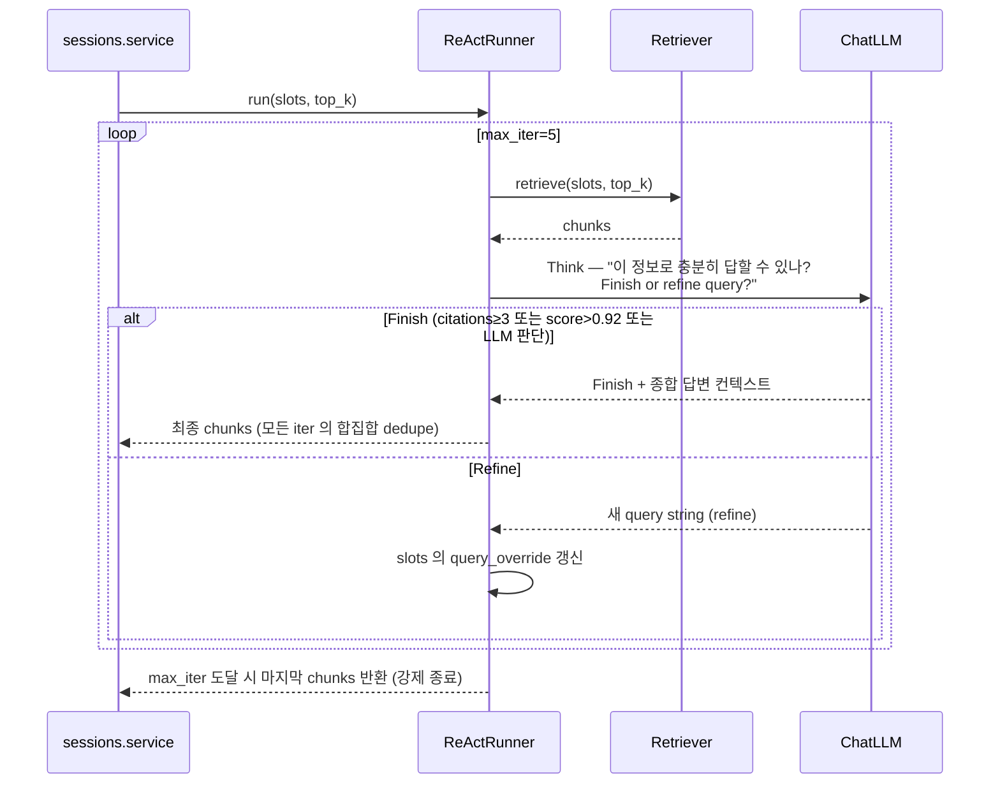

# RAG 아키텍처 — Vector / Graph / Hybrid + ReAct

- 작성일: 2026-05-24
- 최종 갱신: 2026-05-25 (Sprint 12 — VectorStore 추상화 레이어 추가)
- 스프린트: 4 (기반), 12 (VectorStore 어댑터 추가)
- 관련 요구사항: [REQ-04](../requirements/04_graphrag_react.md), [REQ-13](../requirements/13_pgvector-migration.md)
- 관련 설계: [tech-decisions.md § Sprint 4](tech-decisions.md), [tech-decisions.md § Sprint 12](tech-decisions.md), [graph-schema.md](graph-schema.md), [api-spec.md](api-spec.md)

본 문서는 **app/rag/ 도메인의 모듈 구조 + Retriever Protocol + RAG_MODE 토글 + ReAct loop + sessions.service 통합 지점**을 정의한다.

Sprint 12에서 **VectorStore 추상화 레이어** (`app/rag/vectorstore.py`)가 추가되었다. VectorRetriever가 Chroma 또는 pgvector 중 어느 backend를 사용하는지 환경 변수(`VECTOR_STORE`)로 선택하며, Retriever Protocol은 변경 없이 유지된다.

---

## 1. 전체 아키텍처



---

## 2. 모듈 구조

```
app/rag/
├── __init__.py
├── service.py        # retrieve(slots, top_k, *, mode=None, react=None) 단일 진입점
├── protocols.py      # Retriever Protocol + RetrievalResult
├── vector.py         # VectorRetriever — VectorStoreAdapter 주입받아 사용 (Sprint 12 리팩토링)
├── vectorstore.py    # VectorStoreAdapter Protocol + ChromaAdapter + PgVectorAdapter + get_vector_store() (Sprint 12 신규)
├── graph.py          # GraphRetriever (langchain_neo4j + GraphCypherQAChain)
├── hybrid.py         # HybridRetriever (vector + graph 합성)
├── react.py          # ReActRunner (opt-in, assessment 모드만)
├── indexer.py        # build_graph(): SQLite → Neo4j 결정론 변환 ("ica graph-build" 진입점)
└── prompts.py        # Cypher 생성 few-shot, ReAct Think/Action 프롬프트
```

---

## 3. Retriever Protocol (공통 인터페이스)

`app/rag/protocols.py`:

```python
from typing import Protocol
from app.sessions.schemas import SlotState

class RetrievalResult(TypedDict):
    """단일 검색 결과 (기존 search.service.similarity_search 와 동일 계약)."""
    id: str
    text: str
    score: float
    metadata: dict[str, Any]  # insurer/product/version/clause_no/sub_no/page 등
    source: Literal["vector", "graph"]  # 어느 retriever 결과인지 (Hybrid 디버그용)

class Retriever(Protocol):
    """Vector/Graph/Hybrid 공통 인터페이스."""

    def retrieve(self, slots: SlotState, top_k: int = 8) -> list[RetrievalResult]:
        ...

    def health(self) -> bool:
        """저장소 연결 검사 (fallback 판단용)."""
        ...
```

**계약**: 반환 타입이 기존 `list[dict[str, Any]]` 과 호환. `sessions.service` 변경 최소.

---

## 4. RAG_MODE 라우팅 + Graceful Fallback

`app/rag/service.py`:

```python
def retrieve(
    slots: SlotState,
    top_k: int = 8,
    *,
    mode: RagMode | None = None,
    react: bool | None = None,
) -> list[RetrievalResult]:
    """
    mode/react 가 None 이면 settings 값 사용.
    Neo4j 다운 → vector 자동 폴백 + 로그 경고.
    """
    settings = get_settings()
    mode = mode or settings.rag_mode  # vector|graph|hybrid
    react = react if react is not None else settings.rag_react

    # 1) Retriever 선택
    if mode == "graph" or mode == "hybrid":
        if not _graph_health():
            logger.warning("Neo4j 연결 실패 → vector 모드로 fallback (mode=%s)", mode)
            mode = "vector"

    retriever = _get_retriever(mode)

    # 2) ReAct opt-in (assessment 모드만 — sessions.service 가 호출 시 명시)
    if react:
        return ReActRunner(retriever).run(slots, top_k)

    # 3) 단발 호출
    return retriever.retrieve(slots, top_k)


def _graph_health() -> bool:
    """Neo4j ping. 실패 시 False (단일 호출 timeout 1s)."""
    try:
        return _graph_singleton().health()
    except Exception as exc:
        logger.warning("graph health check failed: %s", exc)
        return False
```

**Fallback 정책**:
- Neo4j 다운 → vector mode 자동 폴백
- Cypher 생성/실행 실패 → vector 결과만 사용 (hybrid 의 경우)
- 모두 실패 → 빈 list 반환 (sessions.service 가 `_build_no_match_ask` 로 분기)

---

## 5. VectorRetriever (`app/rag/vector.py`)

Sprint 12에서 VectorRetriever가 `VectorStoreAdapter`를 주입받도록 리팩토링되었다. backend(Chroma / pgvector) 전환 시 VectorRetriever 코드는 변경 없다.

```python
class VectorRetriever:
    def __init__(self, store: VectorStoreAdapter | None = None):
        self._store = store or get_vector_store()  # env 토글로 자동 선택

    def retrieve(self, slots, top_k):
        query, filters = _slots_to_query_and_filters(slots)
        results = self._store.query(query_embedding, n_results=top_k, where=filters)
        return [{**r, "source": "vector"} for r in results]

    def health(self) -> bool:
        return self._store.health()  # Sprint 12: Chroma 직접 의존 제거
```

**Sprint 4 구현 참고 (역사적 기록)**:
- 옵션 A: LangChain Chroma 래퍼 — Sprint 12에서 ChromaAdapter 내부로 격리됨
- 옵션 B (채택): 기존 `search_service.similarity_search` 호출 → Sprint 12에서 어댑터 호출로 위임

## 5.1 VectorStore 추상화 (`app/rag/vectorstore.py` — Sprint 12 신규)

```python
class VectorStoreAdapter(Protocol):
    def add(self, embeddings: list[list[float]], metadatas: list[dict], ids: list[str]) -> None: ...
    def query(self, embedding: list[float], n_results: int, where: dict | None = None) -> list[QueryResult]: ...
    def delete(self, ids: list[str]) -> None: ...
    def count(self) -> int: ...
    def health(self) -> bool: ...

def get_vector_store() -> VectorStoreAdapter:
    settings = get_settings()
    if settings.effective_vector_store == "pgvector":
        return PgVectorAdapter(settings.database_url)
    return ChromaAdapter(settings.chroma_db_path)
```

| 구현체 | 저장소 | 비고 |
|:--|:--|:--|
| `ChromaAdapter` | `chroma_db/` (파일) | 기존 `app/search/service.py` thin wrap. Sprint 13 이후 폐기 |
| `PgVectorAdapter` | `clause_chunks.embedding` (PostgreSQL) | `psycopg` + `pgvector`. HNSW 인덱스 활용 |

`VECTOR_STORE` 자동 선택 로직은 [tech-decisions.md § Sprint 12](tech-decisions.md) 참고.

---

## 6. GraphRetriever (`app/rag/graph.py`)

```python
from langchain_neo4j import Neo4jGraph, GraphCypherQAChain
from langchain_openai import ChatOpenAI

class GraphRetriever:
    def __init__(self, settings):
        self._graph = Neo4jGraph(
            url=settings.neo4j_uri,
            username=settings.neo4j_username,
            password=settings.neo4j_password,
            enhanced_schema=True,  # graph-schema 자동 LLM 프롬프트 주입
        )
        self._chain = GraphCypherQAChain.from_llm(
            llm=ChatOpenAI(model=settings.llm_model, temperature=0),
            graph=self._graph,
            verbose=False,  # PoC 외 운영 시 False
            allow_dangerous_requests=True,
            return_intermediate_steps=True,
            validate_cypher=True,
            top_k=10,
        )

    def retrieve(self, slots, top_k):
        question = _slots_to_question(slots)  # 자연어 질문 합성
        result = self._chain.invoke({"query": question})
        # result["result"] = 자연어 답변, result["intermediate_steps"] = [{query: Cypher}, {context: rows}]
        rows = _cypher_rows_to_results(result, top_k)
        # WARN-2 보정 — source 필드 명시 (Hybrid dedupe/디버그용)
        return [{**r, "source": "graph"} for r in rows]

    def health(self) -> bool:
        try:
            self._graph.query("RETURN 1")
            return True
        except Exception:
            return False
```

**Cypher 결과 → RetrievalResult 변환**: Cypher 가 반환한 Clause/SubClause 노드의 `chunk_id`, `text`, `clause_no` 등을 RetrievalResult 형식으로 매핑. SQLite 의 hydrate (insurer 한글명 등) 는 selectively 추가.

**한계 (Sprint 4 안에선 보정 X)**:
- Cypher 자동 생성이 한국어 약관 도메인에서 실패할 수 있음 → vector 폴백
- `chunk_id` 기반이 아니라 텍스트 검색이라 환각 위험 → SQLite hydrate 로 검증

---

## 7. HybridRetriever (`app/rag/hybrid.py`)

```python
class HybridRetriever:
    def __init__(self, vector, graph):
        self._vector = vector
        self._graph = graph

    def retrieve(self, slots, top_k):
        # 병렬 호출 (asyncio.gather 가능, 단계적으로 도입)
        v_results = self._vector.retrieve(slots, top_k)
        try:
            g_results = self._graph.retrieve(slots, top_k)
        except Exception as exc:
            logger.warning("graph retrieve 실패 → vector only: %s", exc)
            g_results = []

        # 합성 정책 (단순 union + dedupe by chunk_id, score 기준 정렬)
        merged = _dedupe_by_chunk_id(v_results + g_results)
        merged.sort(key=lambda r: r["score"], reverse=True)
        return merged[:top_k]
```

**합성 정책 v0**:
- chunk_id 중복 제거 (vector + graph 가 같은 청크 매칭하면 score 높은 것 유지)
- score 정렬 후 top_k

**v1 (Sprint 5+ 백로그)**: RRF (Reciprocal Rank Fusion) 또는 LLM 재랭킹

---

## 8. ReAct Loop (`app/rag/react.py`)

### 8.1 시퀀스



### 8.2 종료 조건

| 조건 | 우선순위 | 구현 |
|:--|:--|:--|
| LLM 이 Finish 액션 선택 | 1 | "사용 가능한 정보로 assessment 가능" 판단 시 |
| citations≥3 도달 | 2 | 합집합 chunks 가 3개 이상 (서로 다른 clause) |
| 단일 chunk score > 0.92 | 3 | 고신뢰 즉시 종료 |
| iter == max_iter (=5) | 4 (강제) | 마지막 iter 결과 반환 |

### 8.3 비용 / 시간

- 평균 3 iter → LLM 호출 추가 3회 (Think 만, Cypher 생성은 GraphRetriever 내부에서 별도)
- 1턴 평균 비용 ~2.5배 (gpt-4o-mini 기준 $0.0003 → $0.0008)
- 시간 추가 ~3~6초 (각 iter LLM 호출 1~2초)

### 8.4 적용 범위

- ✅ `generate_assessment` 호출 직전 (slots 충족 → status=analyzing 분기)
- ❌ `next_question` 단계 (슬롯 수집 — retrieve 무의미)
- ❌ create_session (initial_message 없을 시)

---

## 9. sessions.service 통합 지점 (변경 1줄)

**before** (`app/sessions/service.py` L181 부근):
```python
chunks = _search_chunks(session.slots)  # 내부에서 search_service.similarity_search 호출
```

**after**:
```python
from app.rag import service as rag_service

chunks = rag_service.retrieve(
    session.slots,
    top_k=8,
    react=get_settings().rag_react,  # env 토글
)
```

**`_search_chunks` 처리 정책 (WARN-5 보정)**: 함수 본체는 **제거하지 않고 thin wrapper 로 유지**. 이유:
- `_slots_to_query()` / `_slots_to_filters()` 의 슬롯 → query/filter 변환 로직은 rag.service.retrieve 내부 또는 rag.vector 내부로 **이동** (재사용)
- `_search_chunks()` 자체는 `return rag_service.retrieve(slots, top_k=8)` 한 줄 wrapper 가 됨 — 기존 호출자(sessions.service.post_message 의 2~3곳) 인터페이스 변경 0
- 기존 단위 테스트가 `_search_chunks` 를 mock 하는 케이스가 있다면 mock 시그니처 유지

slots → query/filter 변환 함수는 `app/rag/vector.py` 또는 `app/rag/_slots.py` 로 옮기고, sessions.service 의 `_slots_to_query`/`_slots_to_filters` 는 제거 + import only.

---

## 10. 환경 변수 추가 (`.env`)

```bash
# Sprint 4 — GraphRAG
NEO4J_URI=bolt://localhost:7687
NEO4J_USERNAME=neo4j
NEO4J_PASSWORD=your-password-here

# Retrieval 모드 — vector / graph / hybrid (기본 vector)
RAG_MODE=vector

# ReAct loop — assessment 모드에서만 적용 (기본 false)
RAG_REACT=false
```

`config.py` 추가 필드:
```python
neo4j_uri: str = Field(default="bolt://localhost:7687")
neo4j_username: str = Field(default="neo4j")
neo4j_password: str = Field(default="")
rag_mode: Literal["vector", "graph", "hybrid"] = Field(default="vector")
rag_react: bool = Field(default=False)
```

---

## 11. Docker compose (`docker-compose.neo4j.yml`)

```yaml
services:
  neo4j:
    image: neo4j:5-community
    ports:
      - "7687:7687"   # Bolt
      - "7474:7474"   # Browser (http://localhost:7474)
    environment:
      NEO4J_AUTH: neo4j/${NEO4J_PASSWORD}
      NEO4J_dbms_memory_heap_max__size: 1G
    volumes:
      - neo4j_data:/data
      - neo4j_logs:/logs

volumes:
  neo4j_data:
  neo4j_logs:
```

**dev 흐름**:
```bash
docker compose -f docker-compose.neo4j.yml up -d
ica graph-build
RAG_MODE=hybrid uvicorn app.main:app --reload --port 8000
```

---

## 12. CLI 추가 — `ica graph-build`

`app/cli/app.py` 에 새 typer command:

```python
@app.command()
def graph_build(
    rebuild: bool = typer.Option(False, "--rebuild", help="기존 그래프 삭제 후 재구축"),
):
    """SQLite → Neo4j 적재 (결정론 매핑, LLM 0회)."""
    with session_scope() as session:
        with neo4j_session() as graph:
            if rebuild:
                graph.query("MATCH (n) DETACH DELETE n")  # 전체 삭제
            indexer.build_graph(session, graph)
    typer.echo("그래프 적재 완료")
```

---

## 13. 검증 시나리오 (test-writer + playwright)

### 13.1 단위 테스트
- VectorRetriever — 기존 search.service smoke 와 동등 결과
- GraphRetriever — Cypher 생성 mock + 결과 변환 검증
- HybridRetriever — dedupe + score 정렬 검증
- ReActRunner — 종료 조건 4가지 각각 발동 케이스
- service.retrieve — fallback (Neo4j 다운 시 vector 호출)
- indexer.build_graph — in-memory Neo4j 또는 testcontainer

### 13.2 통합 회귀 (Sprint 3 시나리오 3 mode 모두)
playwright 로 동일 시나리오 ("길가다 넘어졌어") 를 `RAG_MODE=vector`, `graph`, `hybrid` 환경에서 실행. 결과 비교 → 회귀 0 + 개선 측정.

---

## 14. 검증 체크리스트 (design-reviewer 검토)

- [ ] Retriever Protocol 의 반환 타입이 기존 sessions.service 계약과 호환
- [ ] RAG_MODE 기본값 `vector` 로 Sprint 3 의 363 tests 회귀 0 보장
- [ ] graceful fallback (Neo4j 다운) 이 sessions API 응답 끊김 없이 동작
- [ ] ReAct max_iter 강제로 비용 폭증 차단
- [ ] LangChain 의존이 `app/rag/` 안에서만 import (다른 도메인은 무변경)
- [ ] sessions.service 변경이 단 1~2줄 (계약 무변경)
- [ ] `ica graph-build` 가 멱등 (재실행 안전)
- [ ] 단위 테스트가 LLM/Chroma/Neo4j 실호출 없이 mock 으로 동작
- [ ] Neo4j Docker compose 가 사용자 환경에서 단일 명령으로 부팅
- [ ] graph-schema.md 와 본 문서의 Cypher 예시가 일치

---

## 15. 변경 안 한 것 (의도)

- `app/sessions/llm.py` — generate_assessment 본체 변경 없음 (chunks 입력 계약 유지)
- `app/embeddings/service.py` — openai SDK 직접 유지
- `app/search/service.py` — ingestion 흐름 유지. VectorRetriever 가 호출
- 응답 schema (`AssistantAssessment`) — 변경 없음. Sprint 4 외 정책 변경은 Sprint 5
- Chroma 컬렉션 / 임베딩 모델 / 청크 데이터 — 무변경, 그대로 재사용
