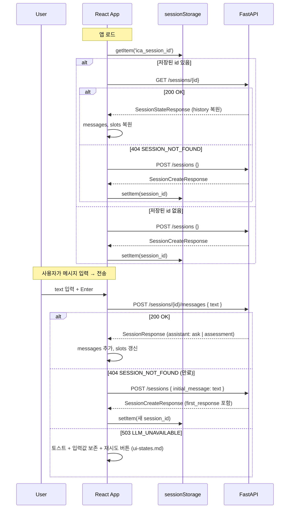

# UI 사양서 — API 호출 시퀀스 + TypeScript 타입

- 작성일: 2026-05-24
- 스프린트: 3
- 관련 요구사항: [REQ-03](../requirements/03_web_ui.md)
- 관련 문서: [ui-spec.md](ui-spec.md), [ui-states.md](ui-states.md), [api-spec.md](api-spec.md)

본 문서는 **Claude 디자인이 UI 코드를 만들 때 호출할 API 의 데이터 흐름·타입 정의**다. 화면 구조는 ui-spec.md, 에러/로딩 UX 는 ui-states.md.

---

## 1. 환경 정보

| 항목 | 값 |
|:--|:--|
| Base URL (dev) | `http://localhost:8000/api/v1` |
| Content-Type | `application/json` |
| 인증 | **없음** (PoC) |
| CORS | localhost:5173, localhost:3000 화이트리스트 (`CORS_ALLOW_ORIGINS` env 로 override) |
| 세션 ID 보관 | `sessionStorage.setItem('ica_session_id', ...)` 권장. localStorage 안 씀 (TTL 30분이라 영속화 무의미) |

### 환경 변수 (`frontend/.env.local` 예시)

```
VITE_API_BASE_URL=http://localhost:8000/api/v1
```

---

## 2. 세션 라이프사이클



### 404 처리 정책 (결정)

| 시점 | 결정 | 이유 |
|:--|:--|:--|
| 앱 로드 시 GET /sessions/{id} 가 404 | **자동으로 새 세션 생성** (사용자 확인 없음) | 만료된 세션 복원 불가, 사용자는 어차피 새로 시작해야 함. 추가 클릭은 잡음 |
| 메시지 전송 시 POST /messages 가 404 | **자동으로 새 세션 + 보낸 메시지를 initial_message 로 재전송** | 사용자 입력을 잃지 않음. UX 측면에서 "잠시 새 대화로 시작합니다" 안내 토스트는 표시 |

---

## 3. 멀티턴 대화

### 3.1 첫 메시지가 있는 경우

```http
POST /api/v1/sessions
Content-Type: application/json

{ "initial_message": "어제 빙판에 미끄러져 발목 골절로 입원했어요." }
```

**응답 (201)**

```json
{
  "session_id": "7f3e8c2a-...",
  "created_at": "2026-05-24T14:00:00Z",
  "ttl_seconds": 1800,
  "first_response": {
    "session_id": "7f3e8c2a-...",
    "turn": 1,
    "assistant": {
      "type": "ask",
      "message": "어떤 보험사·상품에 가입하셨나요? (예: 한화손해보험 — 개인용자동차보험)",
      "expected_slots": ["insurer", "product"],
      "options": []
    },
    "slots": { "area": "auto", "incident_date": "2026-05-23", "...": null },
    "status": "gathering"
  }
}
```

### 3.2 후속 메시지

```http
POST /api/v1/sessions/{session_id}/messages
Content-Type: application/json

{ "text": "한화손해보험 자동차보험이요" }
```

**응답 — ask 모드 (200)**

```json
{
  "session_id": "7f3e8c2a-...",
  "turn": 2,
  "assistant": {
    "type": "ask",
    "message": "사고 당시 본인 과실 비율을 알고 계신가요?",
    "expected_slots": ["fault_ratio"],
    "options": ["0%", "10%", "20~50%", "50%+", "모름"]
  },
  "slots": { "area": "auto", "insurer": "한화손해보험", "...": null },
  "status": "gathering"
}
```

**응답 — assessment 모드 (200)**

```json
{
  "session_id": "7f3e8c2a-...",
  "turn": 4,
  "assistant": {
    "type": "assessment",
    "likelihood": "중간",
    "summary": "치료 사실은 보장 조건에 부합하지만, 사고 경위 입증 자료가 부족합니다.",
    "satisfied": [
      "입원 기간 5일 — 보장 한도 내",
      "진단명 '발목 골절' — 상해 분류 명시"
    ],
    "unsatisfied": [
      "사고 경위 증빙 (경찰 신고서, 사고 사진 등) 미확보"
    ],
    "citations": [
      {
        "chunk_id": "abc-123",
        "insurer": "한화손해보험",
        "product": "개인용자동차보험(공동물건)",
        "version": "2026-03-01_present",
        "doc_type": "terms",
        "clause": "제15조",
        "sub_no": "①",
        "text": "보험금 지급 사유는 다음과 같다 ...",
        "page": 12
      }
    ],
    "next_steps": [
      "경찰 사고 사실 확인원 발급",
      "치료 진료비 영수증 원본 보관"
    ],
    "disclaimer": "본 결과는 참고용이며 최종 청구 가능 여부 판단을 대체하지 않습니다."
  },
  "slots": { "area": "auto", "insurer": "한화손해보험", "..." : "..." },
  "status": "answered"
}
```

---

## 4. TypeScript 타입 정의 (그대로 복사해서 사용)

```ts
// === 기본 ===
export type Area = 'auto' | 'fire' | 'accident_disease';
export type SessionStatus = 'gathering' | 'analyzing' | 'answered' | 'closed';
export type LikelihoodLevel = '높음' | '중간' | '낮음';
export type DocType = 'summary' | 'business' | 'terms';

// === 슬롯 (영역 공통 + 영역별 합집합. 미채움은 null) ===
// 정수 + 범위 제약 필드는 백엔드 pydantic 이 강제한다. TS 는 `number` 표기만 가능하므로
// 실제 송신 전에 zod 등 런타임 검증 또는 input UI 단에서 정수/범위 제약을 보장해야 한다.
export type SlotState = {
  // 공통
  area: Area | null;
  insurer: string | null;
  product: string | null;
  version: string | null;
  incident_date: string | null;  // ISO 'YYYY-MM-DD'. 비표준 문자열은 백엔드가 silent coerce → null (재질문)
  evidence: string[];
  // auto
  incident_type: string | null;
  fault_ratio: number | null;    // 정수 0~100 (backend: int, ge=0, le=100). 소수·범위 외 → 422
  damage_type: string | null;
  // fire
  loss_type: string | null;
  damaged_items: string[];
  cause: string | null;
  // accident_disease
  diagnosis: string | null;
  hospitalization_days: number | null;  // 정수 ≥0 (backend: int, ge=0). 소수·음수 → 422
  outpatient_visits: number | null;     // 정수 ≥0 (backend: int, ge=0). 소수·음수 → 422
  // Sprint 6 — "모름" 명시 (extract_slots 가 사용자 발화에서 추출). _compute_missing 에서 제외 대상
  unknown_slots?: string[];             // default `[]`. 슬롯 필드명 (예: ['product','policy_start_date'])
};

// === 어시스턴트 응답 (discriminated union) ===
export type AssistantAsk = {
  type: 'ask';
  message: string;
  expected_slots: string[];  // backend: min_length=1, max_length=2. 위반 시 422
  options: string[];          // 빈 배열 가능
};

export type Citation = {
  chunk_id: string;
  insurer: string;
  product: string;
  version: string;
  doc_type: DocType;
  clause: string;
  sub_no: string | null;
  text: string;
  page: number;
  // Sprint 5 — PDF 페이지 캡처 (backend hydrate, LLM 미관여)
  // /static/page_images/{document_id}/{page:04d}.png — 변환 실패 시 null
  page_image_url?: string | null;
  // /static/raw/<insurer>/<area>/.../<doc_type>.pdf — 외부 PDF 면 null
  pdf_url?: string | null;
};

export type AssistantAssessment = {
  type: 'assessment';
  likelihood: LikelihoodLevel;
  summary: string;
  satisfied: string[];
  unsatisfied: string[];
  citations: Citation[];      // minItems=1 보장
  next_steps: string[];
  // Sprint 6 — full(슬롯 완전 충족) vs partial(일부 부족 → 추정)
  // backward-compat: 백엔드 default 'full', frontend 도 absent 시 'full' 취급
  confidence?: 'partial' | 'full';
  disclaimer: string;
};

export type Assistant = AssistantAsk | AssistantAssessment;

// === 응답 envelope ===
export type SessionResponse = {
  session_id: string;
  turn: number;       // ≥1
  assistant: Assistant;
  slots: SlotState;
  status: SessionStatus;
};

export type SessionCreateResponse = {
  session_id: string;
  created_at: string;        // ISO datetime
  ttl_seconds: number;
  first_response: SessionResponse | null;
};

export type Message = {
  role: 'user' | 'assistant';
  content: string;
  created_at: string;
  response_type: 'ask' | 'assessment' | null;
};

export type SessionStateResponse = {
  session_id: string;
  created_at: string;
  last_activity_at: string;
  status: SessionStatus;
  slots: SlotState;
  history: Message[];
};

// === documents 메타 (UI 셀렉트박스/표시용) ===
export type InsurerRead = {
  id: string;
  name: string;
  homepage_url: string | null;
  created_at: string;
};

export type ProductRead = {
  id: string;
  insurer_id: string;
  area: string;
  name: string;
  created_at: string;
};

// === 에러 응답 ===
// 두 형태가 섞여 있다. fetch 헬퍼(§ 5)가 통합 흡수.
//
// 1) router 가 raise 한 HTTPException (404 SESSION_NOT_FOUND, 503 LLM_UNAVAILABLE)
//    → FastAPI 가 detail 을 wrap: { "detail": { "error": { "code", "message" } } }
//
// 2) _unhandled_exception_handler 가 잡은 500 INTERNAL_ERROR
//    → 표준 envelope 그대로: { "error": { "code", "message" } }
//
// 3) pydantic 검증 실패 (422)
//    → FastAPI 기본 형태 (표준 envelope 아님): { "detail": [{ "loc", "msg", "type" }, ...] }
//
// UI 는 § 5 의 IcaApiError.code 분기로 처리. 422 는 status 분기.
export type ApiErrorCode = 'SESSION_NOT_FOUND' | 'LLM_UNAVAILABLE' | 'INTERNAL_ERROR';

export type ApiErrorEnvelope = {
  error: {
    code: ApiErrorCode;
    message: string;
  };
};

export type ApiValidationError = {
  detail: { loc: (string | number)[]; msg: string; type: string }[];
};
```

### Discriminator 분기 패턴

```tsx
function renderAssistant(a: Assistant) {
  if (a.type === 'ask') {
    return <AskCard payload={a} />;
  }
  // TypeScript 가 자동으로 AssistantAssessment 로 좁힘
  return <AssessmentCard payload={a} />;
}
```

---

## 5. fetch 헬퍼 예시

전체 응답 파싱 + 에러 표준화 패턴. 그대로 가져가서 쓰면 됨.

```ts
const API_BASE = import.meta.env.VITE_API_BASE_URL ?? 'http://localhost:8000/api/v1';

class IcaApiError extends Error {
  constructor(
    public code: ApiErrorCode | 'VALIDATION_ERROR' | 'UNKNOWN',
    message: string,
    public status: number,
    public validationDetails?: ApiValidationError['detail'],
  ) {
    super(message);
  }
}

async function api<T>(path: string, init?: RequestInit): Promise<T> {
  const response = await fetch(`${API_BASE}${path}`, {
    ...init,
    headers: {
      'Content-Type': 'application/json',
      ...(init?.headers ?? {}),
    },
  });

  if (response.status === 204) return undefined as T;

  const body = await response.json();
  if (!response.ok) {
    // 422 — pydantic 검증 실패. 표준 envelope 가 아니라 { detail: [...] } 형태
    if (response.status === 422 && Array.isArray(body?.detail)) {
      throw new IcaApiError(
        'VALIDATION_ERROR',
        '입력값 검증에 실패했습니다.',
        422,
        body.detail,
      );
    }
    // 404/503 — router HTTPException 형태: { detail: { error: {...} } }
    // 500 — _unhandled_exception_handler 형태: { error: {...} }
    const err = body?.detail?.error ?? body?.error ?? { code: 'UNKNOWN', message: 'Unknown error' };
    throw new IcaApiError(err.code, err.message, response.status);
  }
  return body as T;
}

// 사용 예
export async function createSession(initialMessage?: string): Promise<SessionCreateResponse> {
  return api<SessionCreateResponse>('/sessions', {
    method: 'POST',
    body: JSON.stringify(initialMessage ? { initial_message: initialMessage } : {}),
  });
}

export async function postMessage(sessionId: string, text: string): Promise<SessionResponse> {
  return api<SessionResponse>(`/sessions/${sessionId}/messages`, {
    method: 'POST',
    body: JSON.stringify({ text }),
  });
}

export async function getSessionState(sessionId: string): Promise<SessionStateResponse> {
  return api<SessionStateResponse>(`/sessions/${sessionId}`);
}

export async function closeSession(sessionId: string): Promise<void> {
  await api<void>(`/sessions/${sessionId}`, { method: 'DELETE' });
}

export async function listProducts(insurer?: string, area?: string): Promise<ProductRead[]> {
  const params = new URLSearchParams();
  if (insurer) params.set('insurer', insurer);
  if (area) params.set('area', area);
  const qs = params.toString() ? `?${params.toString()}` : '';
  return api<ProductRead[]>(`/documents/products${qs}`);
}

export async function listInsurers(): Promise<InsurerRead[]> {
  return api<InsurerRead[]>('/documents/insurers');
}
```

**중요**: 에러는 `IcaApiError` 인스턴스. UI 컴포넌트에서 `instanceof IcaApiError` 로 잡고 `err.code` 분기 → [ui-states.md § 에러 코드 → UX 매핑](ui-states.md#3-에러-코드--ux-매핑) 참조.

---

## 6. 응답 검증 체크리스트 (사양서 자체 검증)

본 문서의 TypeScript 타입은 다음 백엔드 파일과 1:1 일치해야 한다:

| TS 타입 | Python 모델 | 위치 |
|:--|:--|:--|
| `SlotState` | `SlotState` | `app/sessions/schemas.py` |
| `AssistantAsk` | `AssistantAsk` | `app/sessions/schemas.py` |
| `AssistantAssessment` | `AssistantAssessment` | `app/sessions/schemas.py` |
| `Citation` | `Citation` | `app/sessions/schemas.py` |
| `SessionResponse` | `SessionResponse` | `app/sessions/schemas.py` |
| `SessionCreateResponse` | `SessionCreateResponse` | `app/sessions/router.py` |
| `SessionStateResponse` | `SessionStateResponse` | `app/sessions/router.py` |
| `Message` | `Message` | `app/sessions/schemas.py` |
| `InsurerRead` / `ProductRead` | `InsurerRead` / `ProductRead` | `app/documents/schemas.py` |
| `ApiErrorEnvelope.error.code` (`SESSION_NOT_FOUND`, `LLM_UNAVAILABLE`) | `_MSG_*` + `_error(...)` | `app/sessions/router.py` |
| `ApiErrorEnvelope.error.code` (`INTERNAL_ERROR`) | `_MSG_INTERNAL_ERROR` + `_unhandled_exception_handler` | `app/main.py` |
| `ApiValidationError` (422) | pydantic ValidationError 기본 직렬화 | FastAPI 자동 |

design-reviewer 가 본 표를 따라 각 필드를 verify 한다.
