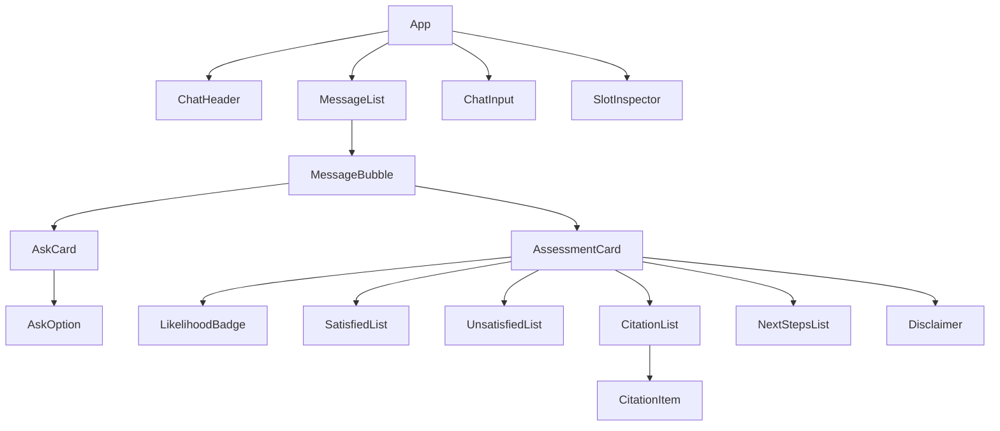

# UI 사양서 — 화면 명세 + 컴포넌트 분해

- 작성일: 2026-05-24
- 스프린트: 3
- 관련 요구사항: [REQ-03](../requirements/03_web_ui.md)
- 관련 문서: [ui-api-flow.md](ui-api-flow.md), [ui-states.md](ui-states.md), [api-spec.md](api-spec.md)

본 문서는 **유저가 Claude 디자인 서비스로 컴포넌트를 만들 때 입력으로 사용할 화면 명세**다. 데이터 흐름·에러 처리·로딩 UX 는 형제 문서 참조.

---

## 1. 화면 구성 — 단일 화면 데모

```
┌────────────────────────────────────────────────────────────────────┐
│ ChatHeader                                                         │
│   보험청구심사 어시스턴트                              [새 대화 시작] │
├────────────────────────────────────────────────────────────────────┤
│ MessageList (세로 스크롤 영역, 가운데 정렬, 최대 720px 폭)         │
│                                                                    │
│   ┌─ assistant ────────────────────────┐                           │
│   │ 안녕하세요. 어떤 청구 상황이신가요?  │                           │
│   │ (시작 메시지 — 빈 세션일 때)        │                           │
│   └─────────────────────────────────────┘                          │
│                                                                    │
│                          ┌─ user ──────────────────────────────┐  │
│                          │ 어제 빙판에 미끄러져 발목 골절로     │  │
│                          │ 입원했어요.                          │  │
│                          └──────────────────────────────────────┘  │
│                                                                    │
│   ┌─ assistant.ask ──────────────────────────────────────┐         │
│   │ 어떤 보험사·상품에 가입하셨나요?                     │         │
│   │ ┌─────────┐ ┌─────────┐ ┌─────────┐ ┌─────────┐    │         │
│   │ │ 한화손해 │ │ 삼성화재 │ │ 모름   │ │ 직접입력 │    │         │
│   │ └─────────┘ └─────────┘ └─────────┘ └─────────┘    │         │
│   └───────────────────────────────────────────────────────┘        │
│                                                                    │
│   ┌─ assistant.assessment ─────────────────────────────────┐       │
│   │ ┌── 가능성: 중간 ────────────────────────────────────┐  │       │
│   │ │ 치료 사실은 보장 조건에 부합하지만, 사고 경위    │  │       │
│   │ │ 입증 자료가 부족해 청구 시 추가 자료가 필요...    │  │       │
│   │ └──────────────────────────────────────────────────┘  │       │
│   │                                                        │       │
│   │ ✓ 충족                                                 │       │
│   │   • 입원 기간 5일 — 보장 한도 내                       │       │
│   │   • 진단명 '발목 골절' — 상해 분류 명시                │       │
│   │ ✗ 미충족                                               │       │
│   │   • 사고 경위 증빙 (경찰 신고서, 사고 사진) 미확보     │       │
│   │                                                        │       │
│   │ ┌─ Citation 1 ─────────────────────────────────────┐  │       │
│   │ │ 한화손해보험 · 개인용자동차보험 · 제15조 ① · p.12 │  │       │
│   │ │ ─────────────────────────────────────────────── │  │       │
│   │ │ "보험금 지급 사유는 다음과 같다 ... (원문)"       │  │       │
│   │ └──────────────────────────────────────────────────┘  │       │
│   │ [+ 인용 1건 더 보기]                                   │       │
│   │                                                        │       │
│   │ 다음 단계                                              │       │
│   │   1. 경찰 사고 사실 확인원 발급                        │       │
│   │   2. 치료 진료비 영수증 원본 보관                      │       │
│   │                                                        │       │
│   │ ⓘ 본 결과는 참고용이며 최종 청구 가능 여부 판단을      │       │
│   │   대체하지 않습니다.                                   │       │
│   └────────────────────────────────────────────────────────┘       │
│                                                                    │
├────────────────────────────────────────────────────────────────────┤
│ ChatInput                                                          │
│   ┌──────────────────────────────────────────────────┐ ┌──────┐   │
│   │ 메시지를 입력하세요…                              │ │ 보내기│   │
│   └──────────────────────────────────────────────────┘ └──────┘   │
│                                                                    │
│ ▼ 디버그 (접힘) — SlotInspector                                    │
│    area=auto, insurer=한화, incident_date=2026-05-23, ...          │
└────────────────────────────────────────────────────────────────────┘
```

### 레이아웃 원칙

- **세로 1열 채팅** — 좌측 메뉴/사이드바 없음. 데모 단일 페이지
- 메시지 영역 **최대 폭 720px**, 가운데 정렬. 모바일은 100% 폭
- 메시지 버블: assistant 좌측 정렬·라이트 톤 배경 / user 우측 정렬·강조 톤
- **assessment 카드는 메시지 버블 안이 아니라 별도 카드 컨테이너** (시각적 무게)
- 면책 문구는 매 assessment 카드 하단에 **항상** 노출 (ⓘ 아이콘 + 작은 글씨)

---

## 2. 컴포넌트 트리



---

## 3. 컴포넌트 명세

각 컴포넌트의 입력(props) / 내부 상태(state) / 동작.

### 3.1 `App` (루트)

```ts
type AppState = {
  sessionId: string | null;        // 세션 미생성 시 null
  messages: ChatMessage[];          // 표시할 전체 대화 이력
  pendingUserText: string | null;   // 전송 중 사용자 텍스트 (낙관적 렌더용)
  isSending: boolean;               // POST /messages 진행 중
  lastError: ApiError | null;       // 에러 상태 → ui-states.md
  currentSlots: SlotState | null;   // 디버그 인스펙터용
};
```

- 세션 lifecycle 관리 (생성 / 메시지 전송 / 만료 시 재생성)
- 자세한 데이터 흐름은 [ui-api-flow.md § 2 세션 라이프사이클](ui-api-flow.md#2-세션-라이프사이클)

### 3.2 `ChatHeader`

- props: `onNewSession: () => void`
- "새 대화 시작" 버튼 클릭 시 `App` 이 `DELETE /sessions/{id}` 후 새 세션 생성

### 3.3 `MessageList`

- props: `messages: ChatMessage[]`
- 자동 스크롤: 메시지 추가 시 가장 아래로 스크롤 (`useEffect` + `scrollIntoView`)
- 빈 배열 시 placeholder ("안녕하세요. 어떤 청구 상황이신가요?") 1건 표시 — `ui-states.md § 빈 상태` 참조

### 3.4 `MessageBubble`

```ts
// 백엔드 Message 모델 (snake_case `created_at`) 과 일치
type ChatMessage =
  | { role: 'user'; content: string; created_at: string }
  | { role: 'assistant'; type: 'ask'; payload: AssistantAsk; created_at: string }
  | { role: 'assistant'; type: 'assessment'; payload: AssistantAssessment; created_at: string };
```

- discriminator `role` + `type` 으로 자식 렌더 분기
- user → 일반 텍스트 버블
- assistant.ask → `AskCard`
- assistant.assessment → `AssessmentCard`

### 3.5 `AskCard`

- props: `payload: AssistantAsk`
- 본문 메시지 + `options[]` 칩 렌더
- 옵션 클릭 시 → `ChatInput` 으로 값 자동 채움 + 자동 전송(권장) 또는 채움만(보수)
  - **결정**: 자동 전송. 사용자가 옵션 선택 = 의도 명확. 추가 confirm 없음
- `expected_slots` 는 디버그용 — `SlotInspector` 에서 다음에 채워질 슬롯 하이라이트 가능

### 3.6 `AssessmentCard`

- props: `payload: AssistantAssessment`
- 카드 컨테이너 (그림자 + 패딩 + 둥근 모서리)
- 자식 컴포넌트 순서: `LikelihoodBadge` → `summary` 텍스트 → `SatisfiedList` → `UnsatisfiedList` → `CitationList` → `NextStepsList` → `Disclaimer`
- **시각 우선순위 — 인용 카드 노출 강도가 가장 높음** (사용자 신뢰 핵심)
- **Sprint 6 — `confidence='partial'` badge**: hero 영역 likelihood 옆에 `(추정)` 노란 배경 칩. `confidence==='full'` (또는 absent) 시 미노출. CSS 클래스 `.assess__partial-badge` + `.assess--partial` (hero band 색조 노란 stripe)

### 3.7 `LikelihoodBadge`

- props: `level: '높음' | '중간' | '낮음'`
- 색상 매핑:
  - 높음 → 녹색 톤
  - 중간 → 노랑/주황 톤
  - 낮음 → 회색/빨강 톤
- 텍스트만 강조 (큰 폰트). 신호등 아이콘은 디자인 자유

### 3.8 `SatisfiedList` / `UnsatisfiedList`

- props: `items: string[]`
- `Satisfied` 는 ✓ 아이콘 / `Unsatisfied` 는 ✗ 아이콘
- `items` 가 빈 배열이면 컴포넌트 자체를 렌더하지 않음 (시각적 잡음 방지)

### 3.9 `CitationList` / `CitationItem`

```ts
type Citation = {
  chunk_id: string;
  insurer: string;       // 보험사 한글명
  product: string;       // 상품 한글명
  version: string;       // 판매기간 라벨
  doc_type: 'summary' | 'business' | 'terms';
  clause: string;        // 조항 라벨 ("제15조")
  sub_no: string | null; // 항/호 ("①") — null 가능
  text: string;          // 원문 발췌 (5자 이상)
  page: number;          // ≥1
  // Sprint 5 — PDF 캡처
  page_image_url?: string | null;  // /static/page_images/{doc_id}/{page:04d}.png
  pdf_url?: string | null;          // /static/raw/.../*.pdf (#page=N 점프)
};
```

- `CitationItem` 시각 우선순위 (위에서 아래): 조항/호 헤더 > **PDF 페이지 썸네일 (있을 때)** > 원문 발췌 텍스트
- 헤더 한 줄: `{insurer} · {product} · {clause}{sub_no?} · p.{page} · [📄 원본 PDF]` 형식 권장
- **Sprint 5 — PDF 썸네일**:
  - `page_image_url` 이 truthy 일 때만 `` 렌더. null/undefined 면 graceful skip
  - `<a href={pdf_url}#page=N target="_blank">` 로 감싸 클릭 시 새 탭에서 원본 PDF 해당 페이지 점프
  - CSS: 컨테이너 너비 100%, 1px border, hover 시 blue-60. 이미지 lazy load
  - PDF link 버튼은 header 의 page 옆에 작은 칩 형태 (있을 때만)
- 원문 발췌는 인용 부호로 감싸고 monospace 또는 인용 스타일 (들여쓰기 + 좌측 보더)
- 2개 이상이면 첫 1건만 펼치고 나머지는 "+ 인용 N건 더 보기" 토글로 접기 (cognitive load 낮춤)

### 3.10 `NextStepsList`

- props: `items: string[]`
- 번호 매기기 (`<ol>`). 빈 배열이면 렌더 X.

### 3.11 `Disclaimer`

- props: `text: string` (기본값 "본 결과는 참고용이며 최종 청구 가능 여부 판단을 대체하지 않습니다.")
- ⓘ 아이콘 + 작은 회색 글씨. 매 assessment 카드에 **반드시** 노출 (제거 금지 — 법적 보호 목적)

### 3.12 `ChatInput`

```ts
type ChatInputProps = {
  value: string;
  onChange: (v: string) => void;
  onSubmit: (text: string) => void;
  disabled: boolean;       // isSending 중 true
  placeholder?: string;
};
```

- Enter 키 = 전송, Shift+Enter = 줄바꿈
- 빈 문자열 전송 차단 (trim 후 빈이면 무시)
- `disabled` 일 때 입력란/버튼 둘 다 비활성 + 회색 처리

### 3.13 `SlotInspector` (디버그 — 시연 노출 결정)

- props: `slots: SlotState | null`
- **결정**: 시연 화면에 노출하되 **접기 가능 (collapsed by default)**
- 이유: 데모 평가자가 슬롯 추출 결과를 확인하면 신뢰감 ↑, 일반 사용자는 안 펼침
- `null` 또는 모든 필드가 비어있으면 컴포넌트 자체 숨김

---

## 4. 디자인 토큰 가이드 (느슨한 권장 — 디자인 자유)

| 토큰 | 권장 값 |
|:--|:--|
| 주 색상 | 신뢰감 있는 채도 낮은 블루/네이비 |
| 메시지 영역 폭 | max-width 720px, 가로 가운데 정렬 |
| 폰트 | system-ui / 나눔고딕 / Noto Sans KR 등 한국어 가독성 우선 |
| 버블 간격 | 12~16px |
| 카드 그림자 | 매우 약하게 (border + shadow-sm 정도) |
| 면책 문구 | 폰트 크기 12px, 색상 회색 (#6b7280 등) |
| 인용 원문 | monospace 또는 serif 인용체, 좌측 보더로 시각 구분 |

---

## 5. 인터랙션 규칙

| 행동 | 결과 |
|:--|:--|
| 사용자가 ChatInput 에 텍스트 입력 후 Enter | POST /sessions/{id}/messages (자세히는 [ui-api-flow.md § 3](ui-api-flow.md#3-멀티턴-대화)) |
| AskCard 옵션 칩 클릭 | 해당 텍스트로 즉시 전송 (=Enter 누른 효과). confirm 없음 |
| "새 대화 시작" 클릭 | DELETE 후 새 POST /sessions. messages 배열 초기화 |
| 응답 대기 중 | ChatInput disabled + loading indicator (`ui-states.md § 로딩`) |
| 응답 도착 (assessment) | AssessmentCard 추가 + 자동 스크롤 + ChatInput 활성 |
| 응답 도착 (ask) | AskCard 추가 + ChatInput placeholder 를 "답변을 입력하세요" 로 잠시 변경 권장 |
| 에러 | inline 에러 토스트 또는 메시지 카드. 자세히는 ui-states.md |

---

## 6. 접근성

- 모든 버튼·옵션 칩에 `aria-label` 부여
- 메시지 영역에 `role="log"` + `aria-live="polite"` (스크린리더가 새 메시지 읽음)
- 면책 문구는 `<small>` 또는 `role="note"` 로 표시 — 시각만이 아니라 의미 전달
- (Sprint 6) `AssessmentCard` 의 `role="article"` `aria-label` 은 partial 모드일 때 `"청구 평가 결과 - 가능성 {likelihood} (추정 — 정보 일부 부족)"` 로 확장. `assess__partial-badge` 자체에는 `title="정보가 일부 부족하여 추정 기반 답변입니다"` 부여 (마우스 hover 안내)

---

## 7. 본 문서의 변경/검증 책임

- 새 컴포넌트 추가 시 본 문서 § 3 갱신
- 응답 데이터 구조 변경 시 [ui-api-flow.md](ui-api-flow.md) 의 TS 타입 + 본 문서 § 3 의 props 모두 갱신
- design-reviewer 가 본 문서와 `app/sessions/schemas.py` 의 필드 일치 검증

---

## 8. Sprint 8~11 추가 컴포넌트 (대국민 서비스 전환)

설계 시스템은 [design-system.md](design-system.md) 참조. 별도 페이지 명세는 [pages/](pages/) 디렉터리.

### 8.1 `<DisclaimerBanner>` (Sprint 8, 의무) — D-1

```tsx
<DisclaimerBanner />
```

**위치**: `<ChatHeader>` 하단 (헤더 안쪽 stripe) — 모든 페이지에서 영구 표시.

**문구**: "본 서비스는 청구 가능성 안내 도구이며, 최종 결정은 보험사에 있습니다. [자세히 보기](/legal/disclaimer)"

**스타일**: `--color-bg-secondary` 배경 + `--text-xs` (소형) + `--color-text-secondary`. 닫기 버튼 없음 (영구).

**ARIA**: `role="note"` + `aria-label="법적 면책 안내"`.

### 8.2 `<FontSizeToggle>` (Sprint 8) — D-3

```tsx
<FontSizeToggle value="medium" onChange={(size) => ...} />
```

**위치**: `<ChatHeader>` 우측 액션 영역 (`+ 새 대화 시작` 옆).

**상태**: 3 버튼 그룹 (소·중·대) — 현재 선택만 강조.

**동작**: `<html>` 태그에 `fs--small | fs--medium | fs--large` class 토글. `localStorage["fontSize"]` 영속.

**ARIA**: `role="radiogroup"` + `aria-label="글자 크기"`. 각 버튼 `role="radio"` + `aria-checked`.

### 8.3 `<CitationItem>` 확장 — 다중 출처 (Sprint 9~10) — D-5

기존 Sprint 5 `CitationItem` 에 출처 종류별 시각 분리 추가.

**Props 확장**:

```tsx
type CitationSource = 'terms' | 'law' | 'precedent' | 'standard' | 'disease' | 'calc';

type Props = {
  // 기존
  citation: Citation;
  // 신규 (Sprint 9~10)
  source: CitationSource;  // 어느 외부 데이터에서 왔는지
};
```

**시각**:
- 좌측 `border-left: 3px solid {sourceColor}` (design-system § 1.3)
- 우측 상단 `<Badge variant="source-{source}">` (예: `법령` / `약관` / `판례` / `표준`)
- 출처별 아이콘 (`lucide-react` — `Scale` / `FileText` / `Gavel` / `LayoutGrid` 등)

### 8.4 `<CalcResultCard>` (Sprint 10) — D-6

```tsx
<CalcResultCard
  amount={1_500_000}
  breakdown={{ baseAmount: 2_000_000, fault_ratio: 0.25, deductible: 0 }}
  formula="손해액 × (1 - 과실비율) - 자기부담금"
  sources={['손보협회 표준 과실비율 도표 #87', '의료수가 2026-Q2']}
/>
```

**위치**: `<AssessmentCard>` 안 `.assess__sections` 의 새 섹션 (충족/미충족 사이 또는 다음 단계 위).

**시각**: `card--calculator` variant (회색 톤). 큰 금액 표시 (천 단위 콤마 + "원") + 산정 공식 + 출처 라인 (위 D-5 와 동일 색).

**환각 회피**: deterministic Python tool 결과만 받아 표시 — LLM 텍스트 직접 비표시.

### 8.5 `<RateLimitToast>` (Sprint 8) — D-2

기존 `<ToastStack>` 에 신규 variant 추가.

**트리거**: API 429 응답 (slowapi 미들웨어).

**문구**: "잠시 후 다시 시도해 주세요. 남은 시간: {countdown}초".

**동작**: 응답의 `Retry-After` 헤더로 countdown. 0초 도달 시 자동 닫힘 + "지금 다시 시도" 버튼.

**스타일**: `--color-bg-warning` (#fdf6e3) + 친절한 톤 (책임 떠넘김 X).

### 8.6 `<CircuitOpenToast>` (Sprint 9~10) — D-4

외부 API circuit open 시 사용자 알림.

**트리거**: 응답에 `meta.degraded` 필드가 있을 때 (Sprint 9 ui-api-flow 갱신).

**문구**: "법령·표준 데이터 일시 조회 불가 — 약관 기준으로만 안내드립니다. 잠시 후 다시 시도하시면 정확한 안내가 가능합니다."

**스타일**: `--color-bg-info` (warning 보다 약함). 비차단 (사용자가 그래도 답변 받음).

### 8.7 `<OptionsPanel>` (Sprint 8.6, 신규) — 하단 중앙 fixed

**상세**: [pages/options-panel.md](pages/options-panel.md)

ask 응답의 options 를 메시지 버블 인라인 대신 화면 **하단 중앙 fixed 패널** 로 분리 (Claude Plan 모드 패턴).

- chip 4개 (예: 자동차/화재/사고질병/모르겠습니다)
- 클릭 시 자동 전송 + 패널 사라짐
- "모르겠습니다" 항상 마지막 — backend `_NEXT_QUESTION_SYSTEM` 이 강제

→ 기존 `AskCard` 의 inline options 렌더 제거.

### 8.8 `<CitationItem>` 확장 (Sprint 8.6) — PDF 캡처본 + 텍스트 동시

**상세**: [pages/citation-item.md](pages/citation-item.md)

backend 가 이미 hydrate 한 `page_image_url` + `pdf_url` 활성. 매 인용 카드에:

1. 메타 (보험사·상품·조항·페이지)
2. **PDF 페이지 캡처본** (썸네일 — 클릭 시 원본 PDF 새 탭)
3. **약관 텍스트 발췌** (`<blockquote>`)

3 요소 동시. 데스크탑은 가로 2-column (캡처 200px + 텍스트 1fr), 모바일은 세로 stack.

### 8.9 컴포넌트 트리 (Sprint 11 최종)

```
App
├─ TermsConsentModal (P-5, 최초 1회)
├─ ChatHeader
│   ├─ Brand
│   ├─ FontSizeToggle ← Sprint 8 신규 (D-3)
│   ├─ NewSessionButton
│   └─ DisclaimerBanner ← Sprint 8 신규 (D-1)
├─ MessageList
│   ├─ AskCard ← Sprint 8.6 변경: options 인라인 제거 (질문 텍스트만)
│   └─ AssessmentCard (다중 turn)
│       ├─ HeroBand (likelihood + partial badge)
│       ├─ SatisfiedList / UnsatisfiedList
│       ├─ CitationList
│       │   └─ CitationItem ← Sprint 8.6 확장: PDF 캡처본 + 텍스트 동시
│       ├─ CalcResultCard ← Sprint 10 신규 (D-6)
│       ├─ NextStepsList
│       └─ Disclaimer
├─ OptionsPanel ← Sprint 8.6 신규 (하단 중앙 fixed, Claude Plan 패턴)
├─ ChatInput
└─ ToastStack
    ├─ RateLimitToast ← Sprint 8 신규 (D-2)
    └─ CircuitOpenToast ← Sprint 9~10 신규 (D-4)

추가 페이지 (별도 라우트):
├─ /legal/disclaimer ← P-1
├─ /legal/privacy ← P-4
├─ /legal/sources ← P-2 (Sprint 9~10)
└─ /legal/accessibility ← P-3
└─ /admin/* ← P-6/P-7 (Sprint 11+, 인증 필요)
```

## 9. Sprint 별 컴포넌트 도입 순서

| Sprint | 추가 컴포넌트 | 페이지 |
|:--|:--|:--|
| 8 | `DisclaimerBanner`, `FontSizeToggle`, `RateLimitToast` | `/legal/disclaimer`, `/legal/privacy`, `/legal/accessibility` |
| 9 | `CitationItem` 확장 (terms/law/precedent), `CircuitOpenToast` | `/legal/sources` (외부 데이터 출처 공개) |
| 10 | `CalcResultCard`, `CitationItem` (standard/disease/calc) | — |
| 11 | `TermsConsentModal` (선택), admin 페이지 골격 | `/admin/audit`, `/admin/eval` (인증 필요) |
