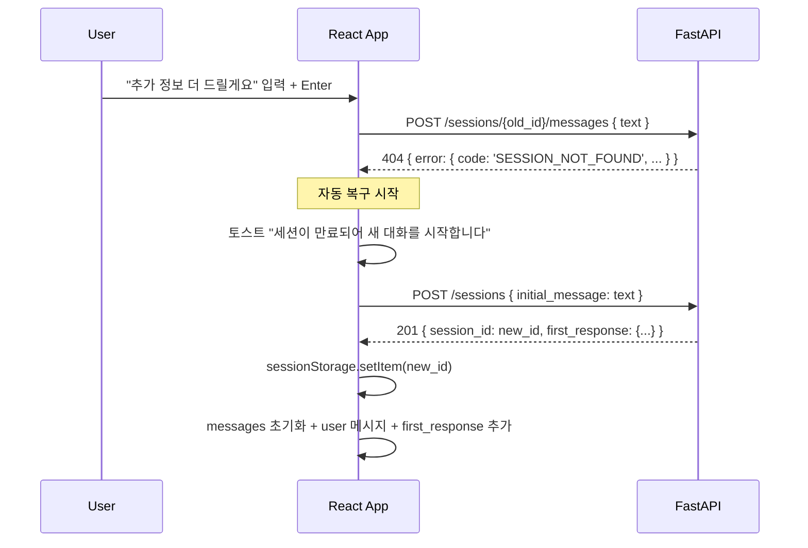

# UI 사양서 — 에러 / 로딩 / 빈 상태 UX 패턴

- 작성일: 2026-05-24
- 스프린트: 3
- 관련 요구사항: [REQ-03](../requirements/03_web_ui.md)
- 관련 문서: [ui-spec.md](ui-spec.md), [ui-api-flow.md](ui-api-flow.md)

본 문서는 **각 상태에서 UI 가 어떻게 동작해야 하는지**를 명세한다. 데이터 흐름·타입은 ui-api-flow.md, 컴포넌트 자체 구조는 ui-spec.md.

---

## 1. 빈 상태 (Empty State)

### 1.1 앱 첫 로드 — 세션 미생성 / messages 빈 배열

```
┌────────────────────────────────────────────────────────┐
│ 보험청구심사 어시스턴트                                │
├────────────────────────────────────────────────────────┤
│                                                        │
│                     💬                                 │
│                                                        │
│        안녕하세요. 어떤 청구 상황이신가요?            │
│        자연어로 자유롭게 적어 주세요.                  │
│                                                        │
│        예시:                                           │
│          • "어제 빙판에 미끄러져 발목 골절로 입원했어요"│
│          • "주차 중 다른 차에 긁혔는데 보상되나요?"    │
│                                                        │
├────────────────────────────────────────────────────────┤
│ [ 메시지를 입력하세요…                          ][전송]│
└────────────────────────────────────────────────────────┘
```

- placeholder 메시지는 assistant 버블이 아니라 **MessageList 자체의 empty state 슬롯**
- 예시 문구 1~2개를 클릭하면 ChatInput 에 값 채움 (자동 전송 X — 사용자가 검토 후 전송)
- 첫 메시지 전송 시점에 POST /sessions { initial_message: text } 호출 — empty state 사라짐

### 1.2 assessment 의 satisfied / unsatisfied / next_steps 빈 배열

- 해당 섹션 자체를 렌더하지 않는다 (라벨만 있고 내용 없는 시각적 잡음 방지)
- citations 는 schema 가 `minItems=1` 강제하므로 절대 빈 배열 안 옴 — 빈 인용 분기 코드 불필요

---

## 2. 로딩 상태 (Loading State)

### 2.1 메시지 전송 중 (POST /messages in-flight)

```
┌────────────────────────────────────────────────────────┐
│   ┌─ user ──────────────────────────┐                  │
│   │ 한화손해보험 자동차보험이요     │                  │
│   └──────────────────────────────────┘                 │
│                                                        │
│   ┌─ assistant.loading ─────────────────────────────┐  │
│   │  ●  ●  ●   (타이핑 인디케이터, 0.4s 페이드)     │  │
│   └─────────────────────────────────────────────────┘  │
├────────────────────────────────────────────────────────┤
│ [ ─────────────────────────  disabled  ─────  ] [회색]│
└────────────────────────────────────────────────────────┘
```

- 사용자 메시지를 **즉시 낙관적 렌더** (서버 응답 기다리지 않음)
- assistant 영역에 타이핑 인디케이터 (3개 점 애니메이션) 렌더
- ChatInput disabled + 회색 처리
- 응답 도착 → 인디케이터 제거 + 실제 AskCard/AssessmentCard 추가

### 2.2 세션 복원 중 (앱 로드 시 GET /sessions/{id})

- 짧은 글로벌 스피너 (헤더 아래 가는 progress bar 또는 중앙 스피너)
- 200ms 미만에 응답하면 스피너 렌더 생략 권장 (깜빡임 방지)

### 2.3 LLM 응답 평균 소요 시간 — 3~10초

- 사용자에게 "분석 중…" 같은 명시 텍스트 노출 권장 (긴 대기에 대한 인지)
- assessment 모드는 ask 보다 오래 걸림 (RAG 검색 + 생성). 인디케이터 메시지를 분리해도 됨:
  - `gathering` 상태에서 ask → "응답 생성 중…"
  - `gathering→analyzing` 전환 후 assessment → "약관 검토 중…" (서버 status 가 `analyzing` 일 때)
- 단, 서버는 응답을 한 번에 보내므로 클라이언트는 status 전이를 실시간 못 봄. 단순히 "분석 중…" 으로 통일해도 무방

---

## 3. 에러 코드 → UX 매핑

`api-spec.md § 에러 응답 표준` + `app/sessions/router.py` 의 `_MSG_*` 상수 + `app/main.py` 의 `_unhandled_exception_handler` 기반.

| HTTP | code | 본문 형태 | 백엔드 message | UI 동작 |
|:--|:--|:--|:--|:--|
| 404 | `SESSION_NOT_FOUND` | `{"detail": {"error": {"code", "message"}}}` (FastAPI HTTPException) | "세션이 만료되었거나 존재하지 않습니다." | **자동 복구**: 새 세션 생성 후 마지막 사용자 입력을 initial_message 로 재전송. 토스트로 "세션이 만료되어 새 대화를 시작합니다" 안내 |
| 503 | `LLM_UNAVAILABLE` | 동일 | "LLM 서비스가 일시적으로 응답하지 않습니다. 잠시 후 다시 시도해주세요." | **재시도 가능**: 토스트 + ChatInput 에 입력값 복원 + 메시지 영역에 "재시도" 버튼이 있는 inline 에러 카드. 자동 재시도 X (비용·중복 위험) |
| 500 | `INTERNAL_ERROR` | `{"error": {"code", "message"}}` (`_unhandled_exception_handler` 표준 envelope) | "서버 오류가 발생했습니다. 잠시 후 다시 시도해주세요." | **재시도 가능**: 503 과 동일 처리 |
| 422 | (pydantic 검증 실패) | `{"detail": [{"loc", "msg", "type"}]}` (FastAPI/pydantic 기본 — **표준 envelope 아님**) | (필드별) | **개발 단계 오류**: 토스트 + console.error. 정상 사용자 흐름에서 발생 안 함. 코드 버그 신호. UI 는 `code` 분기 대신 `response.status === 422` 로 분기 |
| 네트워크 실패 (fetch reject) | — | — | — | **재시도 가능**: "네트워크 연결을 확인해주세요" 토스트 + 입력값 복원 + 재시도 버튼 |

> **본문 형태 차이 주의**: FastAPI 의 `HTTPException(detail={"error": {...}})` 은 `{"detail": {"error": {...}}}` 로 감싸지며, 본 프로젝트 `_unhandled_exception_handler` 는 `{"error": {...}}` 를 그대로 사용. [`ui-api-flow.md § 5`](ui-api-flow.md#5-fetch-헬퍼-예시) 의 `api()` 헬퍼가 두 가지 형태 + 422 형태를 모두 흡수해 `IcaApiError` 로 표준화한다.

### 3.1 에러 카드 (inline)

```
   ┌─ assistant.error ──────────────────────────────┐
   │ ⚠ LLM 서비스가 일시적으로 응답하지 않습니다.   │
   │   잠시 후 다시 시도해주세요.                   │
   │                                                │
   │   [ 다시 시도 ]                                │
   └────────────────────────────────────────────────┘
```

- 어시스턴트 버블 영역에 렌더 (메시지 흐름 안에 자연스럽게)
- "다시 시도" 클릭 → 마지막 user 메시지 텍스트로 POST /messages 재호출

### 3.2 토스트 (전역)

- 우상단 또는 하단 가운데 위치
- 4~6초 자동 사라짐 + 닫기 버튼
- 동시 다발 시 stacking (최대 3개)

---

## 4. 세션 만료 자동 복구 — 상세



### 4.1 복구 시 보존 / 손실

| 항목 | 보존 / 손실 |
|:--|:--|
| 마지막 사용자 입력 | 보존 (initial_message 로 재전송) |
| 이전 대화 history | **손실** — 서버 상태가 사라짐. 재구성 불가 |
| 슬롯 상태 | **손실** — LLM 이 새 input 으로 추출 다시 시작 |

→ 사용자에게 "새 대화를 시작합니다" 안내가 명확해야 헷갈리지 않음

---

## 5. 비-에러 상태 전이 표

| 현재 status | 사용자 행동 | 다음 status | UI 변화 |
|:--|:--|:--|:--|
| (세션 없음) | 첫 메시지 입력 + 전송 | `gathering` 또는 `answered` | 세션 생성 + first_response 렌더 |
| `gathering` | 사용자 답변 + 전송 | `gathering` (ask) 또는 `answered` (assessment) | 새 AskCard/AssessmentCard |
| `answered` | 슬롯 변경 메시지 (예: "사실 사고일은 5/22") | `gathering` 회귀 또는 `answered` 갱신 | 새 카드 (이전 카드는 history 에 보존) |
| `answered` | "새 대화 시작" 클릭 | (세션 없음 → 새 세션) | messages 초기화 |

---

## 6. 접근성 — 에러/로딩

- 토스트: `role="alert"` + `aria-live="assertive"` (스크린리더 즉시 읽음)
- 로딩 인디케이터: `aria-label="응답 생성 중"` + `aria-busy="true"` on MessageList
- 에러 카드: `role="alert"` 권장. "다시 시도" 버튼은 focus 가능

---

## 7. 디버그 옵션 (시연 화면)

- 우하단 작은 토글 — "디버그 모드"
  - on: SlotInspector + 마지막 응답의 status / turn 표시
  - off: 일반 사용자 화면
- 시연 시 발표자가 한 번 켰다 끌 수 있게 — 평가자가 RAG 동작/슬롯 추출 흐름 확인 가능

---

## 8. 본 문서의 변경/검증 책임

- 새 에러 코드가 backend 에 추가되면 본 문서 § 3 표에 행 추가 + 백엔드 `_MSG_*` 상수와 sync
- 새 상태 전이 가 backend service 에 추가되면 본 문서 § 5 표 갱신
- design-reviewer 가 § 3 의 code 컬럼이 `app/sessions/router.py` 의 `_error("...", ...)` 호출 인자 집합과 1:1 일치하는지 검증

---

## 9. Sprint 8~11 신규 상태

### 9.1 429 Rate Limit (Sprint 8) — D-2

**트리거**: slowapi 미들웨어가 per-IP 한도 (기본 10/min) 초과 시 응답.

**응답 형식** (Sprint 8 — api-spec.md 갱신 필요):

```json
{
  "error": {
    "code": "RATE_LIMITED",
    "message": "잠시 후 다시 시도해 주세요."
  }
}
```

응답 헤더: `Retry-After: <seconds>`.

**UI 처리**:
- `<RateLimitToast>` 표시 (ui-spec § 8.5)
- 입력창 일시 비활성화 (`disabled` + `aria-disabled="true"`)
- `Retry-After` 초가 지난 후 "지금 다시 시도" 버튼 + 자동 활성화
- 동일 세션 history 는 보존

### 9.2 503 Circuit Open — 외부 데이터 일시 불가 (Sprint 9~10) — D-4

**트리거**: 외부 API (법령/HIRA/손보협회) circuit breaker open 시 응답에 `meta.degraded` 필드 포함 (정상 응답 + 외부 데이터 누락).

**응답 형식** (Sprint 9 ui-api-flow 갱신):

```json
{
  "session_id": "...",
  "turn": 3,
  "assistant": { "type": "assessment", ... },
  "slots": {...},
  "status": "answered",
  "meta": {
    "degraded": ["law", "kidi"],
    "message": "법령 데이터 일시 조회 불가"
  }
}
```

**UI 처리**:
- `<CircuitOpenToast>` 표시 — 친절체로 "법령·표준 데이터 일시 조회 불가, 약관 기준으로만 안내드립니다"
- 응답 자체는 정상 표시 (assessment 계속)
- CitationItem 의 출처 종류는 약관만 (외부 출처 카드 미표시)

### 9.3 503 LLM 비용 한도 초과 (Sprint 8)

**트리거**: 일일 LLM 비용 한도 ($50, Sprint 8 결정 4) 도달.

**응답**:

```json
{
  "error": {
    "code": "DAILY_BUDGET_EXCEEDED",
    "message": "오늘의 무료 안내 한도가 모두 사용되었습니다. 내일 다시 이용해 주세요."
  }
}
```

**UI 처리**:
- 메시지 영역에 큰 안내 카드 (toast 아님 — 영구 노출)
- 입력창 비활성화 (`disabled`)
- 다음 날 0시 자동 활성화 (frontend localStorage 기록 + polling)
- 운영자에게는 별도 알림 (Slack/Email — Sprint 11)

### 9.4 면책 동의 미완료 (Sprint 11, 선택)

**트리거**: 약관 동의 모달 (`TermsConsentModal`) 미완료 + 새 세션 시도.

**UI 처리**:
- 모달 강제 표시 (`role="dialog"` + focus trap)
- "동의" 버튼만 활성화 가능 (스크롤 끝까지 도달 시)
- `localStorage["termsAgreedAt"]` 영속

### 9.5 ask options + OptionsPanel + "모르겠습니다" (Sprint 8.6)

**트리거**: 마지막 assistant 응답 type='ask' + **options.length > 0** (closed-ended 슬롯 한정).

**OptionsPanel 노출 여부**:

| 슬롯 성격 | 슬롯 예 | OptionsPanel | 비고 |
|:--|:--|:--|:--|
| closed-ended (enum) | area, incident_type, damage_type, loss_type, cause | ✅ 노출 + "모르겠습니다" chip | tech-decisions § Sprint 8.6 결정 1 |
| open-ended (자유 텍스트) | insurer, product, diagnosis, incident_date, 숫자 (days/visits/ratio) | ❌ 미노출 | ChatInput 자유 입력 |

→ **모든 질문에 옵션 강제 X** (Claude Plan 모드 패턴). backend `_NEXT_QUESTION_SYSTEM` 가 슬롯 성격 보고 options 빈 배열 / 채움 결정.

**UI 처리 (closed-ended 케이스)**:
- 메시지 버블 (`AskCard`) 에 options 인라인 미표시 — 질문 텍스트만
- 화면 하단 중앙 fixed 위치에 `<OptionsPanel>` slide-up 등장 (200ms)
- chip 마지막에 "모르겠습니다" 의무
- chip 클릭 → 텍스트 자동 전송 → OptionsPanel slide-down 사라짐
- ChatInput 직접 입력 → OptionsPanel 무시 (자유 답변 우선)
- 자세한 명세는 [pages/options-panel.md](pages/options-panel.md)

**UI 처리 (open-ended 케이스)**:
- 메시지 버블 (`AskCard`) 에 질문만
- OptionsPanel 미노출 — 사용자가 ChatInput 으로 자유 입력
- 사용자가 "모르겠어요"/"몰라요" 자유 텍스트 입력 시 backend `extract_slots` 가 인식 → unknown_slots 머지

**"모르겠습니다" 흐름**:
1. 사용자가 chip 또는 자유 텍스트로 모름 표현 → 텍스트 전송
2. backend `extract_slots` 가 키워드 인식 → 해당 슬롯을 `unknown_slots` 에 추가 (Sprint 6 정책)
3. `_compute_missing` 에서 unknown 슬롯 제외
4. unknown_slots ≥ 2 또는 ask 턴 ≥ 3 도달 시 `_should_partial` true → 다음 RAG → partial assessment 자동 진입

### 9.6 폰트 크기 토글 동작 (Sprint 8) — D-3

**트리거**: 사용자가 `<FontSizeToggle>` 클릭.

**UI 처리**:
- `<html>` 태그 class 변경 (`fs--small | fs--medium | fs--large`)
- CSS 변수 (`--text-*`) 재할당으로 전체 페이지 즉시 확대
- `localStorage["fontSize"]` 영속
- 모바일에서는 16px 미만 회피 (iOS auto-zoom 방지)
- `prefers-reduced-motion: reduce` 일 때 변경 트랜지션 없음 (즉시 적용)

### 9.6 에러 코드 표 (Sprint 8~11 추가)

| code | HTTP | 트리거 | UI 처리 |
|:--|:--|:--|:--|
| `RATE_LIMITED` | 429 | slowapi per-IP 한도 초과 | RateLimitToast + 입력 비활성화 |
| `DAILY_BUDGET_EXCEEDED` | 503 | LLM 일일 비용 한도 | 안내 카드 + 입력 비활성화 (영구) |
| (응답 meta) `degraded` | 200 | 외부 API circuit open | CircuitOpenToast (비차단) |
| `AUDIT_FAILURE` | 200 | audit DB 실패 (응답은 정상) | UI 무영향 (서버 logger.warning 만) |

→ 기존 표 (§ 3) 와 합치되 본 신규 코드는 운영 진입 시 backend 가 발급. Sprint 8 의 `RATE_LIMITED` 만 즉시 활성, 나머지는 점진 활성.
